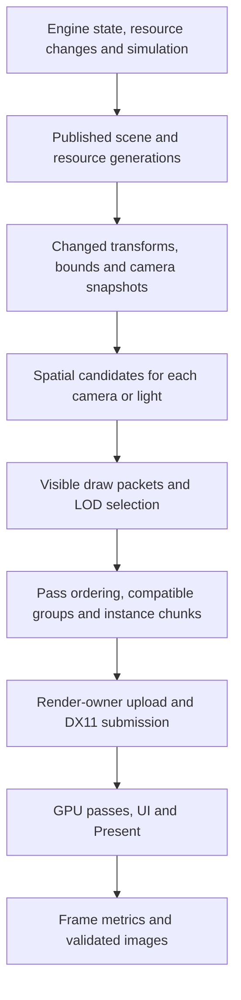

# WorkphoneGraphics performance review and implementation plan

Reviewed: 10 October 2026 in `G:\Workphone`. Source baseline: `f45f375efb8d8c722810c130c5a01beb129cf50d`. During the review HEAD advanced to `2b411b811478e5cc7dbc31a398e16d2e34129810`; the intervening changes affect planning documents only, with no changes to the inspected engine, test or sample sources. Concurrent animation/resource document edits are preserved.

Status: source review and implementation plan; renderer changes have **not** been implemented. Existing RelWithDebInfo graphics test executables were rerun: **11 passed, 1 external-media test skipped**. They were not rebuilt for this review. Their DX11 device evidence identifies **Microsoft Basic Render Driver/WARP**, feature level `b000`, driver `10.0.19041.7548`. No representative Editor/game benchmark, hardware GPU capture, memory profile or fresh-build certification was performed. Source findings below are confirmed in the inspected paths; performance gains are hypotheses or proposed acceptance targets until measured.

This expands the performance work in the [production plan](WPGRAPHICS_PRODUCTION_PLAN.md), coordinated with the [foliage plan](WPGRAPHICS_FOLIAGE_PRODUCTION_PLAN.md), [terrain/procedural review](WPGRAPHICS_TERRAIN_PROCEDURAL_REVIEW.md), [animation plan](WPANIMATION_PRODUCTION_PLAN.md), and [resource/asset plan](WPRESOURCE_ASSET_PRODUCTION_PLAN.md). Implement shared services once. Preserve the native C90 build contract and C++ integration, existing LODGroup/LODSystem selection, resource identity/publication contracts, and current rendering behavior.

## 1. Recommended direction

The strongest optimization opportunity is to reduce repeated CPU work, uploads and actual draw submissions in the existing DX11 path. The renderer already caches triangle-list GPU geometry, render states and some bindings; it already performs mesh frustum culling and tracks dirty constants. Another state cache alone will have limited scope. The larger change is to prepare stable scene/resource data once, derive pass-specific visible lists, group compatible work, and submit shared geometry with reusable instance/dynamic storage.

Prioritize Windows x64/DX11 on both real hardware and WARP. WARP uses the DX11 driver path and is distinct from Workphone's software rasterizer. Keep the latter as a separately measured fallback/reference. Treat DX12 as a separate completion/performance project: its C API and C++ wrapper are different implementations, and neither is an automatic replacement for the active DX11 mesh path.

The proposed order is:

1. Establish trustworthy per-stage/per-pass measurements and reproducible scenes.
2. Remove unused CPU effect allocations, repeated UI uploads, and transient static geometry creation.
3. Introduce resource generations, shared immutable geometry and resolved material records.
4. Prepare transforms/cameras/bounds once and build spatially filtered per-view lists.
5. Add real indexed instancing, then optimize shadow submission and particle batches.
6. Move texture/cubemap preparation out of drawing; add bounded streaming and deformation storage.
7. Optimize terrain/foliage, measured shader costs and the GPU image pipeline.
8. Certify complete playable/editor workloads, memory, latency, recovery and soak behavior.

Use independent switches for each major path until its correctness and performance gate passes. Reorder later stages when baseline captures identify a different dominant cost. Avoid assigning a promised overall speedup before those captures exist.

## 2. Active rendering path and existing strengths

The inspected DX11 path is:

```text
ClawHammerSystem::update
  GraphicsSystem preparation + reload/unload queues + windows/UI/debug
  renderFrame
    enumerate active render textures/viewports
      beginRender -> ClawScene::render -> endRender without Present
    default window
      beginRender -> optional scene -> UI/ImGui -> endRender/Present

ClawScene::render
  resolve directional light/fog
  optional directional shadow pass over native objects + terrain
  sky + terrain
  native scene visibility/filter/stable queue sort
    C++ material-aware callback -> ClawRendererDX11::renderMesh
      converted vertices + cached geometry + material resolution
      native wp_renderer_dx11_draw_geometry_pntc -> DrawIndexed
  particle snapshots -> per-effect sorting/expanded billboard batches
```

Useful foundations to retain:

- Stable merge sorting with retained native render-list/scratch capacity; this is not an insertion-sort problem.
- Conservative mesh frustum tests with parent transforms, rotations, negative scale and unknown-bound fallback.
- Immutable indexed DX11 triangle-list geometry; unchanged meshes do not inherently reupload vertices every frame through the C++ path.
- Rasterizer/blend/depth/sampler caches, partial texture/shader binding reuse, dirty material/transform uploads, and dynamic `WRITE_DISCARD` constant buffers.
- Separate window and offscreen target dimensions, cached target resources, WARP device fallback, and graphics-system VSync propagation.
- Asynchronous timestamp queries using `DONOTFLUSH`, existing draw/upload/state/creation counters, and named CPU profiles.
- ImGui already prepares/uploads each DX11 draw list once and submits index ranges. WorkphoneCore UI has not adopted that path.
- CPU skinning and seeded bounded particle simulation supply correctness references; texture mips have semantic filtering and last-good replacement behavior.

## 3. Source findings

Priorities describe implementation urgency, not measured ranking. **P0** establishes valid evidence or removes a direct low-risk waste; **P1** addresses structural scaling; **P2** needs feature-specific profiling or larger integration. Source line numbers refer to the review baseline.

| ID | Priority | Finding and source evidence | Consequence and proposed change |
|---|---|---|---|
| OPT-01 | P0 | [ClawHammerSystem.cpp](../Engine/cpp/Source/WPGraphics/ClawHammerSystem.cpp), `configure`, lines 930–941, unconditionally initializes ClawGraphicsPipeline. `beginGraphicsPipelineFrame`, lines 666–686, only permits the software default window. [workphone_graphics_pipeline.c](../Engine/c/Source/WorkphoneGraphics/workphone_graphics_pipeline.c), lines 85–102, allocates all effect owners before applying quality. | DX11 pays CPU buffer allocation costs for effects it never executes. Separate settings/capabilities from backend runtime allocation; create effects lazily by backend and enabled dependencies. Retain shadow settings without requiring CPU effect buffers. |
| OPT-02 | P0 | [ClawUIWorkphoneRenderer.cpp](../Engine/cpp/Source/WPGraphics/UI/ClawUIWorkphoneRenderer.cpp), `submit`, lines 219–235 and 274–317, builds a temporary vertex vector and passes the **entire** vector on every command. Native `dx11_prepare_indexed`, lines 2236–2299, uploads supplied vertices and indices each call. | A UI list with V vertices and C commands uploads roughly C × V vertex bytes. Reuse conversion storage and the existing DX11 prepare/draw-range API, uploading one complete VB/IB per list. Preserve command order, clip rectangles, texture handles and fallback behavior. This finding is specifically WorkphoneCore UI; ImGui already uses prepared ranges. |
| OPT-03 | P1 | [workphone_graphics_scenenode.c](../Engine/c/Source/WorkphoneGraphics/workphone_graphics_scenenode.c), lines 227–366, reconstructs local matrices, normalizes quaternions and recursively composes ancestors on every world query. Native culling queries world matrices; the C++ callback queries them again. [workphone_graphics_camera.c](../Engine/c/Source/WorkphoneGraphics/workphone_graphics_camera.c), lines 368–393, also builds/inverts attached-camera world transforms on each view query; `setTransforms`, DX11 wrapper line 1351, reads camera matrices per mesh. | Work grows with objects × hierarchy depth × passes/views. Cache local/world matrices by local and parent generations; prepare camera matrices/inverses/frusta once per view and bounds once per changed object. Preserve the current matrix/depth convention and smooth-motion timing. |
| OPT-04 | P1 | [workphone_graphics_scene.c](../Engine/c/Source/WorkphoneGraphics/workphone_graphics_scene.c), lines 885–964, scans every native object and sorts visible entries for every render. Sorting uses queue and z-order only, lines 70–88. [ClawScene.cpp](../Engine/cpp/Source/WPGraphics/ClawScene.cpp), lines 773–830, exposes culling jobs/visibility sets, but its active render path does not consume them. | Flat culling and repeated list building scale with scene population. Build a retained scene representation with coarse spatial candidates, then exact conservative tests. Use explicit per-view results and retain the native reference path. Existing jobs are a foundation requiring completion/ownership checks, not evidence of active asynchronous culling. |
| OPT-05 | P1 | [ClawRendererDX11.cpp](../Engine/cpp/Source/WPGraphics/ClawRendererDX11.cpp), `renderMesh`, lines 979–1090, resolves submesh material/name fallback, technique/pass state, seven texture views, sampler settings and material values during drawing. `isMaterialDoubleSided` walks the primary material state again. Texture getters can lock and perform preparation. | Native binding caches cannot remove C++ lookup, locking and packing costs. Publish immutable resolved material records keyed by material/resource/device generations; cache shader/state/texture bindings and constants once per change. Sort compatible opaque/cutout work within declared queue boundaries; keep transparent/UI ordering correct. |
| OPT-06 | P1 | Native DX11 [draw_geometry_pntc](../Engine/c/Source/WorkphonePlatformWin32/workphone_graphics_renderer_dx11.c), lines 2794–2885, submits `DrawIndexed`, without a DX11 instance stream/draw path. [ClawMesh.cpp](../Engine/cpp/Source/WPGraphics/ClawMesh.cpp), lines 148–222, constructs/loads a native mesh per ClawMesh. Global GPU cache keys are native mesh pointers. | Repeated trees/props can retain separate geometry and incur one draw per submesh per pass. Share immutable assets by content/resource identity, separate object instance state, and add `DrawIndexedInstanced` with compatible grouping and bounded upload chunks. Geometry sharing and instancing are separate required changes. |
| OPT-07 | P0/P1 | DX11 wrapper lines 236–292 only cache triangle-list geometry. `renderMesh`, lines 1106–1157, expands triangle strips into temporary triangle lists; `drawLitTriangles` creates and destroys immutable GPU VB/IBs per invocation. | Static strips/fallbacks bypass retained geometry and may create resources every shadow/color/view draw. Canonicalize topology and normals during cooking/loading, retain indexed conversions, and make exceptional fallback allocation visible. Preserve strip winding, degenerates, submesh starts and non-indexed inputs. |
| OPT-08 | P1 | [ClawScene.cpp](../Engine/cpp/Source/WPGraphics/ClawScene.cpp), lines 652–680, walks all native mesh casters and terrain for each shadow-enabled view. The wrapper's `beginShadowMap`, line 864, fits one directional map; casters use the full material-aware mesh path. The shader performs alpha preparation before its shadow branch. | Shadow maps reuse allocation but rerender their contents per eligible scene/view invocation. Cull against a conservative light/caster volume, use opaque depth-only and cutout alpha variants, batch/instance casters, and cache only when scene/light/coverage versions permit. Camera-frustum culling must not drop offscreen casters. The current path is one map, not a completed cascaded shadow renderer. |
| OPT-09 | P1 | [ClawTexture.cpp](../Engine/cpp/Source/WPGraphics/ClawTexture.cpp), lines 181–249 and 391–403: each ordinary texture getter enters decode/view helpers; `ensureTextureView` holds a global mutex through mip generation and GPU creation. Decoded pixels remain stored. | First use/property changes can hitch drawing; steady getters add locks/lookups; CPU/GPU residency is not budgeted here. Prepare/cook asynchronously, publish on the render owner with generations and bounded upload work, and draw through ready handles. Preserve semantic mips, authored settings and last-good assets on failure. |
| OPT-10 | P1 | [ClawCubemap.cpp](../Engine/cpp/Source/WPGraphics/ClawCubemap.cpp), lines 100–153 and 171–281: on a cache miss, faces are staged/copied/mapped for CPU readback, then filtered on CPU into a 128-side, eight-mip float cube. `renderSky`, line 1234, invokes this path. Unchanged SRV sets are cached. | Environment changes introduce synchronous readback/filter/upload work in drawing, rather than a constant per-frame cost. Cook static environments, or perform bounded GPU filtering for dynamic probes; publish a complete replacement while keeping the prior one. Include source content generations, not SRV pointer equality alone, for mutable faces. |
| OPT-11 | P1 | [ClawMesh.cpp](../Engine/cpp/Source/WPGraphics/ClawMesh.cpp), `applySkinningPalette`, lines 482–503, skins CPU vertices, allocates/copies vertex bytes, replaces native storage, forgets DX11 geometry and rescans bounds. | Every changed pose invalidates immutable geometry, leading to CPU conversion and new GPU buffers when next drawn. First reuse dynamic output storage and static indices; then upload per-instance joint palettes for GPU skinning. Share bind geometry while retaining independent poses and conservative animated bounds. Coordinate with the animation plan. |
| OPT-12 | P1 | [ClawParticleSimulation.cpp](../Engine/cpp/Source/WPGraphics/Particle/ClawParticleSimulation.cpp), lines 134–146, allocates/copies samples under a mutex for every snapshot. [ClawRendererDX11.cpp](../Engine/cpp/Source/WPGraphics/ClawRendererDX11.cpp), lines 739–810, allocates sorting/billboard storage per effect/view, stable-sorts each effect, expands six vertices per particle and uploads in 1024-particle batches. | Simulation is bounded, but drawing adds snapshot copies, sorting and upload volume. Publish one immutable simulation snapshot per simulation cycle; use reusable per-view sorting storage, emitter bounds, shared quad instances and global transparency ordering. Additive effects can avoid depth sorting when their declared blend behavior permits. |
| OPT-13 | P1/P2 | [ClawTerrain.cpp](../Engine/cpp/Source/WPGraphics/ClawTerrain.cpp), lines 206–310, lazily rebuilds one mesh capped at 257 × 257. DX11 `renderTerrain`, line 1174, draws its full index range; terrain is submitted explicitly outside native mesh culling. Foliage instancing/paging integration remains open in the companion plan. | No active terrain tile/LOD candidate list in this path; dirty terrain can rebuild during draw. Implement authoritative tile data, dirty regions, off-thread mesh preparation, per-view tile/error LOD and dedicated shadow LOD. Reuse existing foliage pager and LOD selection contracts after their adapter correctness is established. |
| OPT-14 | P1 | DX11 wrapper lines 34–46, 134–175 and 445–455: mesh conversion/GPU caches are global, keyed by raw native pointer, with one renderer slot; destroying a renderer clears the entire map. Cache validity checks vertex pointer/count/stride/format; index/topology/content generations are not part of that key. Wrapper mutation methods call `forgetMesh`, but direct native mutations require separate invalidation discipline. | Cache scope, invalidation and shared ownership must be explicit before streaming/multiple renderers. Introduce device-owned resource tables, monotonic resource/content generations, bounded residency and retirement. Audit all native mutations; do not assume pointer identity detects content changes or device recreation. This is a lifecycle/invalidation risk, not a newly reproduced rendering failure. |
| OPT-15 | P1/P2 | [ClawHammerSystem.cpp](../Engine/cpp/Source/WPGraphics/ClawHammerSystem.cpp), lines 429–493, holds the system ScopedLock through preparation, reload-queue draining, scene/UI drawing and presentation. `renderFrame`, lines 539–584, enumerates texture-manager resources to discover active targets. Native transient PC/PTC paths upload DEFAULT buffers from offset zero for each draw. | Measure lock wait/hold time, reload bursts, target enumeration and upload stalls. Publish stable scene/target snapshots; budget prepared reload publication; queue native mutations on the owning render task. Compare retained upload arenas and chunking against current DEFAULT uploads on hardware and WARP. Do not remove synchronization before ownership is defined. |
| OPT-16 | P0 | Native DX11 statistics provide cumulative draw/upload counts and frame averages, with p95 intervals from a retained ring; CPU frame timing includes Present and excludes graphics preparation before first `begin_frame`. The getter allocates/sorts on request. [EditorApplication.cpp](../Tools/cpp/Editor/src/EditorApplication.cpp), lines 693, 1997 and 2101, retains a 240 Hz main-loop target and 60 Hz render-task targets. | Separate preparation/submission/GPU/Present/task pacing; add pass/view labels, bytes, residency, allocation and percentiles over matching windows. FPS alone can conceal improvements under caps. Report raw distributions and sample counts; snapshot statistics through the render owner, especially sample callers currently reading directly. |
| OPT-17 | P2 | Native PNTC shader source contains generalized UV/alpha/normal/PBR/environment/fog code and nine shadow comparisons. Software rasterization, [workphone_graphics_renderer_software.c](../Engine/c/Source/WorkphoneGraphics/workphone_graphics_renderer_software.c), lines 604–790, evaluates bounding-box pixels serially and transforms vertices per triangle. | Use captures to decide shader specialization, packed texture sampling reuse, early-depth/front-to-back ordering and optional depth prepass. Software work needs separate tiled/incremental-edge/SIMD/reference validation; it will not improve DX11/WARP directly. |
| OPT-18 | P2/separate | [ClawRendererDX12.cpp](../Engine/cpp/Source/WPGraphics/ClawRendererDX12.cpp), lines 248 and 469–480, waits for the GPU at frame end; inspected draw paths are quads/lines. Native [workphone_graphics_renderer_dx12.c](../Engine/c/Source/WorkphonePlatformWin32/workphone_graphics_renderer_dx12.c) still contains placeholder frame/draw/resource operations. | First complete an authoritative DX12 feature path, then add per-frame allocators, descriptor/upload storage and fence-based retirement. Removing a wait without per-frame ownership would allow resource reuse while in flight. Do not use DX12 migration as the first DX11 optimization milestone. |

### Quantifiable costs from source

- The native pipeline's six core arrays total **16 floats/pixel = 64 bytes/pixel**, or **126.56 MiB at 1920 × 1080**, before effect-private allocations, the wrapper output, and wrapper input arrays. `ClawGraphicsPipeline::initialize` adds four output floats/pixel, another **31.64 MiB**. Thus this configuration requests at least **158.20 MiB of CPU array storage** at 1080p even before effect internals; this is a source-derived allocation calculation, not measured resident working set. Wrapper input arrays appear when software capture runs. Lazy allocation is therefore a concrete memory opportunity even on DX11.
- WorkphoneCore UI currently uploads `C × V × sizeof(wp_vertex_ptc) + I × sizeof(wp_draw_index)` bytes for a normal command list, ignoring driver copies. Prepared upload should reduce this to `V × sizeof(wp_vertex_ptc) + I × sizeof(wp_draw_index)`. For 100 commands/10,000 vertices and a 24-byte PTC stride, vertex payload falls from about **22.89 MiB to 0.229 MiB per submission**. These are illustrative arithmetic values, not a captured Editor workload.
- The maximum capped terrain grid has **66,049 vertices and 131,072 triangles**. One shadow plus one color pass submits up to **262,144 triangles per view** for that grid, before other views. Geometry stays cached until dirtied, but whole-grid submission remains.
- Particle billboard expansion uses six 24-byte PTC vertices, **144 bytes/particle/view**, before sort/snapshot storage. A proposed 32-byte instance layout would cut that payload by roughly **78%**, subject to the actual chosen fields and shader layout.

## 4. Measurement contract and benchmark matrix

M0 must produce an A/B baseline before substantial refactoring. Proposed new harness/tools below are implementation deliverables, not existing commands.

### Run protocol

Use Release or RelWithDebInfo with the same optimization flags, CRT, backend, plugin binaries and assets. Current generated RelWithDebInfo flags include `/O2 /Ob1 /Zi /DNDEBUG`. Rebuild/deploy the executable and dependent DLLs together, restart the application, and record executable/DLL/source/fixture hashes, scene seed, camera path, resolution, graphics settings, driver, adapter, runtime capabilities and power/pacing settings.

Run a five-second minimum warmup and at least 30 seconds of measurement, five paired A/B runs with alternating order. Keep resource reloads/first use out of the steady-state interval; record them in a separate cold-load/hitch test. Save per-frame data, run medians, p50/p95/p99, outlier counts, query availability and GPU sample coverage. Do not derive submission time by subtracting GPU duration from CPU duration; CPU/GPU work overlaps. Measure preparation, submission and Present directly, and measure queue/worker waits separately.

Run uncapped with VSync disabled for throughput, and separately with the intended 60 Hz/VSync settings for pacing/latency. Inspect all task limiters; the main-loop target is not the render-task target. Fix scene-view resolution separately from main-window resolution. Disable automated frame readback during timed intervals and take validation images outside them. Use real hardware for GPU conclusions; label WARP explicitly and test Workphone Software separately. Capture tools/debug layers change overhead, so collect diagnostic captures separately from release timing.

| Fixture | Initial scale sweep | Required dimensions and decisions |
|---|---|---|
| Empty/window and Editor chrome | 0 meshes; no scene; WorkphoneCore UI and ImGui independently | Cost floor, task pacing, Present/VSync, conversion/upload bytes and UI command counts |
| Repeated mesh/foliage | 1k/10k/50k instances; 1/4/16 compatible groups; 1/2 submeshes | Shared geometry, actual instances/draw, batching capacity, shadow/color pass totals and material split reasons |
| Mostly invisible city | 10k/50k/100k objects, approximately 10% visible | Candidate visits, exact bounds tests, transform updates, culling/list/sort time, near-plane/unknown-bound correctness |
| Deep and dynamic hierarchy | Depth 1/8/32/128; 0/1/10/100% changed nodes | Work proportional to changes; ancestor invalidation, reparent, unload and smooth-motion behavior |
| Material/overdraw stress | Alternating/shared materials; opaque/cutout/alpha; layered foliage | Material resolution, state/texture bindings, shader and shadow pass cost, ordering and visual equivalence |
| Multi-view Editor | Scene + Game; two independent cameras; active preview targets | Per-view visibility, render-target lifetime, once-per-cycle simulation, history isolation and stable selection/input |
| Skeletal workload | 1/32/128 characters; 5k/30k vertices; up to 256 joints | Independent pose ownership, deformation/bounds/upload cost, no geometry recreation after warmup, matching shadow/color poses |
| Particle workload | 1k/10k/50k live particles; 1/32/128 emitters | Snapshot/sort/expand/upload breakdown, total alpha ordering, emitter culling, simulation catch-up and overflow |
| Terrain traversal | Several authoritative tiles plus dense vegetation | Dirty-tile rebuilds, cracks/seams, camera/shadow LOD, bounded residency, transitions and query/collision agreement |
| Resource churn | Cold load, reimport burst, texture quality change, scene switches | Decode/cook/upload stages, p99/hitches, last-good publication, cancellation, peak CPU/GPU bytes and retirement |
| Playable mixed scene | VehicleAdvanced deterministic review path; RacingGameFull/OpenCity and a specified Editor project | End-to-end render/preparation plus physics/game/UI, routes/generation/cleanup, matching quality and captures |

Extend the existing [VehicleAdvanced benchmark controls](../Samples/cpp/VehicleAdvanced/SampleVehicleAdvanced.cpp), including `--benchmark`, `--orbit`, `--view`, forced LOD, resolution and capture options. Keep that sample's vehicle/physics lifecycle. Add a deterministic renderer workload executable for scale sweeps; do not mistake its result for playable-scene acceptance. Freeze and hash camera/input recordings rather than relying on realtime manual motion.

### Telemetry to add

One immutable per-frame record, published on the render owner, should include frame/simulation/view/pass IDs; CPU preparation/cull/sort/material-resolution/submission/UI/upload/publication times; lock wait/hold and queue backlog; GPU timestamps per pass; Present/wait/interval; draw/API calls, instances, triangles and compatible-group split reasons; objects visited/culled/drawn; changed transforms/bounds; successful and failed resource creations; VB/IB/instance/palette/texture bytes uploaded; current/peak decoded/cooked/GPU/reserved capacity; transient allocations and high-water sizes.

Distinguish attempted work from successfully submitted work, count instance-multiplied triangles, and include UI/native fallback paths. The existing binding counter is partial and should not be called a complete API-call census. Record metrics over the same interval: the current cumulative averages and rolling p95 can cover different windows. Keep timing snapshots off hot paths and preserve nonblocking query collection. Measure instrumentation overhead with collection on/off; target under 2% in representative runs.

### Proposed acceptance targets

These are engineering targets to ratify against M0 hardware and scenes, not measured outcomes:

- On controlled warm static/UI/deformation fixtures: zero per-frame GPU geometry creation; zero unexpected render-list/scratch/conversion heap allocations after capacity warmup. Streaming/editor edits are counted exceptions with budgets.
- WorkphoneCore UI uploads at most one full VB/IB per list/capacity chunk; normalized bytes match the prepared-list formula and pixels/input/scissors match the reference.
- For a 10,000-instance, one-mesh/one-material/one-submesh fixture, at least **90% fewer actual draws** across equal passes/views, with unchanged visible coverage. Draw counts must match the sum of `ceil(instances in compatible group / chunk capacity)` per pass/view, including shadow/LOD/crossfade splits.
- Target at least **40% lower p95 graphics CPU preparation plus submission** on the CPU-bound repeated/mostly-invisible fixtures, with a stretch goal of 2× throughput. Report whether the end-to-end frame is CPU/GPU/pacing limited; no universal FPS guarantee.
- At most 5% regression on agreed unaffected scenes, provided run-to-run uncertainty is smaller than that threshold; otherwise rerun/extend the sample and report inconclusive results.
- On a nominated 60 Hz hardware tier: propose p95 graphics CPU work at or below 4 ms and scene GPU work at or below 10 ms at 1080p, with end-to-end p95 frame interval at or below 16.67 ms. Validate overlap and remaining game/physics/UI costs rather than adding these budgets blindly. Assign WARP its own measured tier.
- Lazy DX11 setup allocates none of the CPU post-effect arrays. Texture/cubemap getters perform no decode, mip filtering, blocking readback or GPU creation during a warm draw.
- Static/shared resource residency follows explicit caps, unload returns to a stable baseline after retirement, and resource churn stays within separately recorded peak/hitch budgets.

## 5. Target data flow and ownership



**Scene data:** stable object handles with generations, shared geometry/material resource handles, current/previous transforms, local/world/animated bounds, visibility/queue/z-order, LOD metadata and per-pass participation. Grouping must preserve picking/selection identity and gameplay ownership. Per-view culling never globally toggles shared object visibility.

**Resource data:** separate CPU/cooked asset identity from per-device GPU allocations. Immutable geometry/material records are shared; instance transforms, overrides and poses are independent. Key GPU data by asset/content generation, format/topology and device generation. Keep retained CPU conversion data only where needed by fallback/recovery/editor policy. Hot-reload publishes complete versions at a frame boundary and retains old versions until their consumers/in-flight use are safe.

**Draw packets:** explicit pass/queue/order class, mesh/LOD/submesh range, resolved material/shader/state/textures, transform or instance range, bounds/history and object identity. Opaque/cutout can group by compatible state with a coarse depth key; true transparency needs view-dependent back-to-front ordering, including particle/mesh interleaving where supported. UI keeps painter order. Order-sensitive queues and custom C render callbacks are barriers unless declared reorderable. Start packet collection in Claw/DX11 while keeping a tested native C submission/reference path; extend C APIs with opaque handles, not C++ containers.

**Workers:** use existing jobs to evaluate immutable CPU data and prepare lists/assets. A job owns its scratch/output; merge results deterministically. Commit mutations and immediate-context work on the existing render task. Do not expose raw mutable scene arrays to workers or concurrently issue immediate-context commands. A reusable snapshot can be referenced by several views without redundant SmartPtr/container copies. Define cancellation and generation rejection on unload, Play/Stop and device replacement before shortening locks.

**Upload policy:** static vertices/indices remain immutable; frequently changing vertices/instances/palettes use bounded retained storage. Choose DEFAULT uploads versus DYNAMIC DISCARD/NO_OVERWRITE by measured hardware/WARP behavior. Never overwrite data still needed by queued draws. Optional D3D11.1 constant-buffer subranges require capability checks and 256-byte offset/range granularity; fall back to pooled/discard constant buffers. Split view/pass, material and object constants so camera/light changes do not force repacking every material.

## 6. Implementation milestones

Effort ranges are rough focused engineer-days for implementation and local validation, excluding asset creation, hardware procurement and extended CI/soak time. Shared work already delivered by the companion plans should be reused and deducted. This is a sequence of reviewable increments, not a fixed calendar commitment.

| Milestone | Scope and concrete deliverables | Depends on | Rough effort | Exit evidence |
|---|---|---|---|---|
| M0 — traceable baseline | Fresh graphics/sample builds; pinned scenes/input; extend telemetry; per-frame JSON/CSV; A/B runner; capability/device/hash manifest; CPU/GPU/pacing breakdown | None | 3–5 days | Reproducible hardware and WARP baselines, unavailable coverage explicit, instrumentation overhead quantified |
| M1 — direct waste removal | Lazy backend/effect allocation; reusable WorkphoneCore UI conversion + prepared index ranges; cached strip canonicalization; batch debug lines; cached single sky cube draw where feasible | M0 | 4–7 days | No DX11 CPU effect allocation; UI byte formula; static strip resource creation reaches zero after warmup; matching pixels |
| M2 — shared resources/material records | Device-owned geometry tables; vertex/index/topology generations; asset identity deduplication; resolved material snapshots; complete invalidation/retirement and byte accounting | M0; resource publication contracts | 6–10 days | Same asset instances share buffers; updates affect only relevant versions; second device/renderer and unload are safe; material lookup cost measured |
| M3 — transforms and prepared scene | Generation-based local/world/camera/bounds cache; retained scene snapshot and draw-packet storage; explicit active-target registry; render-task publication; lock instrumentation and reduced critical sections | M2 | 6–10 days | Unchanged hierarchy avoids recomposition; two cameras/parents/reparent/smooth-motion match reference; once-per-cycle state preparation |
| M4 — spatial visibility and ordering | Static BVH or cell index plus bounded dynamic set chosen from M0; conservative per-camera/light candidates; per-submesh packets; opaque/cutout grouping/depth keys and transparent order policy | M3 | 5–9 days | Mostly-hidden workload candidate/time reduction; ordering/visibility images and native differential checks pass |
| M5 — indexed instancing | Native C DX11 layout/shader/instance-buffer APIs, wrapper batches, shared asset instances, per-instance normal/scale/tint/selection metadata, capacity fallback and split diagnostics | M2–M4 | 6–10 days | Actual instanced pixels for independent transforms; draw formula and ≥90% reduction fixture; shadow/color participation and statistics correct |
| M6 — shadow optimization | Light-volume candidate lists; opaque depth-only and cutout variants; instanced shadow bins; frame/view cache keys; dirty-static map reuse where safe; configurable update/shadow LOD policy | M4–M5 | 4–8 days | Offscreen casters retained; light/caster/material/camera changes invalidate; measured shadow CPU/GPU reduction and stable image quality |
| M7 — loading, residency and hitches | Worker decode/cook/mips, bounded render-owner upload queue; ready-only draw handles; cooked BC/format/mip support where appropriate; cooked/static cubemaps and GPU dynamic filtering; CPU/GPU budgets, cancellation and retirement | M2–M3; resource/cook integration | 6–10 days | No expensive work in warm getters; last-good failure tests; bounded cold/reload p99 and peak residency; source-free assets render |
| M8 — animation and particles | Reusable CPU skin outputs/dynamic VBs, persistent indices, independent palettes and GPU skinning; per-cycle particle snapshots, emitter bounds, reusable sorting, instanced quads, transparency integration and quality budgets | M3–M5; animation ownership contracts | 7–12 days | CPU/GPU deformation agreement; no per-pose geometry recreation; two views share simulation snapshots; globally ordered alpha scenes and upload savings |
| M9 — terrain and foliage scale | Authoritative terrain tiles/dirty regions, retained shared patch topology, error/LOD and shadow bins; native paging adapter, species instances and cross-page compatible bins; dirty-page streaming budgets | M4–M7; terrain correctness work | 7–12 days | Playable traversal, no cracks, bounded load/unload, matching terrain queries/collision and foliage draw/LOD budgets; reuse companion milestones |
| M10 — measured GPU image work | Specialize bounded shader families; share packed map samples; measure optional depth prepass; GPU HDR/tone mapping and optional effects with per-view histories, pooled intermediates and quality scaling | M0/M4; GPU feature graph prerequisites | 7–12 days | Per-pass captures/timing; quality matched to feature reference; zero CPU image readback in normal DX11 path; inactive resources absent |
| M11 — workload certification | Integrate complete Editor and racing scenes; failure/reload/resize/device/Play lifecycle; long resource/scene churn; perf trend jobs, captures and release report | All selected release milestones | 4–7 days plus soak | Targets and image gates pass on nominated hardware/WARP tiers; memory stabilizes; limitations and unsupported paths published |

M0–M6 form the first coherent throughput delivery, roughly 34–59 focused engineer-days before shared-work deductions. M7–M11 extend this to effects, large worlds and release evidence. These ranges carry substantial uncertainty until M0/M2 resolve actual ownership and baseline costs. GPU effects add missing functionality and can increase frame cost relative to today's DX11 path; evaluate their efficiency at matched feature/quality settings rather than claiming that enabling them is automatically a speedup.

### First reviewable batches

1. **PERF-01: baseline and telemetry.** Extend existing counters/profiles, correct metric naming/window semantics, add missing bytes/allocations/pass tags and freeze representative fixtures. No draw behavior changes.
2. **PERF-02: backend allocation.** Keep pipeline settings available; instantiate CPU arrays only for an active software pipeline and enabled dependencies. Test DX11 configuration, software enable/disable, resize, quality changes and shutdown/failure.
3. **PERF-03: WorkphoneCore UI prepare once.** Reuse the ImGui/native prepared-range pattern, retaining fallback for software. Test several clips/textures and index ranges, empty/invisible commands and capacity growth; check bytes and pixels together.
4. **PERF-04: retained strip/index conversion.** Canonicalize/cache once, preserve submesh offsets/winding and keep original resource metadata. Cover direct native mutations and invalidation before relying on shared geometry.
5. **PERF-05: resource generations/ownership.** Move raw global cache ownership into device resources; deduplicate stable assets, implement retirement and expose byte counters. Validate index-only updates and device recreation.
6. **PERF-06: resolved materials.** Publish one immutable render record per generation, remove per-draw technique/name/texture traversal, and introduce bounded shader keys. Keep existing primary-pass behavior; do not silently add/remove material passes.
7. **PERF-07: transform/camera snapshots.** Establish parent-generation propagation and per-view matrices, preserve reference paths and smooth-motion interpolation/extrapolation sampling.
8. **PERF-08: draw packets and spatial candidates.** Add explicit ordering classes and custom-callback barriers, then activate the index behind an A/B switch. Verify conservative bounds against native tests.
9. **PERF-09: instancing and caster bins.** Introduce native hardware instancing with resource/capacity fallback, then connect shadow/foliage bins and draw diagnostics.
10. **PERF-10+: asynchronous resources and dynamic effects.** Use established generation/publication/snapshot services for textures, cubemaps, palettes, particle instances and terrain pages; advance one measurable workload at a time.

## 7. Validation and regression requirements

| Area | Required verification |
|---|---|
| Transforms/culling | Parent/rotation/negative/nonuniform scale, reparent, orthographic/perspective, near plane, huge/unknown/animated bounds, camera switches, native depth remap and smooth-motion sample timing; cache results compared with original calculations |
| Materials/order | Alternating PBR/normal/packed/emissive/fog/reflection settings; cutout/double-sided/wireframe; primary pass selection; transparent mesh/particle ordering; queue/z-order/custom callbacks; UI painter order and clip/texture correctness |
| Instances | At least two visibly distinct transforms/tints; nonuniform/negative-scale normals and winding policy; shared submeshes/material overrides; zero/overflow/capacity cases; actual backend draw statistics; picking identity |
| Shadows | Opaque/cutout/terrain/skinned/instanced casters; off-camera caster onto visible receiver; scene/light/material/pose/coverage invalidation; independent cameras and stable texel fitting |
| Resources | Same-size/index-only/in-place-content changes; hot reload/failed replacement; device epoch change, two renderer owners, unload/cancel/reopen; last-good publication and delayed retirement; no stale raw handles |
| Animation/particles | Independent poses, bind/inverse-bind agreement, CPU reference image/vertex comparison; once-per-cycle simulation across views; alpha/additive ordering and depth-write behavior; pause/prewarm/stop/restart; bounds and storage limits |
| Editor/playable flow | Scene+Game targets, resize/minimize, input/selection, Play/Stop/reload/save/reopen; actual generated city/routes/records/cleanup; restart rebuilt binaries before comparison |
| Performance | Same scenes/settings/quality/visibility, raw run distributions and adapter identity; direct measured bytes/counters plus pixels; no readback/capture inside timed interval; cold and warm separated; hardware/WARP/software separate |
| Build/lifecycle | Existing native C90 and C++ target configurations; Debug correctness plus optimized performance; existing mandatory graphics tests; device-loss/recovery/failed uploads and memory/handle/resource soak |

Add focused performance/contract tests where the new behavior has measurable invariants, rather than timing assertions on shared CI machines. Deterministic CI can gate uploads, allocations, draw counts, versions and pixels; dedicated pinned hardware agents can gate percentile timing. Keep unavailable hardware/media explicitly skipped or blocked according to the release policy, never silently successful. A compile or isolated pixel test does not certify the corresponding full Editor scene.

For implementation baselines, use the existing `Tools/BuildWPGraphicsBaseline.ps1` and `Tools/ValidateClawGraphics.ps1` in their documented build directory/configuration. Add new targets to those inventories when appropriate. Release validation requires external fixtures and fresh executable/DLL evidence. CTest names alone are insufficient: `WorkphoneGraphics.aaa_pipeline` exercises the CPU pipeline and does not establish a DX11 GPU post-process graph.

## 8. Backend-specific and deferred decisions

**DX11 constants/uploads:** retain current dirty tracking/DISCARD constants. Split per-view/material/object blocks first; only add D3D11.1 suballocation when Map/binding cost remains significant. Check `ID3D11DeviceContext1`, constant-buffer offsetting and `MapNoOverwriteOnDynamicConstantBuffer` separately. A supported feature level alone does not establish those options. The fallback must handle buffer growth/wrap without overwriting in-flight ranges. Microsoft's [dynamic resource guidance](https://learn.microsoft.com/en-us/windows/win32/direct3d11/how-to--use-dynamic-resources) defines DISCARD/NO_OVERWRITE rules; [VSSetConstantBuffers1](https://learn.microsoft.com/en-us/windows/win32/api/d3d11_1/nf-d3d11_1-id3d11devicecontext1-vssetconstantbuffers1) specifies range alignment.

**CPU parallelism:** prepare CPU snapshots/lists using the existing job system before considering deferred contexts. The immediate context remains owned by one render thread; parallel command recording is a separately measured experiment after batching. See Microsoft's [D3D11 threading model](https://learn.microsoft.com/en-us/windows/win32/direct3d11/overviews-direct3d-11-render-multi-thread).

**Instancing:** implement the complete instance layout/resource/shader path around [DrawIndexedInstanced](https://learn.microsoft.com/en-us/windows/win32/api/d3d11/nf-d3d11-id3d11devicecontext-drawindexedinstanced). Group by pass, geometry generation/LOD/submesh, material/shader/state, resource compatibility and instance layout. Batching across pages is allowed when it preserves visibility/ordering/upload limits. Do not merge genuinely different materials or alpha ordering just to reach a draw target.

**GPU visibility/indirect draws:** reserve hierarchical depth/occlusion queries or GPU culling/indirect submission for a measured remaining visibility/submission bottleneck. Use conservative temporal invalidation and avoid synchronous query waits. CPU spatial culling plus indexed instancing is the first baseline; meshlets/virtualized geometry/bindless architecture are not prerequisites.

**Shaders and quality:** bound permutations for opaque/cutout/unlit/PBR/skinned/instanced/depth variants; cook/cache them and prewarm at explicit load stages. Reuse packed-texture samples and precomputed material UV rotation where measured. Preserve semantic color space and normal/cutout filtering. Establish sRGB/linear/HDR correctness before changing formats or removing conversions. Texture compression/quantized vertices/16-bit indices require content and error policies, not a blanket format switch.

**GPU post-processing:** allocate only enabled graph dependencies, pool compatible intermediate resources, maintain one temporal history per view, reset on resize/cut/reload and supply real motion/depth/normals. Integrate a minimal HDR/tone-map path before TAA/GTAO/SSR/DOF/motion blur. Missing water/lighting features remain owned by the production plan; budget their reflection/refraction/additional-light passes when introduced. Dynamic resolution is a later quality option, not evidence that same-quality work became cheaper.

**Presentation:** preserve configured VSync and current target/window separation. Compare legacy and supported flip/tearing modes on hardware and WARP with throughput, latency and resize/minimize correctness. Prior WARP evidence does not determine the current hardware winner. Do not remove all pacing or globally force flip mode based on generic advice.

**Workphone Software:** if required by product priorities, stage transformed-vertex reuse, scissor-clamped/incremental edge setup, 8×8/16×16 tile binning candidates, SIMD span/depth/color work and tile ownership for jobs. Preserve order for blending and use scalar reference comparisons. Lazily allocate CPU effects, reuse/fuse copies where semantics allow, and keep valid depth/normal/velocity inputs. SIMD should have portable fallbacks and measured end-to-end gains. This is additional effort outside M0–M11's DX11 delivery estimates.

**DX12:** agree on one authoritative implementation, complete mesh/material/UI/presentation parity, then add frame contexts, upload/descriptor arenas, fences and resource states. Retain waits at teardown/resize where required and wait only before reusing a busy frame slot during steady rendering. Estimate and certify this separately after DX11 data/resource ownership work can be reused.

## 9. Review execution evidence

Read-only/source work covered the native scene/node/camera/object/mesh/renderer path, native DX11 draw/state/resource/metrics paths, native software rasterization and CPU effects, native DX12 status, Claw system/scene/renderer/mesh/texture/cubemap/terrain/particle/UI/ImGui integration, culling jobs/visibility sets, build/presets/test registration, Editor pacing, sample benchmark controls and the existing production plans. External API constraints were checked against Microsoft primary documentation linked above. No source optimization or new benchmark implementation was performed.

The review ran:

```powershell
$reviewCTest = Join-Path $env:ProgramFiles 'CMake/bin/ctest.exe'
& $reviewCTest --test-dir project_x64 -C RelWithDebInfo `
    -R '^(WPGraphics|WorkphoneGraphics)\.' --output-on-failure --no-tests=error `
    --output-junit wpgraphics-optimization-review-results.xml
```

Result: 12 selected, **11 passed and 1 skipped**, 3.70 seconds reported test time. The external mesh fixture test `WorkphoneGraphics.mesh_import_assets` was skipped. Selected tests covered skinning, native particle simulation, mesh serialization, renderer/shader/CPU pipeline contracts, cubemap/PBR, production draw, UI/text/input, DX11 targets and UI destruction. Resource/catalog targets were outside this review invocation; companion plans own those evidence requirements.

Local artifacts: `project_x64/wpgraphics-optimization-review-inventory.json`, `project_x64/wpgraphics-optimization-review-results.xml`, and `project_x64/wpgraphics-optimization-review-evidence.json`. These record existing-binary execution; their hashes do not prove those binaries were built from the review revision. Example existing artifact write times were 9 October 2026 23:52:53 UTC for WPGraphics.dll and 21:41:12 UTC for WorkphoneGraphicsRendererTests.exe.

The target regression printed **5.208 ms for 60 scene/window switches and clears** and **25.255 ms for 1,000 alternating mesh draws including readback**, using legacy-discard presentation with one buffer on WARP. These are one-run diagnostic fixture timings, not GPU-only measurements, application frame rates, comparative speedups, or performance acceptance baselines.

The next executable deliverable is **M0/PERF-01 followed by PERF-02 and PERF-03**. They establish the evidence needed to choose structural priorities and remove two directly demonstrated wastes without waiting for the larger instancing/scene redesign.
