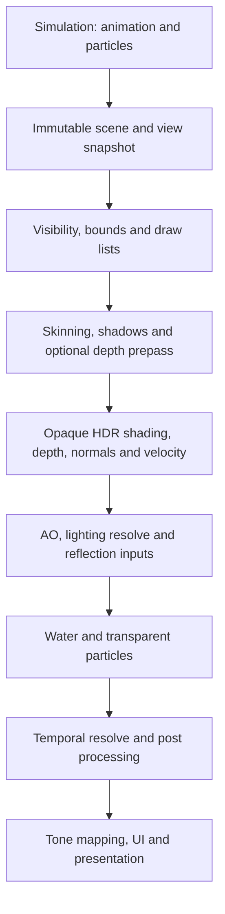

# WPGraphics production readiness and feature implementation plan

Date: 8 October 2026; current source review at `d2e81cdb4`.
Historical implementation evidence: initial graphics review at `8a767dda5`; catalog follow-up starting from `d5c859612`, Visual Studio 2026/MSVC 19.51 and CMake 4.4.4, RelWithDebInfo.
Status: Implementation in progress. Reference deformation, basic particles and catalog contracts have historical validation; current-checkout verification is incomplete. Neither R1 nor R2 is certified.
Scope: WPGraphics/Claw, its native WorkphoneGraphics dependencies, AssetDatabaseManager and the existing resource pipeline, and the engine/editor integration needed to ship it.
User priorities: explicitly validate animation and particle systems; include water rendering and asset database integration in the feature roadmap.

## 1. Intended outcome

Deliver a renderer that can ship a Workphone game and reliably drive the editor: static and animated geometry, production materials and lighting, particles, terrain, UI, and a documented water feature tier. Each advertised feature must have a complete asset-to-screen path, predictable failure behavior, automated coverage, and measured performance.

Use two release gates:

- **R1 — production core:** Windows x64/DX11, cooked assets, static and skeletal meshes, basic animation graphs and IK integration, CPU particle simulation with batched GPU rendering, essential lighting/shadows, GPU HDR presentation, terrain, UI, diagnostics, and release packaging.
- **R2 — comprehensive feature release:** R1 plus richer animation, particle authoring and effects, water for lakes/pools/rivers, reflection probes, scalable lighting, temporal effects, streaming, and the broader feature set below.

DX12 and additional platforms receive their own certification gates. They do not inherit production status from DX11. Advanced ocean simulation, ray tracing, and virtualized geometry are subsequent optional work.

Historical graphics evidence is 11 passed and one external mesh import test skipped; historical catalog evidence includes required SQLite CRUD/migration contracts. On 8 October, the existing `project_x64` Debug configuration selected 14 graphics/catalog/resource targets but **all 14 were unavailable because their executables were missing**. None ran. This establishes a build-artifact gap, not a source-code test failure. No rebuild, GPU capture, benchmark or remote CI run was performed for this planning request. The two isolated native tests duplicate contracts in the graphics suite. See [implementation status](WPGRAPHICS_IMPLEMENTATION_STATUS.md) for commands and evidence limits.

The immediate objective is a rebuilt, traceable baseline and one cooked material/texture resolved through the catalog and drawn on DX11. Then finish animation and particle scene integration, followed by the GPU frame and release certification. Water remains a required R2 workstream. The comprehensive feature table in section 4 defines the release scope; optional ocean/ray-tracing/backend work has separate gates.

The subsequent catalog increment built the required SQLite catalog target and Workphone/WPSQLite dependencies, verified existing identity/mutation/switching contracts, and added schema-version/migration/rollback coverage. Its CTest target and the two retained native reference tests passed locally. Catalog preset configuration was verified with the local build-directory override. GPU rendering and remote CI were not rerun for that increment.

## 2. Evidence and current gaps

Paths below are relative to the repository root. Observations are limited to the inspected paths.

| Area | Evidence | Implementation implication |
|---|---|---|
| Architecture | [WPGraphics build](../Engine/cpp/Project/WPGraphics/CMakeLists.txt) links `WorkphoneGraphics`; [native build](../Engine/c/Project/WorkphoneGraphics/CMakeLists.txt) requires C90 without extensions | Keep C++17 integration and the native C90 contract; improve the existing layers |
| Backends | `ClawRendererDX11.cpp`, `ClawRendererSoftware.cpp`, `ClawRendererDX12.cpp`; engine-wide README also lists other backends | Publish a WPGraphics-specific support matrix; engine-wide support is not Claw certification |
| Post-processing | [ClawGraphicsPipeline](../Engine/cpp/Source/WPGraphics/ClawGraphicsPipeline.cpp) creates CPU effect buffers; [ClawHammerSystem](../Engine/cpp/Source/WPGraphics/ClawHammerSystem.cpp) restricts capture/presentation to the software default-window path | Implement a GPU pipeline for DX11; existing TAA/GTAO/SSR/etc. APIs do not establish GPU integration |
| DX11 materials | `ClawRendererDX11.cpp` has material/channel mapping, mesh caches, and sky environment caches; native DX11 has material and statistics APIs | Extend and test the existing material path; audit cache ownership, invalidation, and bounded growth |
| DX12 | [DX12 source](../Engine/cpp/Source/WPGraphics/ClawRendererDX12.cpp) uses an offscreen target, quad-oriented draw paths, and waits for the GPU at frame end; its header returns a null native renderer for UI integration | Treat as experimental; complete mesh/material drawing, presentation, UI, and per-draw resource safety before certification |
| Animation | [ClawMesh](../Engine/cpp/Source/WPGraphics/ClawMesh.cpp) now accepts explicit skinning data/palettes; native CPU skinning supports four influences/256 joints with validated rigid/uniform-scale transforms; controller methods still delegate to the base | Reuse the validated CPU reference; complete import, inverse-bind/palette ownership and controller-to-scene integration. GPU skinning and full animated instances remain open |
| Animation tests | [Graph tests](../Tests/cpp/UnitTests/AnimationGraphTests.cpp) and [IK tests](../Tests/cpp/UnitTests/AnimationIKTests.cpp) exercise time/events/graph sampling and solvers | Retain these tests; add pose evaluation, import, skinning, rendered output, and scene/component tests |
| Particles | [ClawParticleSimulation](../Engine/cpp/Source/WPGraphics/Particle/ClawParticleSimulation.cpp) owns bounded seeded 120 Hz native simulation; [DX11 rendering](../Engine/cpp/Source/WPGraphics/ClawRendererDX11.cpp) batches billboards; legacy technique/manager/renderer paths remain incomplete | Extend the new authoritative path. Complete asset templates, emitter/space semantics, frame identity, global transparency sorting, authoring and budgets; retire or adapt legacy paths |
| Particle tests | [ParticleSystemTests](../Tests/cpp/UnitTests/ParticleSystemTests.cpp) can return early in headless/unavailable-backend cases; [component tests](../Tests/cpp/UnitTests/ComponentTestsParticleSystem.cpp) use a test renderer | Make skipped/unavailable cases visible in CI; add real Claw rendering tests and deterministic simulation tests |
| Water | [IGraphicsWater](../Engine/cpp/Include/Workphone/Interface/Graphics/IGraphicsWater.hpp) exists; searched water/ocean paths found no concrete implementation | Add a Claw water object and rendering passes; reuse the interface where applicable |
| Resources | [ResourceSystem.md](../Engine/cpp/Project/Workphone/ResourceSystem.md) describes versioned compilation, dependency tracking, atomic publication, runtime validation, and caching | Integrate graphics compilers and GPU upload/residency with this system rather than creating another database/cache |
| Asset catalog | [AssetDatabaseManager.hpp](../Engine/cpp/Include/Workphone/Database/AssetDatabaseManager.hpp) and [implementation](../Engine/cpp/Source/Workphone/Database/AssetDatabaseManager.cpp) now use bound transactional CRUD, UUID-scoped deletion, detached lookup results and schema-v1 migration/rollback; [ResourceDatabase](../Engine/cpp/Source/Workphone/Database/ResourceDatabase.cpp) is the integration caller | Retain repairs; finish canonical paths, explicit asset kinds, lifecycle/failure policy, and catalog-to-ResourceSystem/GPU bridge. The compilation metadata database remains separate |
| Database coverage | [AssetCatalogTests](../Tests/cpp/AssetCatalogTests.cpp) requires SQLite and tests identity/mutations/migration. Older [ResourceDatabaseTests](../Tests/cpp/UnitTests/ResourceDatabaseTests.cpp) still contain plugin/headless early returns | Rebuild and execute the required catalog target in this checkout; add resource-to-render integration and mutation/unload races; early returns do not count as coverage |
| Tests | [C++ registration](../Tests/cpp/CMakeLists.txt) includes Claw text, DX11 target, UI destruction, and cubemap/PBR targets; C tests cover renderer/shader/pipeline contracts | Preserve regression coverage and extend it to complete frames and failure/recovery paths |
| Editor/UI | Existing animation/particle/material/shader Lua editors; recent source changes add long-text serialization/render coverage, visibility checks, editor-camera selection during Play and snapshot restoration | Validate the new tests in rebuilt binaries, preserve camera/runtime transitions, and connect previews to runtime asset/render paths |
| Instrumentation/samples | ClawHammerSystem reports CPU/Present/GPU and upload/draw counters; recent VehicleAdvanced changes validate capture bindings and mesh winding | Use repeatable capture scenes and counters to establish budgets; sample smoke checks do not certify feature performance or end-to-end animation/effects |
| Build/distribution | Windows graphics, catalog and isolated contract presets plus [validation runner](../Tools/ValidateClawGraphics.ps1) exist; `.github` is absent in this checkout and selected Debug executables are missing | Restore/version CI definitions, rebuild required targets, record source/config/adapter/driver evidence, then validate packaging/export and an external consumer |

### 2.1 Current completion and evidence limits

| Work package | Current status | Next evidence needed |
|---|---|---|
| BASE-01/02/03 | Partial inventory/presets/runner; current Debug tests unavailable due to missing executables; CI definitions absent | Rebuilt Debug/RelWithDebInfo targets, required catalog coverage, adapter/driver evidence and restored remote CI |
| BASE-04/05 | Partial generated triangle/particle fixtures; representative content and budgets pending | Licensed imported character/effect/water fixtures, reference sequences and measured costs |
| ANIM-02/05 | CPU reference and explicit mesh deformation validated | Imported skin/clip bridge, multiple independent instances, bind/inverse-bind correctness, repeated GPU cache updates and CPU/GPU comparison |
| FX-01/02/03/05 | Basic lifecycle, seed/step/pool and visible billboard path validated | Templates/serialization, full lifecycle/space semantics, multi-view integration, sorting/depth/state tests and stress budgets |
| CORE-01/02/05 | Some mesh ownership/cache invalidation and synchronized particle copies exist | Teardown/reload races, generation-safe bounded caches, device recovery and immutable frame snapshots |
| M1A asset catalog | Required SQLite CRUD/identity contracts and schema-v1 migration/backup/rollback validated locally | Canonical paths/asset kinds, broader concurrency/lifecycle/durability, graphics-resource bridge and remote CI |
| M4/M5/M6 | Existing materials/static geometry/UI/CPU effects; new long-text/visibility/editor-camera tests present in source | Rebuild tests, cook graphics assets, implement GPU passes/shadows/HDR, streaming and mixed-scene validation |
| M7 water | Unavailable; interface only | Implement WATER-01 through WATER-06 after frame/depth/reflection prerequisites |
| M8/M9 | Not certified | Packaging, clean CI, performance/soak/recovery evidence; DX12 independently |

The GPU regression directly supplies a palette and particle snapshot and checks selected pixels. It does not exercise importer/controller-to-scene animation, automatic scene particle timing, multi-camera rendering or catalog-to-cook-to-render integration. `production` is a test label, not a release certification. Capability statuses in `ClawCapabilities.cpp` are an implementation inventory; they still need alignment with compiled backends and actual device availability.

### 2.2 Graphics findings for the next increments

- **Animation ownership/performance:** `applySkinningPalette` copies/replaces vertex storage and invalidates the DX11 geometry cache on each pose. Preserve the correctness reference; measure costs and add reusable dynamic buffers/GPU palettes. `clone()` does not copy the new bind vertices/palette state, so imported instances need shared immutable bind data and independent poses before ANIM-05 passes.
- **Particle scheduling:** `update()` and `animate()` can both advance simulation. Scene preparation is the intended owner, but copied snapshots have no frame stamp. Audit callers, make once-per-frame evaluation explicit and test two views, hidden/paused effects, reload and destruction.
- **Particle scale/transparency/state:** centers use the owner transform; billboard extents use effect scale and camera axes. Define parent scaling, and test moving/scaled owners, camera handedness, inter-effect ordering, alpha/additive textures and subsequent draw-state restoration. The red-pixel fixture does not establish these variants.
- **Allocation/capacity:** native stepping is preallocated; wrapper snapshots, per-view sorting and transient batching allocate. Bound/profile these across many effects. The one-million-particle capacity limit is an allocation limit, not a verified performance tier.
- **Asset integration:** explicit skin/effect settings bypass catalog compilation. Particle templates are rejected, while inspected generic ResourceDatabase type inference handles legacy mesh/material/texture paths. DB-07 and typed compilers must include skeleton/clip/shader/effect/water assets rather than relying only on extension guessing.

## 3. Scope and engineering rules

1. **Proposed first supported configuration:** Windows x64, DX11, C++17 wrappers, C90 native modules, SDR output. Select supported OS versions, adapter feature levels, toolchain, and driver versions during M0; record them rather than relying on the old README.
2. **Software renderer:** a bounded fallback and headless/reference path. Certify a documented subset and fail explicitly for unsupported features. Do not promise GPU-quality parity or GPU frame rates.
3. **Keep existing engine contracts stable.** Prefer internal services, concrete implementation settings, and additive native APIs. Avoid new virtual methods in shared `Workphone/Interface` headers during this pass; document any eventual ABI migration separately.
4. **Editor work follows existing conventions:** extend existing C++ windows and Lua tools where each feature currently lives; keep rendering/resource logic native and scripting bindings thin. Respect [editor conventions](../Tools/cpp/Editor/docs/CONVENTIONS.md) and coordinate with the existing editor upgrade plan. Preview/runtime must share asset and render services.
5. **One owner per responsibility:** Workphone owns animation graph/IK evaluation; WPGraphics consumes final poses and handles deformation/rendering. Native C now owns particle simulation and Claw owns lifecycle/scheduling/snapshot presentation; legacy update paths must not advance the same effect independently.
6. **Explicit capabilities:** feature availability must describe implemented rendering behavior and limits. Unsupported requests produce a diagnostic or a documented fallback, never a successful no-op. Until full switching exists, expose renderer selection as a restart-required configuration.
7. **Separate simulation and presentation:** immutable, frame-stamped snapshots cross worker/render boundaries. GPU creation/destruction runs on the owning render context. Cancel and drain jobs before scene/device teardown.
8. **GPU residency:** normal GPU frames retain color/depth/normal/velocity data on the GPU. Use asynchronous readback for tests, screenshots, and diagnostics; avoid routine full-frame CPU round trips.
9. **Feature definition of done:** runtime integration, asset validation, serialization, authoring controls where relevant, tests, profiling, fallback behavior, documentation, and a sample scene.
10. **Asset identity and compilation stay distinct:** AssetDatabaseManager owns the editor/project catalog and durable UUID/path/type mapping; ResourceSystem and IResourceCompilationDatabase own compile hashes, versions, dependencies and compiled containers. WPGraphics owns device resources, uploads and residency. Connect these layers through an explicit adapter and avoid duplicating their databases or caches.

## 4. Feature coverage

P0 is required for R1. P1 is required for the documented R2 feature tier. P2 is an extension with its own acceptance gate. Existing code must be reused where sound; “required” does not mean every capability must be written from scratch.

| Feature family | P0: production core | P1: comprehensive release | P2: extensions |
|---|---|---|---|
| Device/window | Adapter selection, resize/minimize, offscreen targets, vsync, recovery | Multiple windows/views, frame pacing, optional MSAA | HDR display output and specialist presentation |
| Geometry | Indexed static/dynamic meshes, submeshes, robust attributes, bounds | Instancing, LOD, occlusion, indirect draws where justified | GPU-driven submission, virtualized geometry |
| Animation | Import, pose evaluation, CPU reference/GPU skinning, clips, transitions, root motion, events, basic IK | Blend spaces, additive layers/masks, animation LOD, sockets, morphs, retargeting | Advanced warping and crowd systems |
| Materials | Unlit and metallic/roughness PBR, normals, packed channels, alpha modes, instances | Clearcoat, detail maps, anisotropy, decals, material quality variants | Subsurface/transmission models |
| Textures/shaders | Mips, sRGB/linear correctness, samplers, offline shader compilation, fallback shaders | Compression, arrays/cubemaps, streaming, safe hot reload | Virtual texturing and specialist codecs |
| Lighting | Directional/point/spot lights, bounded light lists, IBL, directional shadows | Forward+ light lists, local shadows, probes, baked lightmaps | Advanced GI, ray-traced lighting |
| Image pipeline | GPU HDR intermediates, tone mapping, basic AA, optional bloom/exposure | TAA, GTAO, SSR, contact shadows, DOF, motion blur, dynamic resolution | Vendor upscalers, advanced temporal reconstruction |
| Particles | Deterministic CPU simulation, emitter lifecycle, curves, pooling, batched billboards, alpha/additive | Soft particles, flipbooks, trails/ribbons, mesh particles, collisions, subemitters, lighting | GPU simulation and very large effects |
| Water | Architectural hooks and required buffers | Lakes/pools/rivers, waves, depth/absorption, Fresnel, foam, reflection/refraction | Ocean spectrum, underwater volumes, caustics, wakes |
| Terrain/vegetation | Existing terrain correctness, layer blending, stable bounds/LOD | Chunk streaming, foliage instancing/wind, impostors | Virtual terrain materials |
| Sky/environment | Existing sky/cubemap path, cached IBL | Atmosphere, time of day, fog, environment transitions | Volumetric clouds/weather |
| UI/text | Claw UI and ImGui, clipping, text/glyph lifecycle, DPI | Localization/complex text integration, multi-viewport behavior | Specialist text rendering |
| Tool integration | Material, animation and particle preview; picking/debug views | Water controls, effect diagnostics, render graph/profiler views | Specialized capture/inspection tools |
| Resources | Durable catalog UUIDs, safe CRUD/migration, source-to-ResourceID bridge, cook/load/version validation, bounded uploads, failure-safe reload | Residency budgets, prefetch, eviction, dependency reload, catalog/editor diagnostics | Large-world streaming specialization |
| Operations | Diagnostics, test matrix, clean packaging, symbols, migration notes | Backend parity reports, performance dashboards | Additional independently certified platforms |

## 5. Proposed rendering architecture

Preserve `ClawHammerSystem` as orchestration and existing wrappers as engine-facing objects. Introduce internal implementation units with names finalized in M0:

- **Device/context service:** capabilities, device generation, adapter/window state, native handles, device recovery, and GPU diagnostics.
- **Resource registry:** typed handles with generations, ownership, upload queue, per-device caches, residency accounting, and deferred destruction. Replace raw-pointer cache identity where it can survive deletion or address reuse.
- **Render scene snapshot:** transforms, current/previous poses, materials, lights, bounds, particle draw data, and water surfaces frozen for a frame/view.
- **Pass graph:** explicit resource reads/writes, formats, dimensions, clear/load behavior, lifetimes, execution order, and per-view history. Validate conflicting bindings; pool compatible transient resources.
- **Draw lists:** depth/shadow/opaque/alpha-test/water/transparent/UI lists with pass-appropriate sorting and bounded material variants.
- **Graphics asset compilers:** mesh/skeleton/clip/material/shader/texture/particle/water settings plugged into the existing resource compiler registry.
- **Catalog adapter:** resolve AssetDatabaseManager UUIDs and ResourceDirector source paths to canonical `resource::ResourceID` values, route compilation/loading through ResourceSystem, and publish generation-stamped GPU replacement requests. Renaming a source preserves its catalog UUID; path-derived ResourceIDs need explicit remapping and dependent rebuilds.

Start with explicit DX11 passes; avoid building a generic multi-API framework before the first complete frame. Reuse CPU effects as references where useful. DX12 can adopt these contracts after DX11 is proven.

Proposed frame flow:

Detailed ordering is validated in M5/M7: AO/reflections must affect the correct lighting term; refraction samples a pre-water scene copy; planar reflection views suppress recursive water rendering; transparency has an explicit temporal policy; display UI is composed after tone mapping. Each camera/render texture owns its own history and exposure policy.

## 6. Milestones and work packages

Effort ranges below are provisional **engineer-weeks**, including implementation and feature-specific tests. They are not elapsed-time promises. M0 replaces them with measured estimates and a hardware/content baseline. QA hardware access and technical-art fixtures are dependencies throughout.

| ID | Deliverable | Depends on | Effort | Gate |
|---|---|---|---|---|
| M0 | Baseline, capability contract, fixtures, build/test inventory | — | 2–3 | G0 |
| M1 | Device, lifecycle, resource and threading hardening | M0 | 5–8 | G1 |
| M1A | AssetDatabaseManager hardening and catalog/resource bridge | M0; lifecycle coordinates with M1 | 3–5 | GD |
| M2 | Animation asset-to-screen implementation and validation | M0; assets use M1A; GPU integration uses M1 | 6–10 | GA |
| M3 | Particle simulation, visible rendering and lifecycle | M0; effects use M1A; GPU integration uses M1 | 5–8 | GP |
| M4 | Materials, textures, shaders, lighting and geometry | M1, M1A; coordinates with M2/M3 | 6–10 | G4 |
| M5 | GPU pass graph, shadows and image pipeline | M1, M4; temporal deformation uses M2 | 7–12 | G5/R1 |
| M6 | Scene scale, terrain, streaming, UI and tools | M1–M5 as relevant | 5–8 | G6 |
| M7 | Water and richer effects/animation feature tier | M2, M3, M5; streaming integration M6 | 5–8 | GW/R2 |
| M8 | Final certification, documentation and distribution | Applicable release packages | 3–5 | GR |
| M9 | DX12 certification; other backends separately scoped | Stable R1 contracts | 6–12 per DX12 track | GB |

R1 uses P0 subsets of these work packages and an initial M8 certification. R2 completes P1 subsets and repeats certification for newly enabled features. Original planning ranges plus M1A total 47–77 engineer-weeks; this is a scope estimate, not a fresh estimate of remaining work. Credit the validated portions in section 2.1 and re-estimate the remaining packages after catalog contracts, representative imported assets and profiling are available. Track DX12/platform expansion separately. Water design/fixtures can proceed now; its rendering implementation depends on completing the depth/color/reflection frame contracts.

### M0 — establish an honest baseline

- **BASE-01:** Inventory backend selection, feature flags, API behavior, source registration, tests and skipped paths. Publish `supported / experimental / unavailable` capabilities and limits for each backend.
- **BASE-02:** Add Windows Claw presets for Debug and RelWithDebInfo, then static/shared coverage as packaging requires. Remove accidental dependencies on unrelated tools, proprietary directories and developer-local paths from the minimal graphics build.
- **BASE-03:** Run existing C renderer/shader/pipeline tests and C++ Claw tests. Capture actual failures and skips; inspect UnitTests filters and ensure animation/particle tests execute on Claw.
- **BASE-04:** Create licensed, versioned fixtures: material spheres, target/viewport grid, skinned two-bone strip, humanoid clips, particle effects, terrain, and water test geometry. Store source and cooked outputs with fixture hashes.
- **BASE-05:** Measure startup, CPU/GPU frame time, uploads, allocation counts, VRAM and skipped tests. Record adapter/driver/configuration and content complexity.

**G0:** Repeatable configure/build/test instructions work on a clean machine; known failures, skipped coverage, capability limits and budgets are documented. No feature gets promoted based on an API flag alone.

### M1 — safe lifecycle and platform behavior

- **CORE-01:** Audit load/unload/destruction, partial initialization rollback, reference cycles, native handle ownership and render-thread affinity across meshes, textures, targets, UI and scenes.
- **CORE-02:** Make caches device-owned, versioned and bounded. Invalidate on resource mutation, unload, device replacement and address reuse; preserve the existing repeated-draw regressions.
- **CORE-03:** Handle device removal/reset from presentation and resize, rebuild device resources from retained/cooked data, and propagate structured errors. Bound recovery retries and fall back or stop with a useful diagnostic.
- **CORE-04:** Validate dimensions, pitches, counts, formats and checked allocation arithmetic before native allocation/upload. Reject corrupted and unsupported assets without partial state publication.
- **CORE-05:** Define worker/render scheduling and frame snapshot ownership. Join/cancel work before teardown; prevent stale callbacks from publishing into a replacement scene or device.
- **CORE-06:** Support resize storms, zero-size/minimized windows, DPI changes, render-target switches and adapter selection. Distinguish configured backend from active backend.
- **CORE-07:** Add debug-layer messages, resource names, GPU markers, allocation/upload counters and actionable failure logs. Wire a regression runner to fail on relevant graphics validation errors.

**G1:** Resize/target-switch/repeated-load tests and failure injection complete without corruption, leaks or stale references. Recovery checks follow [Microsoft's Direct3D 11 device-removal guidance](https://learn.microsoft.com/en-us/windows/uwp/gaming/handling-device-lost-scenarios).

### M1A — AssetDatabaseManager and graphics asset integration

Include [AssetDatabaseManager.hpp](../Engine/cpp/Include/Workphone/Database/AssetDatabaseManager.hpp) and its implementation in the production scope, together with DatabaseManager, ResourceDatabase, ResourceDirector and the WPSQLite implementation of IResourceCompilationDatabase. Preserve shared interfaces; use internal/additive adapters and explicitly version schema changes.

Retain the existing resource table, UUID/path indexes, CRUD, ResourceDirector lookup/caches and cache clearing on mutations/unload. The narrow-string database-switch handling is also a useful starting point. These do not yet constitute a complete graphics asset pipeline.

#### Review findings driving this work

The following table records the historical problems that motivated the catalog repairs. It is not a list of unchanged current defects; the status table below distinguishes retained implementations from remaining work.

| Finding | Evidence and implication | Priority |
|---|---|---|
| Deletion can affect unrelated scene entries | `removeResourceEntry` combines UUID and path with `OR`; actors/components use the shared path `scene`. Removing one such object can match other scene rows | P0 correctness blocker |
| SQL values are concatenated | CRUD/lookup concatenate UUID, type and path into quoted SQL. An apostrophe in a valid path breaks query semantics; crafted values may change the statement | P0: bound values and transactional mutations |
| Missing-path identity is temporary | `getResourceEntryFromPath` creates/caches a random UUID on a miss without persisting it; UUID lookup returns null on a miss. Cache invalidation/restart can change identity | P0: explicit lookup versus create/import behavior |
| Cache operations lack retained synchronization | `find`/iterator dereference and `operator[]` assignments do not retain map locks; ConcurrentMap documents that iterator/reference protection ends when the call returns. DB calls lock individually, not across query/mutation/cache publication | P0 concurrency risk: catalog serialization, lock order and generation-safe publication |
| UUID/path indexes allow duplicate identities | `id` is unique; UUID/path indexes are ordinary indexes. Check-then-insert is not a transaction. Scene entries deliberately share a path | P0: UUID uniqueness and asset-kind-aware path constraints |
| Update/path fallback and lifecycle differ | Update omits resource-path fallback when a nonnil filesystem ID cannot be resolved; wide-string base loading does not switch an already-loaded database like the narrow overload | P0: consistent resolution and database switching |
| Failure is hard to distinguish from success/miss | Base query paths catch/log failures; executeDML always returns zero, catalog mutations expose void, and missing-path fallback may run after a failed query | P0: internal structured outcomes and publication only after confirmed success |
| Header promises exceed implemented schema | Table-name fields/setters exist, but SQL uses literal `resources`; only that table is created/cleared, `destroy()` is empty, and component-table settings are unused in inspected methods | P1: specify lifecycle/table configuration; keep a compatibility alias if correcting `sestResourcesTableName` |
| Cache bounds and path identity are unspecified | Caches strongly retain mutable directors, use fixed-size keys (256/1024) and have no eviction policy; source paths are not canonicalized here | P0 length/path validation; P1 bounded caches/retained-director policy |
| Coverage can omit database behavior | ResourceDatabaseTests contains plugin/headless early returns; the graphics runner/minimal preset do not require a database backend | P0: standalone contracts with required backend |

These are historical findings from the `8a767dda5` review. Subsequent identity/mutation repairs are now exercised by `WPAssetCatalogTests`: real SQLite, bound quoted paths, scoped scene deletion, miss semantics, duplicate rejection, failed-rename rollback, detached directors, concurrent reads and narrow/wide database switching. Mutation/unload races and the full graphics-resource bridge remain unverified.

The current source includes catalog schema version 1 in `wp_asset_catalog_schema`, without taking ownership of `PRAGMA user_version`. Valid unversioned `resources` rows migrate transactionally and retain IDs/UUIDs; a one-time `wp_asset_catalog_backup_v0` table preserves their original row contents inside the same database. Value/uniqueness guards protect subsequent writes using the bundled SQLite backend. Invalid legacy rows or duplicate identities/paths require explicit repair rather than automatic data loss. Reserved-object collisions and unsupported/newer metadata fail closed, with rollback restoring original schema/data. The row snapshot is not an independent file backup; canonical paths and explicit file/scene kinds remain DB-04/DB-01 follow-up work.

| Work | Retain from current implementation | Remaining acceptance work |
|---|---|---|
| DB-01/02 | Persistent UUID CRUD, lookup misses return null, bound values, transactional conflicts/rollback and scoped scene deletion | Explicit file/scene/subasset kinds, stable reimport/move references, structured public operation outcomes and cross-process conflicts |
| DB-03 | Version-1 migration, row snapshot, validation/uniqueness guards, collision/new-version rejection | Fresh rebuild/run, independent backup/recovery procedures and future migration policy |
| DB-04 | Key-length/NUL rejection and filesystem-ID path fallback | Project-root canonicalization, case/separator/relocation policy and UUID-to-ResourceID mapping |
| DB-05 | Catalog-wide recursive locking; fresh detached results avoid caching mutable directors | Mutation/unload/database-switch races, generation validity and cache policy if caching is reintroduced |
| DB-06 | Unified narrow/wide loading, explicit destroy/unload behavior and rejection of unsupported table names | Open-failure recovery, backend capability diagnostics, durability/busy policy and outstanding-job cancellation |
| DB-07/08/09 | ResourceSystem separately supplies compilation/container/dependency contracts | Catalog adapter, graphics compilers, failure-safe GPU publication, editor diagnostics and packaged runtime manifest |
| DB-10 | Required SQLite test target and catalog preset | Missing CI definitions must be restored; current binaries rebuilt, race/failure tests and catalog-to-render fixtures executed |

| ID | Deliverable | Acceptance evidence |
|---|---|---|
| DB-01 | Durable catalog identity, asset/scene entry kinds, lookup/miss/create semantics and duplicate policy. UUID survives move/reimport; runtime misses do not create editor assets | Miss leaves catalog unchanged; import creates one persistent UUID; restart/rename/reimport retains it; conflicting IDs fail deterministically |
| DB-02 | Prepared/bound operations via concrete SQLite/internal adapter, checked mutation results and transaction ownership. Preserve shared interfaces | Apostrophe/Unicode paths round-trip; malformed values cannot alter queries; failed mutations roll back and do not update caches |
| DB-03 | Versioned schema migration with backup/rollback, UUID uniqueness and conditional canonical-path uniqueness for file assets; scene entries remain UUID-addressed | Duplicate rows diagnosed/migrated; two rows sharing `scene` survive deletion of just one; failed migration preserves original data |
| DB-04 | Canonical project-root paths, validated lengths, filesystem-ID fallback, case/separator policy and source-to-ResourceID mapping | Equivalent spellings resolve one asset; traversal/outside-root rejected; project relocation works; long keys reject rather than alias |
| DB-05 | Serialized mutation/cache publication, retained views where needed, catalog generations and bounded caches; define retained-director semantics | Lookup/delete/reload/unload races cannot republish stale entries; rename invalidates both keys; directors cannot silently alter catalog state |
| DB-06 | Aligned narrow/wide load, close/reopen/unload/destroy and table configuration; absent-plugin/open/schema errors. Audit `optimise()` durability settings before authoritative-catalog use | A/B switching works through both overloads; open failure is reported rather than creating a fabricated asset; outstanding work drains on unload |
| DB-07 | Adapter from catalog UUID/type/source metadata to ResourceIDs and ResourceSystem compile/runtime requests; compile versions/hashes/dependencies stay in IResourceCompilationDatabase | Catalog material and texture dependencies compile, upload and draw on DX11; type/target/version mismatches produce diagnostics |
| DB-08 | Failure-safe reimport across catalog, compiled outputs and GPU generations using staging/recovery records; cancellation and last-good asset policy | Compile/upload failure retains old visible asset; interrupted publication can be reconciled; stale jobs cannot replace newer assets |
| DB-09 | Lua/editor catalog/import/reimport diagnostics and read-only packaged runtime manifest; reference remapping for source moves | Editor/runtime use matching cooked identities/dependencies; packaged app needs no source files/editor DB writes; declared fallbacks apply |
| DB-10 | Required-backend catalog target, ResourceSystem contracts and integrated graphics fixtures in CI, with explicit unavailable outcomes | No plugin/headless early-return pass; identity/mutation/migration/race/failure contracts execute; cooked character/effect/material reaches Claw rendering |

**GD:** Stable identities, correct transactional CRUD and cache/lifecycle semantics; a catalog-resolved cooked material and texture reach a DX11 draw, and failure preserves the last good asset. R1 also requires this path for imported mesh/skeleton/clip and particle assets. Water assets join the same pipeline for R2.

### M2 — animation: close the entire deformation path

Animation is an early blocking workstream. Existing graph samples and IK solver results must reach a correctly deformed mesh. Maintain a CPU reference implementation to diagnose GPU/import errors.

| ID | Implementation | Required evidence |
|---|---|---|
| ANIM-01 | Trace and complete importer → mesh skeleton → clip/controller → evaluated local/model pose → skin palette → render draw | One real imported character animates through the same cooked path used by a packaged application |
| ANIM-02 | Define joint ordering/remapping, inverse bind transforms, coordinate/unit conversion, matrix conventions, weights and influences; normalize valid weights and reject invalid indices/NaNs/cycles | Bind pose reproduces original vertices; shuffled joint indices and importer axis conversion fixtures behave correctly |
| ANIM-03 | Implement/validate translation/scale interpolation and shortest-path quaternion interpolation, missing/constant channels, loop/clamp, seek and reverse playback policies | Analytical expected poses at endpoints/midpoints; empty/one-key/zero-duration/duplicate-time cases handled explicitly |
| ANIM-04 | Bridge existing graphs to actual pose blending; clip playback, transitions, event delivery, pause/resume, root motion and basic IK | Idle/walk/run transitions deform correctly; root displacement is applied once; events survive wraps without duplicates |
| ANIM-05 | Implement skinned vertex attributes, per-instance joint palettes, CPU fallback and DX11 GPU skinning; handle normals/tangents and declared scale constraints | GPU positions/normals agree with CPU reference; two characters sharing assets retain independent poses |
| ANIM-06 | Use deformed geometry in depth and shadow passes; update conservative animated bounds; retain previous-frame poses for velocity | Limbs remain visible at frustum edges, shadows follow limbs, and skinned motion vectors are correct |
| ANIM-07 | Implement sockets/attachments and serialize skeleton/clip references; invalidate pose/palette caches safely on reload | Attached prop follows a bone; reload/unload while animation jobs run is safe |
| ANIM-08 | Complete P1 blend spaces, additive layers, masks, animation LOD, morph targets and retargeting; specify morph/skin order | Rendered reference poses and transition tests cover each advertised feature |

Specific tests and fixtures:

- A two-joint strip with analytically known bend; a rigid one-joint mesh; a humanoid; separate instances; skeletal LODs; morph targets.
- Imported hierarchy/inverse-bind validation, nonuniform scale policy, negative-scale policy, missing joints, bad weights and limit boundaries. Native header capacities are not a supported GPU bone budget; specify limits per backend and asset compiler.
- Unit tests for sampling/blending/root-motion/event math; component tests for update scheduling and graph/controller ownership; real Claw render tests for deformation, materials, shadows and velocity.
- Camera cuts, seeks, clip changes, teleport, LOD change and reload reset history appropriately. First-frame previous pose must equal current pose.
- CPU/GPU comparison via asynchronous buffer capture where available, with screen-space/image checks as a complementary oracle. Proposed position tolerance: `1e-4 × max(1, fixture extent)`; normal tolerance and scale policy are fixed in M0.
- Stress: 100 characters at the selected skeleton size, mixed clips, culling, pause/resume, rapid scene reload and repeated resource replacement. Benchmark graph/pose evaluation separately from skinning/draw cost.

**GA:** A packaged Claw sample imports and renders animated characters, independent poses, root motion, events, basic IK and animated shadows correctly. GPU integration tests run on the certified backend; graph/solver-only success cannot satisfy this gate. P1 features have additional explicit tests before R2 promotion.

### M3 — particles: complete simulation, drawing and ownership

First decide the authoritative path among `CParticleSystem`, techniques/jobs, inherited `ParticleSystem`, and native particle state. Repair the selected path; remove or clearly isolate obsolete entry points after checking consumers.

| ID | Implementation | Required evidence |
|---|---|---|
| FX-01 | Real load/unload, effect/technique/emitter creation, lookup, play/stop/pause/restart, and attachment behavior | A created effect loads, emits, draws and fully releases; component state reaches the renderer |
| FX-02 | Seeded RNG per instance, fixed simulation step, emission accumulators, bursts, lifetime/expiry and bounded catch-up/prewarm | Counts and particle state match analytical/seeded expectations for varying frame rates |
| FX-03 | Preallocated particle pools and draw buffers, bounded capacities, explicit overflow policy, safe reuse | No steady-state per-particle allocation; saturation is bounded and observable |
| FX-04 | Point/box/sphere/cone emitters, local/world space, velocity/gravity/drag, color/size/rotation curves and flipbooks | Local particles follow emitters as documented; world-space particles remain independent after emission |
| FX-05 | Batched/instanced camera-facing and velocity-aligned billboards, premultiplied/straight-alpha material rules, additive blending and sorting | Visible smoke/sparks match reference captures; alpha ordering and depth writes are correct |
| FX-06 | Simulation/render snapshots, bounds, culling/time policy, distance LOD, independent multi-camera draw orientation | Camera changes do not advance simulation twice; culling does not produce reentry explosions or frozen lifetime bugs |
| FX-07 | P1 soft particles, lighting/fog, mesh particles, trails/ribbons, collisions and subemitters with recursion budgets | Depth intersections soften; trails remain continuous; collision/subemitter behavior is bounded and reproducible |
| FX-08 | Versioned effects and safe resource reload; extend `ParticleEditor.lua` preview, curves, seed, playback, pool/overdraw stats | Editor and packaged application use the same effect asset and produce matching seeded results |

Required tests:

- Separate deterministic simulation tests from GPU rendering tests. Use independent analytical counts/trajectories, not only implementation-generated golden data.
- Boundary cases: zero/negative settings, invalid timestep, fractional emission, large delta time, finite/non-looping duration, expired particles, zero capacity and full pools.
- Stop-immediate versus stop-emitting-and-drain; pause versus timed pause; restart/prewarm; moving/scaled parent; disabled/hidden emitter; scene removal during pending jobs.
- Effects: fire, smoke, sparks, rain, a burst explosion and a ribbon. Compare reference captures for additive/alpha blending, flipbooks, sorting and depth intersection.
- Stress: 10,000 visible particles across multiple systems, then a 100,000-particle optional tier. Publish hardware/settings and simulation, submission, GPU and overdraw costs separately; particle count alone is insufficient.
- Run headless simulation in normal CI and real rendering on a GPU runner. Required GPU tests that cannot obtain their backend report skip/unavailable explicitly and block release certification.

**GP:** Seeded effects simulate and visibly render through Claw, respect lifecycle/space semantics, stay inside pool and frame budgets, and release cleanly. Settings serialization and mock component tests cannot satisfy this gate by themselves.

### M4 — assets, materials, geometry and lighting

- **ASSET-01:** Use DB-01 through DB-07 catalog identity/resolution and register graphics compilers with existing `ResourceSystem`; validate meshes, skeletons, clips, textures, materials, shaders and effects. Include target/format/compiler versions in derived outputs and resolve types/dependencies explicitly. Add water settings at M7.
- **ASSET-02:** Compile shaders offline with reflection and bounded variant keys; validate bindings, vertex layouts and constant-buffer alignment; retain last good shader on failed development reload.
- **MAT-01:** Complete consistent metallic/roughness PBR, correct linear/sRGB treatment, normal/tangent conventions, packed-channel mapping, alpha-test/blend and material instances. Test against material sphere/texture fixtures.
- **TEX-01:** Audit mips, sampler states, row pitches, cubemap faces, compression and missing-texture fallback. Integrate incremental background decode and bounded render-thread upload.
- **GEO-01:** Complete topology/index-size/submesh/dynamic-buffer paths; validate cache invalidation after vertex/index changes; add instancing and material/mesh LOD in the P1 tier.
- **LIGHT-01:** Connect scene directional/point/spot lights to shading with documented limits, attenuation and unit conventions; complete IBL cache invalidation and environment transitions.
- **LIGHT-02:** Implement scalable Forward+ light lists, overflow handling, reflection probes and lightmap consumption for P1. Audit the existing lightmapper before promising baking; implement or explicitly defer unsupported authoring/bake paths.

**G4:** Cooked assets render the same material/light behavior in editor and runtime. Corrupt/reloaded inputs fail safely. Every material feature is tested in static, skinned and instanced paths where supported.

### M5 — GPU frame pipeline, shadows and effects

- **PIPE-01:** Implement the pass graph and per-view resource/history ownership; explicit color/depth/normal/velocity contracts, transient target pooling and resize-safe allocation.
- **PIPE-02:** Render linear HDR color on DX11 and tone-map once at presentation. Verify UI composition and offscreen render-texture color semantics.
- **SHADOW-01:** Real directional shadow maps/CSM, stable cascades, bias/filter controls, caster visibility and alpha-test/skinned caster support. P1 adds local-light shadow budgets and atlas management.
- **POST-01:** First complete tone mapping/basic AA/bloom/exposure. Port AO, TAA, SSR, contact shadows, DOF and motion blur as separate tested passes; API availability follows each completed pass.
- **TEMP-01:** Camera jitter, static/skinned motion vectors, per-view history, disocclusion handling and reset on cut/resize/teleport/reload. Validate temporal behavior over sequences, not single screenshots.
- **QUALITY-01:** Low/medium/high presets with documented feature/cost differences; P1 dynamic resolution and upscaling policy. Use fallbacks when required inputs/capabilities are unavailable.

**G5 / R1 pipeline gate:** GPU HDR frames reach the window and render textures without normal-frame CPU readback. Essential shadows and P0 effects are visually validated, and animation/particles compose correctly. Each P1 effect remains experimental until its temporal/image/performance tests pass.

### M6 — scene scale, terrain, UI and authoring

- **SCENE-01:** Audit per-camera visibility jobs and snapshot completeness; introduce frame completion barriers or immutable visibility results. Measure frustum culling, sorting and scene traversal with representative content.
- **WORLD-01:** Validate terrain geometry, blend layers, normals, bounds and seams; add terrain LOD/chunk streaming and foliage instancing/wind/impostors for P1.
- **STREAM-01:** Budget CPU/GPU memory, uploads and concurrent work; prioritize visible assets, retain safe placeholders, cancel requests on unload and evict only unused resources.
- **UI-01:** Retain the recent long-text/serialization, empty-label, visibility and editor-camera-during-Play fixes and tests. Validate clipping, state restoration, font/glyph lifetimes, DPI, render textures, multiple views, Play/Stop snapshot restoration and device recovery through rebuilt binaries.
- **TOOL-01:** Extend existing Lua editors; expose skeleton/palette/bounds diagnostics, particle pool/overdraw views, material reload errors, pass timing and texture residency.
- **TOOL-02:** Add picking, debug shading modes and inspectable capabilities/settings. Native implementation detail stays in diagnostics rather than ordinary user flows.

**G6:** Representative multi-view scenes, animated characters, particles, terrain and UI remain correct during streaming, reload and camera changes. Editor preview uses the runtime path rather than an unrelated renderer.

### M7 — water and the comprehensive feature tier

Water is a new implementation workstream. Start with lakes/pools/rivers so the first tier is bounded and useful. Introduce `ClawWater` internally (name provisional), implement applicable `IGraphicsWater` methods, and keep richer settings in a versioned concrete resource/settings object.

| ID | Implementation | Required evidence |
|---|---|---|
| WATER-01 | Water plane/mesh and river geometry, surface bounds, material settings, flow/normal textures, time and wave controls | Lake/pool/river sample assets cook, load, render and round-trip settings |
| WATER-02 | Fresnel, normal perturbation, depth reconstruction, absorption/scattering approximation, refraction with edge clamping | Correct shallow/deep appearance and silhouettes; samples use matching-view depth/color |
| WATER-03 | IBL/probe reflection fallback; budgeted planar reflection for suitable surfaces; optional SSR contribution | Missing/offscreen reflection information falls back gracefully; no recursive water reflection |
| WATER-04 | Shore/intersection foam, river flow maps, wave normals and basic analytic wave displacement | Stable shoreline, continuous river seams and conservative displaced bounds |
| WATER-05 | Pass order, transparent object/particle policy, fog/shadows, per-view reflection targets and quality settings | Objects above/below/intersecting water and particles crossing the surface compose predictably |
| WATER-06 | Extend Lua material/scene controls with water preview and reflection cost diagnostics | Editor/runtime match; multiple surfaces share a documented reflection budget |
| WATER-07 | Optional ocean spectrum/FFT, underwater volumes, caustics, shore simulation, wakes and spray integration | Separate P2 gate after core water is stable; explicitly separate visual waves from physics/buoyancy |

Core water acceptance includes camera grazing angles, reflection-camera clipping/handedness, near-plane intersections, overlapping water surfaces, resize, multi-camera views, depth precision and documented transparency limitations. Test a lake, shallow pool and moving river against repeatable images/sequences.

Expose wave height/normal sampling only through a deliberate contract if gameplay needs it; physics owns buoyancy. Splash emitters may consume interaction events and must respect particle budgets. Underwater cameras are outside the first water tier and receive explicit fallback behavior until WATER-07 is certified.

**GW / R2 water gate:** The three core water samples render correctly with defined reflections/refraction, foam and quality budgets. No ocean/underwater claim is made without its own implementation and tests. R2 also completes ANIM-08, FX-07/08 and other P1 feature gates.

### M8 — certification and shipping

- **SHIP-01:** CI: clean configure/build, C90/C++17 compilation, contract/unit tests, targeted static analysis and supported sanitizer configurations. GPU jobs produce image/sequence comparisons and capture diagnostics.
- **SHIP-02:** Separate test outcomes into passed/failed/skipped/unavailable; require the selected backend for certification. Pin assets, capture settings and tolerances; review golden-image updates rather than automatically accepting changes.
- **SHIP-03:** Add install/export targets, headers/libraries/dependency manifests, sample cooked content, license notices, symbols and an out-of-tree consumer that builds against the installed package.
- **SHIP-04:** Document supported hardware/features/limits, setup, resource formats, quality tiers, recovery, migration, troubleshooting and profiling.
- **SHIP-05:** Run long-duration mixed-scene soak, repeated scene/resource reload, device recovery, corrupted-asset and memory-pressure tests. Archive evidence per candidate/version/backend.

**GR:** Ship only after the applicable R1/R2 gates below pass. Release notes identify certified configurations and experimental features.

### M9 — backend expansion

For DX12, complete real geometry/material submission, swapchain/window/render-texture presentation and UI integration first. Add per-draw upload allocations and descriptors with fence-governed reuse, frame contexts, resource-state tracking, deferred release and a bounded memory budget. Repeated draws in one command list must preserve distinct transforms/materials; waiting at frame end alone is insufficient to validate per-draw writes.

Use [Microsoft's fence-based resource management guidance](https://learn.microsoft.com/en-us/windows/win32/direct3d12/fence-based-resource-management) and [resource-state synchronization guidance](https://learn.microsoft.com/en-us/windows/win32/direct3d12/using-resource-barriers-to-synchronize-resource-states-in-direct3d-12). Certify device/presentation/lifecycle, animation, particles, water and frame pipeline independently on DX12. Native bridges or internal backend-neutral draw interfaces must replace the current null UI renderer path.

**GB:** Backend-specific tests, images, recovery, packaging and measured budgets pass. Linux/macOS/mobile require a separate windowing/build/backend audit and estimate; an engine-wide build flag does not establish WPGraphics feature parity.

## 7. Test strategy and release acceptance

| Layer | Purpose | Examples |
|---|---|---|
| Unit/headless | Fast, deterministic correctness | Pose/weight math, particle trajectories/counts, resource validation, pass dependencies, settings serialization |
| Database contracts | Prove durable identity and safe persistence without graphics | UUID/miss/rename/restart, scoped deletion, quoted paths, migration/rollback, DB switching, cache races, required SQLite backend |
| Component/integration | Prove scheduling and ownership | Graph/controller/mesh bridge, effect lifecycle, reload/cancellation, scene teardown, upload queue |
| GPU contract | Catch native state/resource errors | Independent per-draw constants, target switching, bindings, formats, skinned buffers, device reset |
| Visual/sequence | Prove final appearance and time behavior | Materials, skinned shadows, motion vectors, smoke sorting, water clipping, temporal stability |
| Performance/soak | Prove predictable cost and longevity | Crowds, particle overdraw, streaming, terrain, multi-view UI, repeated reload and eight-hour scenes |
| Packaging | Prove someone else can use it | Clean installation, cooked-content sample, external consumer, no local dependency paths |

Preserve existing tests. Extend the existing native skinning/particle and DX11 pixel harnesses; add focused catalog, imported-animation, scene-particle, GPU-pipeline and water targets using current registration conventions. The database-enabled target requires SQLite independently of graphics; the dependency-free contract preset stays lightweight. GPU tests require backend availability; WARP/offscreen checks supplement hardware coverage where viable. Headless/plugin early returns cannot satisfy release gates.

Proposed budgets, to calibrate in M0:

- 1080p medium reference scene: p95 GPU frame time ≤16.7 ms and p95 CPU render submission ≤4 ms on the declared baseline machine. Measure after warm-up; record p99 and streaming spikes separately.
- Scenes report geometry/material/light counts, bone counts, visible characters, particle screen coverage and active water reflection views. Test subsystem fixtures as well as one mixed scene.
- Animation target: 100 characters with a declared skeleton/clip complexity; particle target: 10,000 visible particles. Optional larger tiers need separate measured budgets.
- No avoidable full-frame synchronous GPU readback in normal rendering. No unbounded cache/pool growth or per-particle steady-state allocations.
- Eight-hour soak: no crash, no graphics validation errors, no monotonic unexplained memory growth after warm-up. Post-unload live resource counts return to documented baseline; allocator-reserved memory is reported separately.
- At least 1,000 repeated scene-load/unload and target-resize cycles; injected creation/upload/decode failures preserve valid state. Device recovery tests restore a usable scene or produce the specified bounded failure outcome.
- Certification covers selected AMD/NVIDIA/Intel adapters where available, with recorded drivers. The initial supported set is the machines actually validated, then broadened deliberately.

**R1 checklist:** G0, G1, GD, GA, GP, P0 portions of G4/G5/G6, initial GR; catalog-to-cooked-asset-to-screen evidence; licensed cooked sample; no unresolved crash/data corruption/resource leak; no mandatory feature tests skipped; documented performance and capabilities.

**R2 checklist:** R1 plus every advertised P1 feature gate, GW, expanded performance/visual/soak suite and renewed GR. If a P1 feature is deferred, adjust the published scope and retain its explicit backlog entry.

## 8. Risks and decisions to resolve in M0

| Risk/decision | Response |
|---|---|
| Direct skinning/particle draws pass but complete scene behavior is unproven | Prioritize catalog-resolved imported fixtures and GA/GP; retain the validated reference paths |
| Catalog repairs regress during broader resource integration | Preserve required SQLite identity/migration/deletion tests; expand to explicit kinds, canonical paths and actual cooked graphics assets |
| Catalog and compilation index use different identity models | Add UUID/source-to-ResourceID mapping/reconciliation; compiler dependencies remain in IResourceCompilationDatabase |
| Old catalog results or pending jobs survive database generations | Keep detached lookups; define retained-handle validity and publication generations; test mutation/unload/switch races |
| Multiple animation representations and particle update paths | Define authoritative data and ownership; adapt existing layers rather than updating twice |
| Bone/keyframe/influence limits differ between code and assets | Publish validated per-backend limits; compiler rejects overflow or performs documented partitioning |
| Shared interface ABI and other graphics implementations | Keep this pass internally additive; test compatibility; isolate any later versioned interface change |
| Software CPU pipeline mistaken for DX11 feature support | Separate capabilities; implement GPU passes and prove actual output |
| DX12 resources/texture handles interpreted across APIs | Require typed backend ownership and an explicit bridge; reject incompatible handles |
| Transparent particles, water and temporal effects interact | Specify pass order and history policy; maintain dedicated mixed-effect test scenes |
| Legacy dependency paths and missing GPU CI | Resolve clean build/packaging and hardware access before expanding the feature promise |
| Feature breadth outgrows staffing | Ship R1 first; complete R2 work in bounded packages; estimate P2 independently |

Owners to assign: graphics lead (contracts/gates), asset/resource engineer (catalog/schema/compiler bridge), native rendering engineer (device/passes), animation engineer (pose/deformation), effects engineer (particles/water), technical artist (fixtures/reference scenes), and QA/build engineer (CI/certification). One person may hold several roles; staffing changes elapsed time and parallelism, not the acceptance criteria.

## 9. Next implementation increments from the current baseline

Each increment should be independently reviewable and preserve the baseline tests.

1. **Rebuild the current baseline (`BASE-02/03`, `DB-10`, `UI-01`):** configure/build selected Debug and RelWithDebInfo graphics, catalog and resource targets; execute them with required backends and explicit unavailable reporting. Record commit/toolchain/configuration/adapter/driver/fixture hashes. Restore CI definitions that are absent in this checkout. Retain the historical catalog/native/GPU evidence, but do not count it as fresh certification.
2. **Catalog lifecycle/bridge (`DB-01/04/05/06/07`):** preserve bound CRUD and schema-v1 repairs; implement explicit asset kinds, canonical project paths, publication generations and failure/race policy, then catalog material/texture → compile → load → DX11 draw. The dedicated `asset-catalog` preset already exists; add the graphics integration fixture to it or a companion configuration.
3. **Imported animation (`BASE-04`, `ANIM-01/02/04/05/06`):** reuse CPU skinning; cook a two-bone mesh/clip with inverse-bind transforms and drive it through the scene. Prove independent instances, bounds and events, then extend to a licensed character.
4. **Particle assets/scene (`FX-01/04/06/08`, `DB-07/08`):** load a versioned effect, round-trip settings, define once-per-frame simulation and space/scale rules, test multiple cameras and lifecycle/reload. Preserve analytical and direct-draw tests.
5. **Ownership/performance (`CORE-01/02/05`, `ANIM-05`, `FX-03/05`):** generations/teardown, dynamic/GPU deformation, reusable particle buffers, draw-state restoration and global transparency sorting; record CPU/GPU/upload/memory costs.
6. **Complete baseline (`BASE-02/03/05`, `DB-09/10`):** clean Debug/RelWithDebInfo builds, remote native/database CI, GPU runner, versioned fixtures and budgets. Local tests remain mandatory regressions.
7. **GPU frame (`PIPE-01/02`, `SHADOW-01`):** HDR, depth/normals/velocity, per-view resources, shadows and animated/particle composition. Define water input contracts here.
8. **R1 completion:** cooked assets, material/light/UI/terrain correctness, reload/recovery/streaming and packaging; certify G0/G1/GD/GA/GP/G4/G5/G6/GR for P0.
9. **R2 water/richer features:** WATER-01 through WATER-06 via the catalog/GPU frame plus P1 work; validate lake/pool/river and mixed particle/water sequences before R2 certification.
10. **Backend expansion:** DX12 remains experimental until its own presentation/material/UI/resource/performance gates pass.

Completion records include changed files, actual tests/skips/unavailable results, reference captures, measured costs and limitations. The next executable task is rebuilding/running the current baseline and restoring CI, followed by catalog path/lifecycle hardening and UUID/source-to-ResourceID mapping. CPU skinning, basic particles and catalog migration form the retained implementation baseline. Use the implementation status for commands and historical evidence limits.

## 10. First three reviewable delivery batches

| Batch | Concrete deliverable | Exit condition |
|---|---|---|
| A — verification baseline | Current graphics/native/catalog/resource tests built in Debug and RelWithDebInfo; latest UI/camera tests included; reproducible runner and versioned CI | All required tests run and pass; external-media gaps explicitly resolved or block the applicable release gate; evidence records match source/configuration |
| B — one complete graphics asset | Canonical catalog identity mapped to ResourceID, material/texture compilers, dependency loading and render-thread upload/publication | Imported material and texture draw identically in preview/runtime; failed compile/upload retains old output; rename/reload/unload races are covered |
| C — animation and effects through the scene | Imported two-bone mesh/clip → evaluated pose → deformation; catalog-loaded seeded effect → once-per-frame simulation → camera-dependent draw | Independent character instances and two views behave correctly; bounds, lifetime, pause/restart/reload are verified; timings/allocations are recorded |

After these batches, prioritize GPU pass resources, HDR/shadows and recovery for R1. Add lake/pool/river water, soft particles and richer animation against those same frame/asset contracts for R2. Do not estimate the remaining calendar schedule from historical effort ranges until A–C establish representative content, hardware and staffing.
