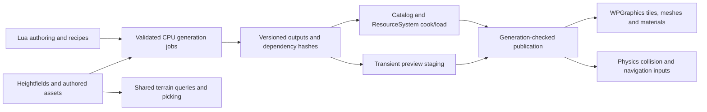

# WPGraphics terrain and procedural review and implementation plan

Reviewed 9 October 2026 against `38e012a5b` in `C:\dev\Workphone`. This extends the [graphics production plan](WPGRAPHICS_PRODUCTION_PLAN.md), retaining animation, particles, water, asset catalog integration and independent backend certification.

Foliage follow-up at `2a37b63ea`: the [dedicated foliage plan](WPGRAPHICS_FOLIAGE_PRODUCTION_PLAN.md) now owns tree/grass/species paging, instancing, LOD/impostors and procedural foliage tools. **Actual batch-count/draw-call reduction and foliage LOD are mandatory R1/GF0 requirements.** Rich plant/biome tools and streaming scale use R2/GF1. The follow-up credits existing merged pine patches and the retained native C pager; its C++ wrapper has been removed.

This was a source audit and proposed implementation programme; the original review changed no runtime code. The [10 October terrain implementation increment](WPGRAPHICS_IMPLEMENTATION_STATUS.md#terrain-data-and-editor-workflow-increment--10-october-2026) now records shared height data, queries/picking/meshes, sample persistence and basic Lua sculpt/undo work. The findings below remain the original audit baseline; that increment does not certify the expanded terrain/procedural scope or complete GT0.

## Outcome and release scope

Production readiness means an advertised feature has a working authoring-to-runtime path, stable saved data, bounded resource use, failure handling, automated checks and representative visual evidence. Existing class names, UI controls, browser demos and test target names are implementation leads rather than completion evidence.

| Track | R1: production core | R2: comprehensive release | Later, separately scoped |
|---|---|---|---|
| Terrain data | Versioned height/layer assets, explicit dimensions/spacing/units, coherent transforms, queries, picking and collision | Tile manifests, holes, large-world coordinate policy, incremental edits | Volumetric/voxel terrain and caves |
| Terrain appearance | PBR splat layers, normals/ORM, stable UVs, correct shadows/fog, baseline tile LOD | Height blending, triplanar/detail normals, macro variation, wetness/snow masks | Virtual terrain texturing and tessellation |
| Terrain authoring | Height import/export, raise/lower/smooth/flatten/stamp, layer paint/normalize, brush preview, undo/redo and save/reopen | Hydraulic/thermal erosion, terrace/noise tools, biome/mask rules, road grading and holes | GPU erosion and collaborative authoring |
| Vegetation/world scale | GF0: paged tree/grass rendering, instancing/material groups with measured draw reduction, near/mid/far LOD, basic scatter/paint/undo/persistence and bounded residency | GF1: richer plant/biome/exclusion tools, textured impostor baking, interaction and multi-view streaming scale | GPU-driven submission and massive-world specialization after profiling |
| Procedural assets | Working service paths, deterministic recipes, valid geometry/bounds/UVs/tangents, generated PBR maps, bake/cook/load, collision/LOD output | Editable rule stacks and texture graphs, robust modelling/CSG/UV tools, cities/buildings/roads/biomes | Destructible generated worlds and specialist simulation |
| Tools | Existing Lua editors drive native services; accurate capability/errors, cancellable generation, save/reopen and runtime-equivalent previews | Selection tools, graph diagnostics, batch baking, generation/residency profiling | Distributed baking |
| Environment | Existing cubemap/IBL/fog integration; coherent procedural sun/light settings | Native atmosphere/time-of-day, water/shorelines/rivers and weather-driven material masks | Clouds, ocean simulation and underwater volumes |

GT0, GP0 and foliage GF0 are additional R1 gates; GT1, GP1 and foliage GF1 are additional R2 gates. GP in the parent plan remains the particle gate. Model editing, CSG and texture graphs belong to the comprehensive release; their controls must report unavailable until implemented. Runtime procedural generation is optional per asset: shipping a cooked procedural asset does not require loading WPProcedural or running its generator.

## Source findings and their implications

| Finding | Current source evidence | Consequence and planned response |
|---|---|---|
| Terrain queries and rendering use different height semantics | [Terrain.cpp](../Engine/cpp/Source/Workphone/Graphics/Terrain.cpp), `getHeightAtWorldPosition`, returns raw bilinear samples; [ClawTerrain.cpp](../Engine/cpp/Source/WPGraphics/ClawTerrain.cpp), `rebuildRenderMesh`, multiplies by height scale and substitutes 1 for near-zero scale | Rendering/query agreement is not established. Define one units/scale/zero-scale contract and migrate stored data; test world translation, scale, interpolation and boundaries |
| World transforms are handled differently by queries | Terrain height lookup subtracts position; terrain-space conversion uses inverse world transform; DX11 draw uses the full world matrix | Non-identity scale/rotation can diverge. Define supported transforms and world-height semantics; use ray queries where a single world-Y height is ambiguous |
| Three terrain representations need an explicit bridge | Native [terrain implementation](../Engine/c/Source/WorkphoneGraphics/workphone_graphics_terrain.c) supports square `2^n+1` grids, triangle interpolation, rays, dirty bounds and LOD/index helpers; engine terrain accepts rectangular grids; Claw constructs a separate mesh and its native terrain pointer starts null | Reuse native query/LOD/index code where appropriate, but do not assume representation parity or complete streamed rendering. Specify rectangular source assets, tiled render adapters, border samples and shared triangulation |
| Claw picking, CPU mesh and layer operations are incomplete | `ClawTerrain::intersects`, `getBlendMap` and `getMesh` return null; `setTextureLayer` and `updateMaterial` are empty; `setHeightMap` only stores a texture reference | Existing base Terrain functionality is bypassed by these overrides. Connect validated CPU data, ray results, blend resources and height-image decoding instead of accepting setter success as rendered behavior |
| Terrain detail is globally capped and replacement is destructive | Claw caps each render side at 257 and nearest-samples the source; rebuild destroys the old mesh before allocating/filling its replacement | This is a preview mesh, not distance-dependent chunk LOD. Retain as a documented fallback; add tiles/error-based LOD and stage successful replacements before retiring old resources |
| Terrain materials use one texture | [ClawRendererDX11.cpp](../Engine/cpp/Source/WPGraphics/ClawRendererDX11.cpp), `renderTerrain`, binds texture 0, clears extra material textures and applies fixed surface values | TerrainSystem detail/blend/normal settings are not a complete Claw PBR terrain path. Implement layer arrays/control maps and shared material/shader bindings |
| Terrain directional shadows already have a submission path | [ClawScene.cpp](../Engine/cpp/Source/WPGraphics/ClawScene.cpp) submits terrains in shadow and colour passes; DX11 terrain draws enable shadow receiving | Preserve this implementation. Add terrain-specific visible shadow tests, tile bounds and quality settings; do not restart shadows as a missing feature |
| Terrain collision bridge needs completion | [CollisionTerrain.cpp](../Engine/cpp/Source/Workphone/Scene/Components/CollisionTerrain.cpp) creates `ITerrainShape` with null data; its width/depth/scale setters store values. [WPPhysicsTerrainShape3.cpp](../Engine/cpp/Source/WPPhysics/WPPhysicsTerrainShape3.cpp) expects an actual mesh/resource and clears collision data when absent | In this inspected path there is no complete heightfield-to-shape bridge. Supply a validated collision representation and rebuild/version coordination; prove contact/raycast agreement rather than component existence |
| Height generation has incompatible sample-count metadata | [CTerrainGeneratorDefault.cpp](../Engine/cpp/Source/WPProcedural/CTerrainGeneratorDefault.cpp) declares `(width+1,height+1)` resolution but flattens a width-by-height noise map; option loading forces height to width | Reject or migrate inconsistent legacy outputs; define sample count versus cell count and row-major order. Use asymmetric fixtures to detect transposition and rectangle loss |
| Terrain tools often record actions rather than execute them | [TerrainEditor.lua](../bin/Media/Scripts/Lua/Editor/TerrainEditor.lua), `performAction`, has real rebuild/height-generation paths, but many sculpt/erosion/biome/collision/LOD actions write `TerrainAction` recipes; mesh/height exports select JSON recipe output | Retain the UI and serialization work. Implement native commands and actual outputs; distinguish saving a recipe from exporting geometry or height samples |
| Generic procedural generation is largely empty | [MeshGeneratorDefault.cpp](../Engine/cpp/Source/WPProcedural/MeshGeneratorDefault.cpp) returns empty road/terrain/object meshes, default settings/status and ignores setters | Audit registration/callers, then adapt working concrete generators behind the existing service. An interface or Lua binding alone cannot satisfy generation |
| Modelling operations need a real kernel | [ProceduralBindings.cpp](../Tools/cpp/Editor/src/procedural/ProceduralBindings.cpp), `applyBooleanToMesh`, ignores its second mesh and mode and returns the first mesh; [ProceduralModel.cpp](../Engine/cpp/Source/WPProcedural/ProceduralModel.cpp), `computeBoundingBox`, is empty | Explicitly report unsupported operations first; implement topology/bounds/CSG and validate output changes. Existing [model editor](../bin/Media/Scripts/Lua/Editor/ProceduralModelEditor.lua) already records/replays operations and must be extended in place |
| Texture export does not honor requested format | [ProceduralTextureBindings.cpp](../Tools/cpp/Editor/src/procedural/ProceduralTextureBindings.cpp), `saveTextureToFile`, emits P6 RGB bytes regardless of the format argument | Select a real encoder and preserve alpha, precision and colour semantics; file extensions must match contents. Report unsupported formats rather than silently writing another format |
| Texture graph UI is ahead of graph execution/persistence | [ProceduralTextureEditor.lua](../bin/Media/Scripts/Lua/Editor/ProceduralTextureEditor.lua), `generate`, selects the first node encountered by `pairs` and handles only noise/normal/colour correction; `getProperties`/`setProperties` are empty | Reuse the editor but implement explicit output selection, deterministic dependency evaluation, graph validation and save/reopen; a node UI does not establish a working graph |
| Useful procedural services/components already exist | [public procedural README](../Engine/cpp/Include/Workphone/Interface/Procedural/README.md), [services](../Engine/cpp/Source/WPProcedural/ProceduralServices.cpp), [component bridge](../Engine/cpp/Source/Workphone/Scene/Components/ProceduralMeshComponent.cpp) and [service tests](../Tests/cpp/ProceduralServices/ServiceTests.cpp) cover road/vehicle/sky/texture services and scene meshes | Reuse these implementations. Generated texture maps still need GPU/material publication; sky parameter calculation is distinct from an atmospheric renderer. Extend the proven bridge rather than inventing a second system |
| Regeneration runs on the application task | `ProceduralMeshComponent::update` calls generation there, with fresh transient mesh identities and CPU-side retention on generation failure | Move expensive preparation to cancellable workers and commit validated results safely. Preserve the current ownership/restore behavior while adding bounded cache identity and render-thread last-good publication |
| Procedural world claims exceed the orchestration shown | [WPProceduralPipeline.cpp](../Engine/cpp/Source/WPProcedural/WPProceduralPipeline.cpp) aggregates noise/textures/buildings/sky and updates sky; procedural world/scene classes hold collections. The module README describes ThreeJS effects and streaming demos | Treat demos as references. Certify native scene generation, jobs, streaming, collision and rendered output separately; no native performance claim follows from a browser demo |
| Current test coverage is uneven | [GraphicsTerrainTests](../Tests/cpp/UnitTests/GraphicsTerrainTests.cpp), [TerrainTests](../Tests/cpp/UnitTests/TerrainTests.cpp), [PhysicsTerrainTests](../Tests/cpp/UnitTests/PhysicsTerrainTests.cpp), component tests, editor tests and procedural service contracts exist; several unit paths return early without required subsystems | Inventory executed assertions and required plugins/backends. Add focused headless/GPU/integration targets; unavailable dependencies must not become passing release evidence |

These are scoped source findings, not claims that every engine backend or caller has the same behavior. Broader performance, numerical stability, navigation and interactive authoring remain to be measured.

## Architecture and ownership

1. **Terrain source:** Workphone owns a versioned terrain descriptor and immutable sample/layer snapshots: sample dimensions, cell spacing in metres, origin, height encoding, scale/offset, layer assets, holes and revision. Decide supported transforms explicitly. Queries must avoid copying the full height array for each sample; use lifetime-bound read views or retained snapshots.
2. **Terrain adapters:** WPGraphics consumes snapshots to build/render tiles and material resources. Physics consumes a collision mesh or native heightfield from the same source revision. Picking consumes the same triangulation and transform policy. Native C remains C90; wrappers remain C++17. Reuse existing native terrain algorithms only after representation/units are reconciled.
3. **Procedural recipes:** WPProcedural computes renderer-neutral CPU outputs from versioned recipes. Identity includes generator/version, seed, normalized parameters, input UUID/content hashes and target settings. Define stable PRNG and traversal order; thread scheduling must not change a result. Same-platform reproducibility is required; cross-platform floating-point equality/tolerances must be declared rather than assumed.
4. **Baking and catalog:** AssetDatabaseManager owns persistent identity; ResourceSystem owns compilation/dependency metadata and containers. Recipes, terrain tiles, generated meshes/material maps, collision and LOD artifacts use that existing pipeline. Preserve stable subasset identities across rebakes; exclude transient preview outputs from durable catalog churn. Shipping manifests include all dependencies and generator format versions.
5. **Jobs and commit:** Workers prepare immutable candidates. Application/scene owners commit component state, the render context publishes GPU resources, and the physics task publishes collision at a defined synchronization point. Source/scene/project generations and cancellation guard every publication. Preparation failure keeps the last complete asset visible; cancel/drain jobs before unload. Preview may show pending geometry, but gameplay edits must expose a coherent render/collision revision or remain pending.
6. **World streaming:** One shared scheduler manages requests, priorities, CPU/GPU/collision budgets and cancellation. Terrain tiles and generated city/foliage chunks are producers with residency states, not separate competing streamers. Multi-camera demand uses a budgeted union; shadow/reflection views have explicit demand policies. Active gameplay collision gets a residency margin and must remain available until replacement is ready.
7. **Authoring:** Extend the existing terrain/model/texture Lua editors and thin native bindings according to [editor conventions](../Tools/cpp/Editor/docs/CONVENTIONS.md). Native commands own geometry, brush math and long jobs. The command system groups a brush stroke into one undo item and bounds history memory. Do not duplicate existing Lua editors in C++ or add shared-interface virtual methods casually; stage any required ABI migration separately.
8. **Capabilities:** Report implemented/experimental/unavailable per operation, backend, device and quality tier. Disabled actions explain the missing capability. Completion status requires an actual result or explicit failure; metadata recording is reported as recipe editing. Device recovery rebuilds resources from retained CPU/cooked data through the same publication service.

## Terrain work packages

Dependencies use parent-plan IDs where applicable. Each row includes implementation and its required acceptance evidence; feature promotion requires both.

| ID / tier | Deliverable and main code owners | Dependencies | Required evidence |
|---|---|---|---|
| TERR-01 / R1 | Terrain engineer: normalize sample/cell counts, rectangular row order, units, spacing, height scale/offset, transforms, finite/range checks, overflow limits and versioned legacy migration in Terrain/ClawTerrain/generator adapters | BASE-01/04; asset formats coordinate with DB-07 | Asymmetric 3×5 ramp/saddle, 257×257 and larger grids; invalid lengths/NaN/overflow rejected; zero/negative scale policy explicit; render/query positions agree |
| TERR-02 / R1 | Terrain/physics engineers: shared height/normal sampling, triangle-consistent ray picking, CPU/collision mesh bridge, conservative world bounds and supported-transform handling | TERR-01, CORE-01/02 | Corner/edge/interior/vertical/oblique rays, out-of-bounds policy, translations/nonuniform scale; physics ray/contact checks against the same revision; unsupported rotations diagnosed |
| TERR-03 / R1 | Rendering engineer: staged tile meshes, material/control-map resources, bounded four-layer initial PBR splatting with albedo/normal/ORM and UV tiling; normalize weights with a defined zero-weight fallback | TERR-01, MAT-01/TEX-01, DB-07/08 | Four distinct layers visibly blend; normal/roughness effects change GPU output; sum/zero-weight tests; shadows/fog and render-texture views match; failed upload retains old tile/material |
| TERR-04 / R1 | Tools engineer: image/raw height import, actual height/mesh export, raise/lower/smooth/flatten/stamp and layer painting, dirty rectangles, viewport brush/picking, stroke undo/redo and persistent edit data | TERR-02/03, DB-07/08, editor command service | Edit→undo→redo→save→restart→reload restores identical samples/weights; cancelled stroke leaves no partial edit; exports decode/reimport; repeated edits refresh geometry/normals/collision |
| TERR-05 / R1 baseline, R2 scale | Terrain/rendering engineers: chunk partitioning, shared border samples, baseline LOD, geometric error bounds, neighbor-aware stitch/morph policy and tile culling; replace global nearest-sample reduction | TERR-01/02, GEO-01 | Adjacent tiles of differing LOD have no cracks or normal discontinuities; camera threshold sequences do not oscillate; shadow views retain relevant casters; collision error remains within declared gameplay tolerance |
| TERR-06 / R2 | Terrain/streaming engineers: tile manifests, async decode/generation/upload, prefetch, eviction, upload budgets, multi-view residency, cancellation and origin policy | TERR-05, DB-07/08, shared M6 streaming | Flythrough/teleport/camera-switch under bounded memory; stale requests cannot resurrect evicted tiles; reload/unload during work; cold/warm timings and pending/active counts recorded |
| TERR-07 / R1 integration, R2 expansion | Terrain supplies corrected ground sampling, masks, exclusion inputs and dirty regions to FOL-01 through FOL-13 in the foliage plan; it does not implement a second foliage renderer/streamer | TERR-01/02/03; FOL core; TERR-06 for scale | GF0 proves foliage LOD and actual draw reduction plus basic deterministic placement; GF1 adds richer biomes/plant tools; terrain edits correctly resample only affected instances |
| TERR-08 / R2 | Procedural/tools engineers: deterministic hydraulic/thermal erosion, terrace/noise, mask generation and tile-border halos; non-destructive recipe stack with cancellable previews | TERR-01/04, PROC-01/02 | Known erosion fixtures and finite-value checks; shared borders match; seed/parameters replay; undo/cancellation/version migration work; runtime cost and peak temporary memory recorded |
| TERR-09 / R2 | Terrain/physics/tools engineers: hole masks, road/river grading, collision/nav input rebuilds and water shoreline integration; preserve manual edits and recipe dependency ordering | TERR-02/04, PROC-08, WATER-01/04 | Ray/contact/nav inputs respect holes; road cut/fill and river banks meet terrain without gaps; edit regeneration updates dependent assets; no missing gameplay collision during publication |
| TERR-10 / both | QA/terrain engineers: terrain capability inventory, diagnostics, format/migration docs, mixed scene fixtures, focused test targets and final evidence | Continuous; release depends on relevant TERR rows | Separate headless, component, GPU, visual, physics, performance, soak and package reports; unsupported cases visible; GT0/GT1 checklists complete |

Initial terrain tier supports a documented four-layer tile material. Additional layer counts require explicit resource limits and shader variants. Terrain LOD may simplify visual geometry, but gameplay queries/collision must share the authoritative source and a declared approximation tolerance; silently returning raw heights under a scaled render mesh is unacceptable.

## Procedural work packages

| ID / tier | Deliverable and main code owners | Dependencies | Required evidence |
|---|---|---|---|
| PROC-01 / R1 | Procedural engineer: inventory registered generators and every UI/binding action; fix false-success paths, bounded inputs, seed/version/parameter contracts, mesh bounds and consistent error/status reporting | BASE-01/04; existing service contracts | Defaults/setters round-trip; identical recipes reproduce results; changing meaningful inputs changes output; empty generic/CSG paths report unavailable until implemented |
| PROC-02 / R1 | Procedural/job engineer: cancellable generation requests, debounce, progress, worker preparation, memory/complexity limits and generation-safe commits; adapt ProceduralMeshComponent | CORE-01/02/05, PROC-01 | Rapid parameter edits publish only newest result; cancellation/unload/plugin removal drains safely; failed generation preserves prior owned/reused components; UI remains responsive |
| PROC-03 / R1 | Asset/rendering engineers: shared generated asset bake/cook/publish for mesh/submeshes, PBR maps/materials, collision, baseline LODs and stable subasset UUIDs; runtime loads cooked results without editor/generator dependency | DB-07/08, M4, PROC-01/02 | Recipe→cook→catalog→GPU draw and package reload; generated albedo/normal/ORM visibly affect output; dependency rebake/rename/failure tests; hashes and resource counts recorded |
| PROC-04 / R1 primitives, R2 editing | Procedural/tools engineers: adapt working geometry kits/rules behind generic services; explicit topology/selection kernel for extrude/inset/bevel/bridge/connect/subdivide/triangulate/weld/detach/edge loops and CSG | PROC-01/02; publication uses PROC-03 | Index/attribute/bounds/winding checks; nonmanifold/degenerate/coplanar cases produce valid results or explicit failure; union/subtract/intersect independently alter expected volume/topology; undo preserves selections |
| PROC-05 / R1 | Procedural/asset engineers: finite attributes, normal/tangent policy, UV/material seam preservation, collision generation, baseline LOD baking and real format-specific export/import | PROC-01/03/04; TERR-02 for terrain adapter | Reimported mesh retains topology/submeshes/materials; indices fit; normal/tangent directions and UV seams correct; simplified colliders remain usable; format signatures match extensions |
| PROC-06 / R1 maps, R2 graph | Texture/tools engineers: upload/bind existing generated PBR maps; versioned texture graph with noise/blend/mask/warp/colour/normal/height/edge-wear/atlas nodes, typed sockets, cycle rejection and incremental baking | PROC-03, TEX-01 | Tile seams/seed/repeatability; albedo sRGB versus linear normal/ORM/height; mip semantics; alpha/precision preserved; graph save/reopen/migration/cancellation; supported encoders round-trip |
| PROC-07 / R2 | Tools engineer: extend model/texture Lua editors with actual operation results, native selection/picking, ordered rule stacks, graph diagnostics, undo, previews and batch bake/export | PROC-04/05/06, UI-01, TOOL-01/02 | Every advertised action exercises a native operation and persists; preview matches cooked runtime; missing services produce errors; scene selection changes/unload/hot reload leave no dangling listeners |
| PROC-08 / R1 current road bake, R2 roads/world | Procedural/terrain/physics engineers: road splines/intersections/camber/markings/sidewalks, terrain cut/fill, buildings/parcels/city layout and biome/prop exclusions; generated collision and navigation inputs | Existing road/building services, PROC-03/05, TERR-01/02; later grading coordinates with TERR-09 | Curves/junctions/grades have valid tangents/UVs/collision and no cracks; nonplanar cases handled; deterministic parcels/scatter; vehicles and characters traverse representative junctions |
| PROC-09 / R2 | World/streaming engineer: adapt procedural scene/world collections and pipeline into chunk producers using shared scheduler, independent deterministic chunk seeds, dependencies, instance manifests and cache eviction | PROC-02/03/08, TERR-06, shared M6 streaming | Chunk request order does not change world; neighboring outputs agree; teleport/cancel/unload tests; bounded CPU/GPU/collision memory; cook-only and runtime-generation tiers documented |
| PROC-10 / R1 parameter bridge, R2 atmosphere | Rendering/procedural engineers: sun/moon/ambient/fog parameter coherence, native sky rendering and IBL update policy, water/river masks and particle interaction events | Existing sky service, M4/M5, WATER work, FX work | Time-of-day sequences and exposure/IBL transitions; no stale lighting across views; river/water/terrain agreement; parameter service results distinguished from rendered atmosphere |
| PROC-11 / both | QA/tools engineers: named capability tests, deterministic/generative test corpus, generator migrations, external consumer/package and Lua/native runtime fixtures | Continuous | Record mandatory/unavailable outcomes; real procedural scene renders outside editor; long regeneration/scene cycles bounded; GP0/GP1 checklists complete |

CSG kernel selection requires a small technical spike on robustness, supported topology, attribute preservation, license, build integration and maintenance. The proposal is to integrate a suitable existing kernel if it meets those criteria; do not commit to writing robust general CSG from scratch before that evaluation. No additional renderer or graph framework is required merely to expose existing generators.

## Milestones, dependencies and staffing

| Milestone | Deliverable | Required predecessors | Provisional subsystem effort | Gate |
|---|---|---|---|---|
| M6A | Terrain semantics, queries/picking/collision, PBR layers, basic tile LOD and persistent sculpt/paint | M0; M1/M1A lifecycle and assets; M4 materials | 4–7 engineer-weeks | GT0, R1 |
| M6B | Terrain streaming, biome masks/erosion/holes and terrain-world integration; foliage now M6E/M6F | M6A; shared streaming/frame contracts | Re-estimate after foliage split | GT1, R2 |
| M6C | Honest procedural services, safe generation, generated material maps and complete asset bake/export | M0; M1/M1A; M4; TERR-01/02 for terrain outputs | 4–7 engineer-weeks | GP0, R1 |
| M6D | Modelling/CSG/UV tools, texture graphs, roads/cities/world authoring and atmosphere integration | M6C; M6A/M6B for terrain/streaming portions; M5/M7 for environment | 8–14 engineer-weeks | GP1, R2 |

The earlier 21–37 engineer-week allowance is historical after extracting the dedicated foliage track. M6E/M6F provisionally allow 9–15 engineer-weeks in the foliage plan; these expand and replace the prior vegetation allowance rather than adding cleanly to it. Re-estimate M6B and remove overlapping general instancing/paging/scatter work before rolling up totals. Shared device/catalog/frame/streaming services and programme certification remain separate. M0 must credit working code, fix fixture/hardware availability and estimate with named owners before publishing dates.

Terrain and procedural correctness can start alongside graphics batches B/C. Neither needs to wait for TAA/water/DX12. GPU layers require M4 resource bindings; streaming needs shared lifecycle/budget contracts; water/atmosphere integration needs the GPU frame. The critical release path is shared lifecycle/cook/publication → terrain/procedural complete slices → mixed-scene recovery/performance → packaging/certification.

Assign one accountable owner per gate: terrain engineer for GT0/GT1, procedural/tools engineer for GP0/GP1, graphics lead for cross-system contracts. Physics, rendering, asset pipeline, technical art and QA/build provide explicit shared tasks. Parallel staffing is a programme decision, not a reduction in acceptance criteria.

## First four reviewable delivery batches

| Batch | Concrete implementation scope | Exit condition |
|---|---|---|
| T/P-A: correctness and capability audit | TERR-01; TERR-02 query/pick slice; PROC-01; fix generator sample counts/row order, mesh bounds, false-success boolean/export reporting and invalid-input handling | Tiny asymmetric fixture agrees across sampling/picking/CPU geometry; supported operations actually change output; unsupported operations cannot report success; regression tests identify each repaired defect |
| T/P-B: terrain asset-to-world slice | TERR-02/03 and minimum TERR-04/05: one cooked terrain with four layers, working picking/collision, one sculpt/paint stroke with undo and save/reload, baseline tiled geometry | DX11 capture plus physics ray/contact evidence agree; real export/reimport and saved edit replay; failed rebuild/upload preserves prior complete revision; tile seams are checked |
| T/P-C: procedural recipe-to-runtime slice | PROC-02/03/05, initial PROC-06 maps: a seeded road/building/vehicle or primitive fixture, generated material maps, collision/LOD outputs and external cooked loading | Repeated bake/reopen yields stable outputs; meaningful recipe changes appear on screen; maps visibly affect PBR; stale/cancelled jobs cannot publish; package runs without authoring dependencies |
| T/P-D: scale and comprehensive tools | TERR-06/07 coordination; PROC-04/06/07/08/09, then erosion/holes/environment integration; foliage F-A/B/C run earlier for R1 | Streamed terrain/foliage/city scene meets memory/frame budgets; modelling/graph actions produce and persist real results; R2 evidence covers supported operations and integration with water/particles. Essential foliage LOD/draw reduction cannot wait for this batch |

T/P-D is a sequence of smaller PRs grouped by feature; never merge an entire modelling kernel, graph editor and world streamer as one review unit. Every PR identifies its package, representative fixture, actual tests/captures and remaining limitations. This document proposes work; implementation starts only when that work is requested.

## Validation and measurable acceptance

Extend existing harnesses before introducing new frameworks. The 10 October increment adds terrain data/query/editor contracts and a real Lua workflow target, and extends Claw production/DX11 pixel fixtures for geometry edits. Terrain scene/collision integration, DX11 terrain material output, procedural operation/export contracts, and procedural recipe-to-cooked-render integration remain proposed coverage. Reuse ProceduralServiceTests, native C contracts and the editor Lua lifecycle harness. Required configurations are the parent plan's Debug and RelWithDebInfo; static/shared/package variants remain shipping checks.

| Evidence type | Mandatory scenarios |
|---|---|
| Headless | Asymmetric grids/counts; scale/spacing/triangulation; finite samples/attributes; weight normalization; bounds/indices/UVs; stable PRNG and hashes; graph cycles; legacy format migrations; corrupted artifacts and export signatures |
| Component/job | Generator setters and service availability; stale generations; cancellation; unload/reload/plugin teardown; restored user-owned components; grouped undo/redo; same terrain revision across graphics/physics; dependency rebake |
| Physics/navigation handoff | Render/query/physics ray agreement, falling body/vehicle contacts, collision LOD error, tile-edge traversal, holes and road grades; verify real navigation rebuild if that capability is advertised |
| GPU/visual | Four-layer PBR terrain; border/LOD sequences; cast/receive shadows; normals/ORM; generated asset textures; two views/render textures; scaled terrain; foliage wind/bounds; sky/IBL; water intersections and mixed transparent effects |
| Interactive tools | Brush cursor follows actual hit; strokes/selection/operations change output; undo/redo/save/reopen; graph validation; visible errors; format-correct export; live generation cancellation and hot reload |
| Performance/soak | Fixed flythrough and teleport; cold/warm generation and cook; p50/p95/p99 CPU/GPU/frame and job latency; upload volume/queue; draw/instance counts; CPU/GPU/collision/cache peaks; 1,000 regeneration/load/unload/resize cycles and parent-plan eight-hour soak |
| Packaging | Installed external consumer loads cooked terrain/generated assets and all material dependencies; no editor-only paths or generator requirement for cooked content; license/fixture/generator versions included |

Initial numerical targets are proposals to calibrate in M0:

- Preserve the parent mixed-scene 1080p p95 GPU ≤16.7 ms and render-submission CPU ≤4 ms target on declared reference hardware. Measure terrain, foliage, generation and upload contributions separately; do not assign a subsystem the entire frame budget.
- Lock an initial terrain test corpus: asymmetric 3×5 queries, 257×257 tile fixtures, a 1025×1025 source split into shared-border tiles, and a larger multi-tile flythrough with declared world dimensions/materials/foliage counts. Large data must be tiled under budgets rather than silently reduced to 257×257 globally.
- For exact full-resolution fixtures, proposed render/query/physics position agreement is `1e-4 × max(1, fixture extent)`; define separate visual/collision LOD error in metres and screen pixels. Use triangle-aware saddle cases because bilinear agreement on a planar ramp cannot prove triangulation parity.
- Require no full-map CPU copy per height query, no unbounded preview-resource accumulation, no synchronous generator work in the steady-state render loop and no unexplained memory growth after warm-up. Decide cache, upload-per-frame, undo-history and active collision budgets from measured fixtures before GT0/GP0 certification.
- Record generation/cook/preview latency and cancellation time with recipe complexity, seed, hardware and worker count. Set numeric latency budgets after representative generation measurements; the module README's texture/sky timing statements are not accepted measurements.

**GT0:** A packaged DX11 scene loads versioned terrain, renders PBR layers and shadows, agrees with height queries/picking/physics within declared tolerances, has stable baseline tile LOD and preserves real sculpt/paint edits through undo and restart. Invalid/stale/failing edits retain a complete usable revision. Mandatory headless, integration, GPU, interactive and package evidence is present.

**GP0:** A deterministic procedural recipe produces valid mesh/material/collision/LOD outputs, bakes through the catalog/resource pipeline and renders from cooked assets outside the editor. Generated maps reach GPU materials. Generation/reload/cancellation and actual export/reimport work; unsupported operations are explicit. Repeated generation does not leak resources or overwrite user-owned components.

**GT1:** Neighbor LOD/streaming, vegetation/biomes, erosion/holes and road/water integration pass visual, collision and performance tests under declared budgets and multi-view demand. Cold streaming, teleport and cancellation preserve active gameplay collision and bounded residency.

**GP1:** Advertised modelling/CSG/UV operations and texture graphs produce valid persistent outputs; road/city/world tools integrate with terrain/collision/shared streaming; environment integration is visible in native runtime output. Save/reopen, recipe/generator migrations, batch baking and mixed-scene performance pass. Features deferred from this tier remain explicit backlog items and are removed from its published support claim.

## Decisions to close before implementation expands

1. Freeze terrain units, sample/cell counts, row order, triangulation, height scale/offset, world-height semantics, supported transforms and legacy migrations. This is the first blocking design decision for terrain consumers.
2. Choose baseline tile/LOD representation and error policy after a two-tile prototype; reconcile native square-grid restrictions through adapters without breaking rectangular source assets.
3. Pick the first real generated-asset fixture and supported export encoders; confirm fixture licenses, generator dependencies and stable subasset IDs.
4. Decide which topology/CSG/UV kernel to reuse after the bounded spike; record robustness/license limits and explicit unsupported cases.
5. Establish revision publication, collision residency, undo-history and async job budgets jointly with M1/M1A/M6 owners. Define which recipes are offline-only and which may generate during gameplay.
6. Assign owners, supported hardware/content sizes and accepted R1/R2 feature lists. Expand platform/backend claims only with separate evidence.
