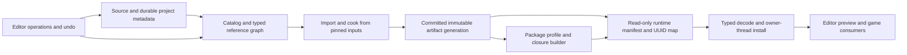

# Workphone resource and asset system production plan and review

Implementation follow-up: [current changes, validation and remaining gates](WPRESOURCE_ASSET_IMPLEMENTATION_STATUS.md).
The findings below describe the review baseline; the ledger records subsequent repairs.

Reviewed and refreshed: 10 October 2026 in `G:\Workphone`, source baseline `ada702f91db9c9b3c9eadc09014091b9711a4755`. The initial review used `cb1463b7a`; the findings and execution priorities below now reflect the later runtime, graphics, Lua and Editor implementation. This is an implementation plan, not a release certification.

Status: retain the repaired catalog, cooked material/texture bridge, cooked Lua modules and read-only runtime manifest mount. Production readiness is blocked by unsafe authoring mutations/durability, cooked-file/index commit ordering, identity/variant collisions, disconnected Editor services and incomplete packaged typed-consumer adoption. This refresh includes source review and three retained-binary tests; no source rebuild, interactive Editor validation, independent package launch, crash-injection run or performance benchmark was performed.

Related plans: [WPGraphics production](WPGRAPHICS_PRODUCTION_PLAN.md), [animation production](WPANIMATION_PRODUCTION_PLAN.md), [foliage production](WPGRAPHICS_FOLIAGE_PRODUCTION_PLAN.md) and [physics production](WPPHYSICS_PRODUCTION_PLAN.md). This document owns shared identity, dependency, import/cook, runtime residency, publication and packaging contracts. Feature plans own the contents and quality of their typed assets.

### Current review summary

| Area | Current foundation | Required production completion |
|---|---|---|
| Catalog/database | Bound catalog CRUD, canonical paths, schema migration, file/scene kinds and lifecycle snapshots | Durable project metadata, safe maintenance/backup, serialized mutation routes, per-asset revisions, exact legacy adapters and domain migrations |
| Cooking | Compiler registry, dependency hashing, persistent SQLite index, validated atomic individual containers | Collision-free BuildKeys, immutable inputs/artifacts, recoverable generation commit and shared-root writer ownership |
| Runtime | WPRS manifest, source/registry/SQLite-free mount, exact pinned install closure, bounded synchronous loading | Runtime UUID mapping, typed installation, async residency/global budgets, multi-mount/package lifecycle and real application adoption |
| Consumers | Cooked material/texture DX11 stage/swap and bounded Lua source/preload/VM replacement | Source-free graphics/Lua installation, scene/mesh/animation/audio/UI integration and coordinated compatible-set publication |
| Editor | Asset tree, import jobs, resource picker, Lua tools and atomic project document save | One project asset session, transactional operations/undo, functioning database/picker/package tools, owner-thread job publication and scale |
| Shipping | Manifest export and generic relocated runtime contract fixture | PackageEditor/CLI using pinned typed closure, UUID map, failure-safe bundle publication and relocated game launch |

The first deliverable should be an integrity slice: safe database maintenance, explicit legacy lookup/attribute repair, binary-safe asset operations and durable identity migration. Runtime mount work should be extended, not restarted. Follow with immutable build generations, shared typed consumers and one actual Editor-to-package workflow. Sections 5 and 11 define the execution order and completion criteria.

### Earlier implementation increments (historical provenance)

Implementation follow-up, 10 October, starting at `7107f0a39`: the first typed
material/texture consumer now exists in WPGraphics. `GraphicsResourceCompiler`
registers `matres`/`texres` descriptors with bounded portable payloads, offline
semantic mips, explicit compile/install edges and pinned texture hashes/versions.
`ClawMaterialResource` stages a complete DX11 bundle and coordinates its final
catalog snapshot check with the pointer swap, rejecting obsolete requests and
device generations. It also checks the loaded root against its compilation
report. This addresses the narrow graphics portion of **RV-08/RV-15** and
**RES-010/019/021/022**; broader repairs remain open and the current findings
below distinguish this implemented slice from remaining work. See [implementation status and
execution evidence](WPGRAPHICS_IMPLEMENTATION_STATUS.md) and [format/ownership
guide](WPGRAPHICS_COOKED_RESOURCES.md). In particular, **RV-04/05/06/07/11**
were not closed by that increment: these compilers reject subresources, typed readers reject mismatched
targets, and callers must isolate variant output roots, but the shared storage,
input snapshot, crash recovery and source-free runtime work is still required.

Implementation follow-up, 10 October 2026, starting at `eead5c43d`: a first
**RES-018** load-only mount now exists on the concrete `ResourceSystem`, without
changing `IResourceSystem` virtual methods. `writeRuntimeManifest(path, roots,
error)` exports a deterministic version-1 WPRS manifest containing target,
root IDs, exact compiler/source/payload hashes, payload sizes and install edges.
Every resource must first pass `compile()` (including `UpToDate`) in the current
authoring session. A committed recook invalidates evidence for that resource and
its transitive dependents, so an independently changed child cannot be packaged
with an unchecked parent; evidence for independent roots remains reusable.
Export validates cooked files against committed compilation records before
atomically replacing the manifest; failed export retains the previous manifest.

Copy that manifest and its matching cooked containers to a separate immutable
directory, then construct `ResourceSystem(nullptr, nullptr)` and call
`initializeRuntime(RuntimeResourceConfig, error)` with `compiledRoot`,
`manifestPath` and the expected `target`. Ordinary `load(ResourceID, error)`
then validates and retains the declared install closure. The mount requires no
source tree, compiler registry, catalog or writable compilation database, and
rejects cooking/export operations. Manifest mismatches, missing/corrupt files,
cycles and configured limits fail without publishing a partial cache entry.
Default request limits are 1 GiB of unique payload bytes, 4,096 resources and
64 dependency levels; `maxPayloadBytes`, `maxClosurePayloadBytes`,
`maxClosureResources` and `maxDependencyDepth` configure those bounds. Manifest
parsing additionally caps bytes, identifier lengths, entry counts and edges.
Synchronous requests share retained resource identities. Recook/unload
conservatively clears the weak lookup cache, including parents holding prior
dependency snapshots; caller-owned immutable resources survive that operation
and shutdown.

Validation **passed in Debug and RelWithDebInfo** through `WPResourceTests`;
the complete required baseline reports 18 passed and one unavailable external-mesh
test in each configuration. See [execution evidence](WPGRAPHICS_IMPLEMENTATION_STATUS.md).
`ResourceRuntimeContracts.hpp`,
called by the existing `WPResourceTests` smoke executable, covers real SQLite
cook/restart, deterministic and failed export, current-target provenance,
relocation with source and authoring DB removed, read-only file preservation,
shared diamond dependencies, byte/count/depth limits, concurrent retained loads,
corrupt/missing/stale artifacts, malformed manifests and last-good lifetimes.
This is a synchronous container mount and portable manifest foundation, **not
resource R1 certification**. UUID resolution, typed decode/install registration,
PackageEditor integration, source-free domain-consumer execution, asynchronous
residency/global memory budgets, immutable build generations, crash recovery and
cross-process ownership remain open. Target names and pinned hashes here do not
repair the shared build-variant output namespace or authenticate packages. The
current findings below supersede the original present-tense gaps; the release gates remain open until independently demonstrated.

## 1. Intended outcome and release tiers

Deliver a single dependable asset workflow: discover/import source → preserve identity/settings → cook the exact dependency graph → load/install typed runtime resources → publish a coherent replacement → author/preview/save in the Editor → package and run without source files or authoring databases. Errors, cancellation, disk/process failure, rename, duplicate, delete, project switching and incompatible data must have predictable outcomes without losing authored content or the last working runtime asset.

| Release | Required scope |
|---|---|
| **R1: production asset foundation** | Windows x64; authoritative durable asset identity and metadata; reliable SQLite catalog and rebuildable compilation index; exact dependency/reference queries; transactional Editor file operations with binary-safe undo; deterministic incremental cooking and typed first-party loaders; async requests/cancellation and coherent last-good publication; complete asset-browser/import/diagnostic workflows; source-free read-only packaged runtime; recovery, scale and integration evidence |
| **R2: comprehensive resource platform** | R1 plus stable embedded subassets, platform/quality variants, scalable search/collections/previews, stronger validation and batch tooling, chunked streaming/residency, local/shared derived-data caching, reproducible content bundles/patches, version-control collaboration and extension SDKs. Each supported asset family receives complete compile/load/editor/package coverage |
| **Separate optional integrations** | Hosted asset management, remote build farms, marketplace/CDN delivery, collaborative live editing, organization permissions/approvals, arbitrary mod execution, asset encryption/DRM and external source-control providers. Add only against a concrete product requirement; they are not substitutes for local correctness |

R1 certifies a shared pipeline and the declared R1 asset families, not every existing extension/backend advertised elsewhere in the engine. R2 broadens that supported matrix. Additional platforms use the same architecture with their own filesystem, compiler, format, device and packaging evidence.

## 2. Thorough source review

### 2.1 Foundations to preserve

- [AssetDatabaseManager](../Engine/cpp/Source/Workphone/Database/AssetDatabaseManager.cpp) now uses bound catalog values, transactions, explicit file/scene kinds, UUID-scoped deletion, canonical root-relative paths and detached lookup results. Lookup misses do not invent persistent identity. Schema-v2 migration and lifecycle snapshots are real existing work; do not describe the earlier SQL/scoped-deletion defects as unchanged in this class.
- [AssetCatalogPath](../Engine/cpp/Source/Workphone/Database/AssetCatalogPath.cpp) validates UTF-8/length, records platform path policy, audits aliases/containment and rejects unsupported paths. Reuse this behavior when unifying legacy and Editor paths.
- [CatalogResourceAdapter](../Engine/cpp/Source/Workphone/Database/CatalogResourceAdapter.cpp) binds catalog identity to typed ResourceIDs and validates requests before/after compile/load. Its header explicitly leaves final consumer publication to a separate owner.
- [ResourceSystem](../Engine/cpp/Source/Workphone/System/ResourceSystem.cpp) has recursive compile/install dependency handling, cycle diagnostics, source/transitive hashes, compiler version checks, up-to-date validation, atomic single-file output and a weak runtime cache. [CompiledResourceIO](../Engine/cpp/Source/Workphone/System/CompiledResource.cpp) validates bounded headers, payload length/identity/hash and uses an endian-stable container.
- [Runtime mount/export](../Engine/cpp/Source/Workphone/System/ResourceSystem.cpp#L898) already supports source-free read-only WPRS manifests with pinned install closures, target validation, unique closure limits and cache publication after a complete successful synchronous load. Preserve [runtime contracts](../Tests/cpp/ResourceRuntimeContracts.hpp) and the serialized retained-resource identity guarantee.
- [GraphicsResourceCompiler](../Engine/cpp/Source/WPGraphics/Resources/GraphicsResourceCompiler.cpp#L345), [typed formats](../Engine/cpp/Source/WPGraphics/Resources/GraphicsResourceFormats.cpp) and [ClawMaterialResource](../Engine/cpp/Source/WPGraphics/Resources/ClawMaterialResource.cpp#L106) provide real cooked texture/material compilation, dependency generation checks and coordinated DX11 bundle publication. [LuaScriptCompiler](../Engine/cpp/Source/WPLua/LuaScriptCompiler.cpp) and [LuaManager](../Engine/cpp/Source/WPLua/LuaManager.cpp#L619) provide syntax-checked cooked source, explicit module dependencies, preload installation and replacement-VM rollback. These are implemented slices awaiting broader adoption.
- [Project document save](../Tools/cpp/Editor/src/editor/Project.cpp#L104) already uses same-directory temporary replacement. Preserve this and existing scene/prefab identity repairs while adding asset-session ownership and transactional multi-file metadata operations.
- [ResourceCompilationDatabase](../Engine/cpp/Source/WPSQLite/ResourceCompilationDatabase.cpp) uses prepared statements, transactions, foreign keys, WAL and a versioned rebuildable index. [ResourceReference](../Engine/cpp/Include/Workphone/Database/ResourceReference.hpp) already models required/optional/soft/excluded modes, platforms, tags and priority; consolidate its semantics rather than invent competing flags.
- [Catalog tests](../Tests/cpp/AssetCatalogTests.cpp), [path contracts](../Tests/cpp/AssetCatalogPathContracts.hpp), [adapter contracts](../Tests/cpp/CatalogResourceAdapterContracts.hpp), [resource smoke tests](../Tests/cpp/ResourceSystem/ResourceSystemSmoke.cpp) and [resource unit tests](../Tests/cpp/UnitTests/ProductionResourceSystemTests.cpp) provide useful regression foundations.

### 2.2 Prioritized findings and implications

P0 means a data-integrity or shipping blocker in the relevant supported workflow. P1 means required production reliability/completeness work. P2 means comprehensive scale/tooling work. Findings describe inspected source behavior or a clearly stated risk; they are not claims of interactive reproduction.

| ID / priority | Evidence and concrete consequence | Required repair / proof |
|---|---|---|
| **RV-01 / P0: remaining legacy lookups bypass catalog contracts** | [ResourceDatabase.cpp](../Engine/cpp/Source/Workphone/Database/ResourceDatabase.cpp#L1499) constructs exact-match and substring `LIKE` SQL with unbound input for remaining non-Lua paths; [getObject](../Engine/cpp/Source/Workphone/Database/ResourceDatabase.cpp#L2247) also builds UUID SQL. The `.lua` route now uses canonical catalog identity and preserves imported UUIDs, but other paths still mix lookup/load/create | Extend the repaired exact path to all families with structured outcomes. Restrict fuzzy matching to explicit legacy repair; test apostrophes, `%`, `_`, duplicate basenames, missing paths and failed DB access |
| **RV-02 / P0: Editor moves/copies are filesystem-only** | [ProjectAssetsWindow.cpp](../Tools/cpp/Editor/src/ui/ProjectAssetsWindow.cpp#L1005), `copyAsset`/`moveAsset`, copy or rename files and refresh folders without a catalog/dependency/reference transaction. `moveAsset` returns true after `Path::rename` without checking its result here. Containment is lexical lowercase-prefix comparison, unlike catalog path auditing | One operation service for filesystem, identity, metadata and references; actual filesystem success, canonical containment, rollback/recovery and undo. Move preserves UUID; duplicate generates new IDs/remaps internal references |
| **RV-03 / P0: delete undo is not a general binary restoration path** | [RemoveResourceCmd.cpp](../Tools/cpp/Editor/src/commands/RemoveResourceCmd.cpp#L15) captures files through `readAllText` and restores with `writeAllText`; folder undo reconstructs paths/resources ad hoc. This cannot guarantee byte-identical restoration for textures, audio or binary meshes, and does not preserve the complete filesystem/metadata/reference transaction | Quarantine/trash or byte-safe disk snapshots, exact manifests including empty folders and identities, conflict-aware undo/redo and crash recovery. Test binary hashes, large trees, metadata and external edits |
| **RV-04 / P0: cooked output precedes metadata commit** | [ResourceSystem.cpp](../Engine/cpp/Source/Workphone/System/ResourceSystem.cpp#L640), `compileNode`, replaces the output before `commitCompilation` at line 655; metadata failure returns before runtime-cache/evidence invalidation. Disk can contain new bytes with old index/cache state despite reported failure | Stage immutable generations and commit/publish a generation manifest, or a tested journal/compensation protocol. Inject failures between write, metadata commit, cache publication and consumer swap |
| **RV-05 / P1: runtime mount exists; packaged identity/consumer adoption remains open** | [initializeRuntime](../Engine/cpp/Source/Workphone/System/ResourceSystem.cpp#L898) already avoids source/compiler/SQLite/writes. [CatalogResourceAdapter](../Engine/cpp/Source/Workphone/Database/CatalogResourceAdapter.cpp#L25) still requires source/registry binding, and the manifest resolves ResourceIDs rather than scene/property AssetUUIDs. Export explicitly leaves immutable payload copying to its caller | Extend existing mount with package UUID/subasset mapping, typed format/installer registry and application bootstrap. Prove scene/property resolution and typed consumption in a relocated read-only package with catalog, source, build DB, importer and Editor absent |
| **RV-06 / P0: subresource output path aliases** | [ResourceID.cpp](../Engine/cpp/Source/Workphone/System/ResourceID.cpp#L304), `compiledRelativePath`, drops the parent extension and appends `_child.type`. `data://characters/hero.charres:walk.animres` and `data://characters/hero_walk.animres` both map to `characters/hero_walk.animres`; different parent types can also collide | Versioned collision-free layout keyed by the complete resource identity/build variant, with ownership conflict rejection and migration. Add both alias cases before enabling embedded-subasset workflows |
| **RV-07 / P0: build variants share the physical/key namespace** | `compileNode` hashes target/mode, but [CompiledResourceRecord](../Engine/cpp/Include/Workphone/Interface/Database/IResourceCompilationDatabase.hpp#L13) and output/cache keys remain ResourceID-only. WPRS pins an expected target and graphics payloads check target/mode, but these checks do not prevent writers overwriting a shared variant root | Enforce isolated roots and incompatible-root ownership rejection immediately; implement composite BuildKeys and variant-qualified records/outputs. Preserve runtime target checks; test simultaneous services/processes/targets/modes |
| **RV-08 / P0: coherent publication exists only for a narrow consumer slice** | [ClawMaterialResource::publish](../Engine/cpp/Source/WPGraphics/Resources/ClawMaterialResource.cpp#L214) now coordinates catalog validation and pointer swap, checking request/device generations. Generic adapter rejection cannot undo an already persisted stale cook; Lua/scene/audio/physics installation and multi-consumer compatible sets lack that shared protocol | Generalize staged compatible-set publication and per-asset revisions; preserve the graphics guard. Pin prior objects until subsystem work retires; reject rename/delete/project/device-stale completion at the actual swap |
| **RV-09 / P1: dependency discovery is split/incomplete** | [ResourceDatabase.cpp](../Engine/cpp/Source/Workphone/Database/ResourceDatabase.cpp#L1023), `calculateDependencies`, reads each resource's dependencies then discards them. Generic ResourceSystem compile edges and ResourceReference/package policies exist separately; they do not establish one complete reference graph | Authoritative typed edge model with forward/reverse queries and explicit compile/install/soft/editor provenance. Persist edges after successful scan/cook and test change/delete/package closure |
| **RV-10 / P0: packaging uses legacy reference/path heuristics** | [JobCreatePackage.cpp](../Engine/cpp/Source/Workphone/Jobs/JobCreatePackage.cpp#L350) opens `Media/AssetDatabase.db`, probes several legacy reference tables/configured actors, expands path/UUID aliases and filters files by extension. Normal ResourceDatabase uses a cache-relative `asset.db`. Empty roots warn and continue; packaging is Win32-gated and waits for all queue jobs, not only its own | Explicit project package roots and transitive typed install closure from a pinned build generation; fail missing required content, isolate job groups, publish a manifest atomically and verify a source-free launch |
| **RV-11 / P1: build inputs and writers are not isolated** | ResourceSystem serializes compile/load operations per service instance; no complete cross-process output ownership or immutable source snapshot is visible. Sources/dependencies are read for scans/hashes and later compiler reads, permitting changes during a build | Snapshot/pin inputs, detect changed scan/build inputs and retry/reject; per-key coalescing plus shared-root writer ownership. Test source mutation, two processes, registry changes and stale cancellations |
| **RV-12 / P1: success/miss/failure are still ambiguous at boundaries** | [DatabaseManager.cpp](../Engine/cpp/Source/Workphone/Database/DatabaseManager.cpp#L326) logs exceptions and returns zero from both DML overloads. Catalog mutations return void. [AssetDatabaseEditorDatabase.cpp](../Tools/cpp/AssetDatabaseEditor/src/AssetDatabaseEditorDatabase.cpp#L196) also returns zero from DML and `setModelFieldData` concatenates field/value SQL | Add structured result/diagnostic services beneath compatibility APIs; bind values, whitelist identifiers, return affected counts/conflicts and publish UI/cache changes only on success |
| **RV-13 / P0 for supported domain editing: standalone authored trees lack atomic integrity** | [AssetDatabaseDomain.hpp](../Tools/cpp/AssetDatabaseEditor/src/AssetDatabaseDomain.hpp) owns configured actors/attributes/model trees, not just file rows. [add/remove](../Tools/cpp/AssetDatabaseEditor/src/AssetDatabaseEditorDatabase.cpp#L291) and [clone](../Tools/cpp/AssetDatabaseEditor/src/AssetDatabaseEditorDatabase.cpp#L405) perform multiple writes without a domain transaction, infer IDs using maxima and pair unordered results; clone also repairs parents beyond its copied subtree. Descendant attribute/object cleanup lacks an established invariant | Preserve the domain; transactional updates, connection-scoped inserted IDs, explicit old-to-new maps, constrained subtree updates and validated cascade/restrict rules. Inject failure after each statement and verify tree/attribute/object/reference integrity after reopen (**RES-045**) |
| **RV-14 / P1: durable identity versus rebuildable cache is unresolved** | Legacy [ResourceDatabase.cpp](../Engine/cpp/Source/Workphone/Database/ResourceDatabase.cpp#L1616) locates `.resourcedata` by a UUID derived from file path; catalog UUIDs are stored in the DB. Cache-relative catalog placement and path-hashed settings make clean/rebuild/move semantics significant | Put durable UUID/import settings/derived IDs in versioned project metadata; treat indexes/cooks/thumbnails as regenerable. Migrate existing IDs first; prove rebuilding from project files preserves references |
| **RV-15 / P1: typed graphics/Lua foundations are not the shared production application path** | [ClawMaterialResource::stage](../Engine/cpp/Source/WPGraphics/Resources/ClawMaterialResource.cpp#L133) still resolves through catalog and compiles; repository call sites are its tests. [Lua UUID execution](../Engine/cpp/Source/WPLua/LuaManager.cpp#L678) uses the authoring adapter. Its [compiled-only fixture](../Tests/cpp/LuaAssetContracts.hpp#L147) hides files while retaining catalog/root/registry/authoring service | Extract install-from-pinned-runtime-resource APIs, use package UUID mapping, and adopt them in real managers, Editor preview, scene loading and game bootstrap. Prove relocated runtime-mounted graphics/Lua and subsequent mesh/animation/audio/UI consumers |
| **RV-16 / P1: synchronous closure bounds exist; async residency is missing** | [ResourceSystem::load](../Engine/cpp/Source/Workphone/System/ResourceSystem.cpp#L1197) serializes loads and publishes the complete validated closure, preventing duplicate retained identities. Runtime config bounds unique bytes/count/depth per request. Weak caching and conservative whole-cache invalidation do not provide global residency, independent parallel requests, priorities or cancellation | Preserve closure validation while adding async per-key single-flight requests, global IO/decode/install/memory budgets, explicit pins/eviction and owner-thread retirement. Separate authoring compilation from runtime responsiveness |
| **RV-17 / P1: watchers/reconciliation are not established** | [FileSystem.cpp](../Engine/cpp/Source/Workphone/IO/FileSystem.cpp#L96) has watcher/listener creation commented out; [FileListener.cpp](../Engine/cpp/Source/Workphone/IO/FileListener.cpp) is a conditional event adapter. Import scheduling sleeps against a global count of ImportFileJob objects | Explicit watcher lifecycle plus reconciliation scan, coalescing/stable-write detection, ignore rules, per-project job counts, cancellation and backpressure. Test rename pairs, dropped events, partial writes and project switch |
| **RV-18 / P2: Editor indexing/preview scale needs work** | [ProjectAssetsWindow.cpp](../Tools/cpp/Editor/src/ui/ProjectAssetsWindow.cpp#L1360) recursively filters UI tree nodes; thumbnail preview calls texture source loading directly. BuildTreeJob ownership/cancellation exists, but no large-catalog paged query/thumbnail budget contract was established | Virtualized indexed queries, incremental UI diff publication on its owner thread, bounded async thumbnails/previews keyed by asset generation, preserved selection/navigation and scale evidence |
| **RV-19 / P1: recovery and portability need explicit policy** | Catalog migration backups are tables in the same DB, not independent backups. Compilation DB migration rebuilds its derived tables and stores u64 fields as native-memory blobs. Catalog and ResourceSystem path normalization use separate rules/IO entry points; cross-host/index interchange and Unicode/alias behavior need limits | Recoverable independent backup/restore for authored data, rebuild policy for derived DB, integrity checks, supported SQLite/runtime version matrix, path-policy reconciliation and versioned portable export where required |
| **RV-20 / P0: Editor maintenance weakens authoritative-store durability** | [DatabaseManager::optimise](../Engine/cpp/Source/Workphone/Database/DatabaseManager.cpp#L607) executes `synchronous=OFF` and `journal_mode=memory`. [OptimiseDatabasesJob](../Tools/cpp/Editor/src/jobs/OptimiseDatabasesJob.cpp#L20) reaches it through ResourceDatabase. DB-only identities are still authoritative, so this normal Editor command undermines the required crash-recovery policy | Role-specific durability configuration, checked effective pragmas and safe maintenance; prevent authored stores using the unsafe derived-cache profile. Independent backup/restore and interrupted-write/integrity tests (**RES-042**) |
| **RV-21 / P0: raw writes bypass catalog isolation/revision publication** | Inherited [executeQuery](../Engine/cpp/Source/Workphone/Database/DatabaseManager.cpp#L288) bypasses catalog method locking/invalidation. [ResourceDatabase::clean](../Engine/cpp/Source/Workphone/Database/ResourceDatabase.cpp#L600) uses raw deletes/scripts. Bound and raw [SQLite paths](../Engine/cpp/Source/WPSQLite/SQLiteDatabase.cpp#L130) do not share one write guard; raw statements can interleave with catalog transactions and same-identity changes lack persisted revision proof | One serialized repository/session for writes; bound compatibility delegates, revisioned post-commit changesets and explicit external-writer detection. Test raw/catalog interleaving, delete/reinsert, rollback and stale consumer rejection (**RES-042**) |
| **RV-22 / P1: a reference query switches the shared catalog connection's database role** | [getReferenceObjects](../Engine/cpp/Source/Workphone/Database/ResourceDatabase.cpp#L2406) reloads the existing manager from `Media/AssetDatabase.db` at line 2424, rather than its cache catalog. [ResourceDatabaseDialog](../Tools/cpp/Editor/src/ui/ResourceDatabaseDialog.cpp#L382) reaches it through `getResourceData`; a read workflow can change catalog binding/generation | Distinct project catalog, configured-domain and compilation connections, explicitly injected into services. Querying a picker must preserve connection/root/session identity; test subsequent lookups, open readers and project changes (**RES-044/046**) |
| **RV-23 / P1: database panel and resource picker are incomplete production workflows** | [AssetDatabaseWindow](../Tools/cpp/Editor/src/ui/AssetDatabaseWindow.cpp#L115) has population calls commented out; its getter opens separate `Media/resources.db` and configured-model tables. [ResourceDatabaseDialog](../Tools/cpp/Editor/src/ui/ResourceDatabaseDialog.cpp#L340) queues raw `this`, then mutates live UI from its populate callback; reference assignment directly edits properties/saves materials | Inject the correct domain services, build paged DTO queries, publish on the UI owner using weak/session tokens, and use typed undoable reference commands. Test window close, rapid selection, stale results, type errors and save/reopen (**RES-046**) |
| **RV-24 / P1: imports/queries are not owned by a project asset session** | [AssetImportJob](../Tools/cpp/Editor/src/jobs/AssetImportJob.cpp#L13) and [ImportFileJob](../Engine/cpp/Source/Workphone/Database/ResourceDatabase.cpp#L2574) resolve global current DB/cache at execution. Imports mutate shared loader settings. [Project::unload](../Tools/cpp/Editor/src/editor/Project.cpp#L301) lacks an asset-job/query/watcher/mount drain protocol | Project session owns connections, mounts, queries, jobs and previews; carry immutable settings and session/revision tokens, serialize shared importer state, cancel/drain only owned work, then detach. Test queued/running imports during switch and repeated close/Play/Stop (**RES-044**) |
| **RV-25 / P1: PackageEditor exposes unimplemented controls** | [PackageEditor.lua](../bin/Media/Scripts/Lua/Editor/PackageEditor.lua#L319) calls build type/output/platform/compression/version setters absent from native interfaces; [SystemBind](../Engine/cpp/Source/WPLuabind/Bindings/SystemBind.cpp#L227) exposes only createPackage and texture flags. PackageManager still opens a separate destination dialog | Persist a validated package profile; bind each supported control to the real manifest builder and structured operation result. Show only supported target behavior, restore settings on reopen and verify controls affect produced manifests (**RES-047**) |
| **RV-26 / P1: UTF-8 identity is not carried through native resource IO** | [CompiledResourceIO](../Engine/cpp/Source/Workphone/System/CompiledResource.cpp#L245) opens `path.c_str()` and constructs native filesystem paths from narrow UTF-8 strings. [LuaScriptCompiler](../Engine/cpp/Source/WPLua/LuaScriptCompiler.cpp#L24) has the same conversion boundary. Correct catalog Unicode lookup does not prove Unicode file cooking/loading on Windows | Use UTF-8 logical IDs and filesystem-native paths consistently; exercise non-ASCII project roots, files, manifest paths and relocation through hash/compile/export/load/package (**RES-048**) |
| **RV-27 / P1: legacy authored-domain loading can skip attributes or hang** | [loadAssetProperties](../Engine/cpp/Source/Workphone/Database/ResourceDatabase.cpp#L2369) loops `while(query->eof())`, skipping rows and looping on a valid empty result. [loadAssetNode](../Engine/cpp/Source/Workphone/Database/ResourceDatabase.cpp#L2310) mixes asset UUIDs and numeric configured-actor row IDs; many non-script UUID type branches remain empty | Repair EOF handling and explicit authored-row/AssetUUID mapping, separate find/load/instantiate outcomes and fill only declared supported family handlers. Test empty/missing/multiple attributes, real model trees, malformed IDs and absent subsystem prerequisites (**RES-043**) |

The catalog's resource table-name setter now explicitly rejects unsupported table names; this is an improvement over the earlier ambiguous contract. Component-table fields remain compatibility surface until their domain is specified. Retain repaired behavior rather than reverting the catalog to make legacy paths easier to support.

### 2.3 Current verification and its limits

Executed during this refresh against available **RelWithDebInfo** binaries in `project_x64`:

```powershell
ctest --test-dir project_x64 -C RelWithDebInfo -R '^(WPResourceTests|WorkphoneAssets\.catalog_contracts|WPGraphics\.cooked_material_resource)$' --output-on-failure --no-tests=error --output-junit resource-production-review-current-results.xml
```

Result: **3/3 passed**, 4.35 seconds total: catalog 2.52 s, cooked material 1.52 s and resource smoke 0.17 s. No rebuild was performed. In particular, the retained `WPResourceTests` prints `WPResource smoke tests passed`, whereas current source prints `WPResource authoring and cooked-only runtime contracts passed`; this execution does **not** validate the new runtime contracts against current source. Current Debug availability and hardware certification were not established by this run.

Local ignored evidence for this refresh: `project_x64/resource-production-review-current-results.xml` and `project_x64/resource-production-review-current-evidence.json`, including source/binary/JUnit hashes and no-rebuild limitations. The earlier two-test run remains historical evidence in `resource-asset-review-results.xml` / `resource-asset-review-evidence.json`; it is not reused as a new test result.

Current source contains meaningful runtime/typed graphics/Lua contracts, and earlier implementation reports describe their rebuilt runs. This refresh independently establishes only the three retained test results above. It does not establish current-source runtime/graphics output, actual Editor operations, crash consistency, cross-process publication, global residency or runnable source-free domain packages. Dedicated rebuilt failure, lifecycle, Editor and package lanes remain mandatory.

## 3. Authoritative data and service architecture



The Editor and game share typed consumers. The catalog indexes authored truth; generation manifests control which derived artifacts are visible.

### 3.1 Separate authored truth from derived state

| Layer | Owns | Durability and rules |
|---|---|---|
| Project asset metadata | Asset UUID, source provenance, type, import recipe/version, stable subasset IDs, authored tags and overrides | Version-controlled project descriptors/sidecars; atomic writes, explicit schema versions and mergeable deterministic text. Final format chosen in RS0 after legacy inventory |
| Specialized authoring data | Scenes/prefabs, configured actors/attributes, materials, graphs and other domain documents/DBs | Durable authored content with its own domain migrations/export/backup. Preserve existing IDs and semantics |
| Asset catalog | Searchable index of identity/path/type/kind, derived relationships, references/status and metadata revisions | Rebuildable from durable metadata plus domain sources once migration is complete. Until then, existing DB-only identities are authored truth and must be backed up/migrated before any clean/rebuild |
| Compilation index | Build keys, dependency fingerprints, outputs, diagnostics and successful generations | Derived/rebuildable; uses existing IResourceCompilationDatabase/WPSQLite service, with versioned extensions |
| Cooked artifact store | Immutable validated payloads, typed metadata, install graph and target/profile identities | Reproducible derived content; generation manifests control visibility, not in-place file existence alone |
| Runtime resource store | Read-only mounts/manifests, typed decoders, async state/residency/pins and install dependencies | Independent of importer/source/editor/writable SQLite; supports package and development mounts |
| Consumer publication | GPU/audio/physics/script/scene installation and last-good asset-set swap | Each subsystem's owning thread, coordinated by generation tokens and retirement callbacks |
| Editor services | Query, import/build operations, diagnostics, undo/repair, previews and package controls | Calls shared services; does not edit catalog tables or move source files behind them |

Do not collapse the durable configured-actor/model database into a file cache. Do not create a parallel animation/foliage/effects database. The existing ResourceDatabase façade can remain while its operations are migrated to these authoritative services with explicit compatibility adapters.

### 3.2 Identity, variants and dependency contracts

Use a durable **AssetUUID** for authored identity, a stable **SubassetID** under a source parent, a canonical **ResourceID** as a logical location/type, and a distinct **BuildKey** for one artifact variant. Runtime object/scene-instance UUIDs are separate from source asset IDs. Moves change location while preserving asset identity; copies create new identities and remap copied internal references; displays and basename searches never establish identity.

BuildKey covers full asset/subasset/type identity, source/import settings, compiler/toolchain fingerprint, target/architecture/backend, build mode, quality/features and all relevant dependency digests. Target/profile storage and cache keys must be collision-free. Until implemented, enforce isolated build roots and reject incompatible configurations sharing a namespace. Version and migrate the current flattened subresource layout and ResourceID-keyed compilation records; verify full identity at load even when a digest indexes files.

Adopt one root/path policy shared by catalog, importer, runtime development mounts and Editor operations: UTF-8 text, filesystem-native IO, root-relative logical paths, platform case rules, limits and handling of symlinks/junctions/8.3 aliases/hard links. Record a policy version and reject unsupported/ambiguous spellings. Case-only rename must preserve identity and authored display spelling. Audit canonical targets immediately before filesystem operations; lexical prefix checks are insufficient.

Define typed edges with owner identity, target identity/subasset, property/provenance, mode, target predicates and revision. Distinguish raw-source/compile dependencies, hard install references, optional/soft runtime references, editor-only links and explicit exclusions. Reuse ResourceReference's existing modes/platforms/tags. A compile edge can also be an install edge, but these meanings must remain queryable; optional unavailable content must not silently become required or vice versa.

Persist forward/reverse edges and support cycle diagnostics, where-used, affected rebuild, safe deletion and package closure from one pinned snapshot. Compile cycles fail. Runtime cycles need an explicit typed policy; R1 rejects unsupported cycles with a chain diagnostic rather than deadlocking recursive loads. Soft cycles cannot force eager installation. Unknown/dynamic references require explicit package roots/rules, not a guessed substring match.

### 3.3 Structured operations and lifecycle

Introduce additive internal services/results while preserving compatibility interfaces during migration. An operation returns ID/status (`pending`, `running`, `succeeded`, `up-to-date`, `failed`, `cancelled`, `stale`, `conflict`, `not-found`), typed diagnostics, affected IDs, generation and progress. Database, IO, compiler, decoder and install errors remain distinguishable. Legacy void/log-only methods delegate and surface failures without fabricating success.

Use per-project/context generations plus per-asset revision/build generation; avoid invalidating every independent job for an unrelated asset edit once finer-grained revisions exist. Request results hold detached immutable data. Specify lock order and owner-thread callbacks; do not hold catalog/DB locks while invoking compilers, user scripts, UI callbacks or render installs. Project shutdown stops scheduling, invalidates/cancels requests, drains or detaches safe work, retires installed resources and closes databases last.

Runtime request lifecycle: `unloaded → queued → reading → decoding → waiting-dependencies → installing → ready`, with explicit failed/cancelled/stale and unloading states. Coalesce requests for the same identity/variant/generation; cancellation releases one request's interest and does not cancel shared work still needed elsewhere. Hard dependencies install before dependents, with bounded graph traversal and aggregate budgets.

Runtime handles pin immutable generations and expose readiness/errors. Erasing a cache entry is not immediate destruction while owners remain. Define evictable residency versus pinned ownership, install retirement and forced shutdown behavior. Placeholders are typed and visible in diagnostics; shipping required-asset failures fail validation rather than quietly loading source or a different similarly named asset.

### 3.4 Proposed implementation contracts and ownership

These are proposed contracts, not claims that the named interfaces already exist. Implement behind existing façades and reuse existing registry/database/job systems; choose concrete class names during RES-001/002.

| Contract | Minimum API/data | Ownership and invariants |
|---|---|---|
| Project asset session | Session ID/epoch, immutable root/mount policy, catalog/domain/build services, request groups and subscription tokens | Project owns session. Queries cannot rebind its database; close stops intake, cancels/drains owned work, retires consumers and releases mounts/subscriptions before another session publishes |
| Catalog repository | Exact `findByUUID`, `findByPath`, paged `query`, `applyChanges(expectedRevisions)`, change subscription | Detached immutable records; distinguish not-found/error/conflict. All writes including compatibility/maintenance publish one post-commit changeset and persisted per-asset revision |
| Asset operation | `preflight`, `execute`, `cancel`, `undo`, `redo`, `recover`; immutable plan of source/destination IDs, revisions, references and storage requirements | Journaled filesystem plus metadata/domain updates. Cancellation is allowed before commit; after commit, finish/recover and use a reverse operation. An interrupted folder batch reports exact committed/recovered state |
| Import/build request | Asset/source/recipe snapshot, BuildKey, typed graph snapshot, session/compiler generations, operation group and cancellation token | Source and dependency bytes match fingerprints. Workers produce immutable staging outputs/results; output visibility follows a generation commit, not file existence |
| Runtime request/handle | UUID/subasset or ResourceID plus variant/mount generation; async status/progress/result; retain/pin/release and typed diagnostics | One in-flight operation per complete key; requester cancellation does not cancel another requester. Use the lifecycle in 3.3; only ready handles publish |
| Typed format/installer | Type/schema compatibility, bounded decode/validate, install/uninstall and retirement callbacks | Format registry works without compilers. Worker CPU decode is separate from graphics/audio/physics/VM owner-thread installation; preserve last-good handles on failure |
| Preview request | Asset/build/preview-version key, isolated preview context, owner/session token and resource budget | Uses the same typed runtime loader as game content. Stale selection cannot replace current preview; close releases resources/subscriptions and bounded derived thumbnails |
| Package request | Persisted profile, explicit roots/rules, pinned build generation, UUID map, target/variant, output and operation group | Validate exact required closure, stage/copy/verify immutable artifacts and runtime configuration, atomically publish completion manifest; report failure/cancel/retry and why each asset is included |

Use the existing AssetUUID as durable authoring identity. A proposed metadata document minimally records schema, UUID, source-relative path/type, importer ID/version, settings, source provenance and stable subasset ID mappings; authored tags/overrides are optional versioned fields. Do not regenerate IDs when deriving the catalog. Source control receives project metadata/domain sources, while cooks, build indexes, thumbnails and operation staging have explicit ignored/retention policies.

Extend WPRS through a new supported format version when adding UUID/subasset maps, BuildKeys, target profiles or mount dependencies. Keep the current v1 reader and its limits explicit; reject unsupported versions without writes. The package map must identify the exact artifact variant and typed schema, with duplicate IDs/path aliases rejected during export and mount. Resolve dynamic script/UI/scene references through declared package roots/rules; retain development fallbacks only behind a visible development policy, with shipping mode failing missing cooked content.

Record lock order and callback boundaries before implementation: session admission → repository transaction → journal/build commit → owner-thread publication. Do not wait for UI/render/audio completion while holding repository locks, and do not call arbitrary subscriber code inside a catalog transaction. The existing graphics final-validation guard should stay short; generalize its invariant with revision tokens rather than expanding it into a long compile/install critical section.

## 4. Comprehensive feature coverage

| Workstream | R1 production commitment | R2 comprehensive commitment |
|---|---|---|
| Catalog/schema | Durable identity migration, constrained UUID/type/kind/path records, explicit project roots, indexed exact lookup, detached snapshots, error results and safe database switch | Subasset/variant/taxonomy indexes, large-catalog pagination, stable change feeds and portable metadata export |
| Database reliability | Transactional mutations, schema validation/migration rollback, supported bundled SQLite behavior, read-only diagnostics, independent backup/restore and process ownership | Online backup/maintenance, scalable query plans and conflict-aware batch/domain updates |
| Discovery/import | Explicit add/import/reimport, persistent recipes, deterministic outputs, source scan reconciliation, bounded jobs/progress/cancel, source change detection | Stable embedded subassets, batch presets/overrides, richer validation and third-party importer extensions |
| Identity/refactoring | UUID-preserving rename/move, new-ID duplicate with internal remap, safe delete/quarantine, where-used and reference repair | Cross-project/library imports, redirector migration/cleanup, source-control-aware mass refactors |
| Dependency/build | Unified typed edges, deterministic incremental cook, failure propagation, changed-input detection, target-isolated outputs and build manifests | Composite variants, parallel DAG scheduling, local/shared derived cache and reproducibility comparisons |
| Formats/loaders | Versioned bounded containers and first-party typed decoders/installers; actual data reaches its consumer | Compressed/chunked payloads, seekable blocks, richer migration/inspection and versioned extension SDK |
| Runtime loading | Source-free read-only mounts, async/coalesced requests, priority/cancel, generation pins, hard/soft dependencies and typed errors | Predictive streaming, mips/LOD/clip/audio chunks, quality-driven residency and budgets across consumers |
| Hot reload | Dependency-compatible set staging, owner-thread installation, last-good fallback and safe retirement | Larger incremental asset sets, live change diagnostics, version-compatible state preservation and editor audition |
| Asset browser | Virtualized/paged results, stable selection/navigation, name/type/path/status filters, multi-select, drag/drop, import inspector and bounded preview/thumbnail jobs | Saved searches/collections/tags, dependency graph view, custom metadata columns and richer content previews |
| Authoring/reference tools | Undo/redo and recovery for all destructive operations, missing/reference conflict UI, import/build console, migration/backup diagnostics | Bulk edit/repair, compare source/cooked/previous generations, validation dashboards and batch fix previews |
| Packaging | Explicit roots, typed transitive closure, target manifest, required-content checks, atomic bundle completion and relocated launch | Content-addressed bundles, dedup/compression, deterministic patch/delta manifests, mount priority and rollback |
| Team workflows | Version-controlled metadata, deterministic serialization, duplicate-ID/conflict detection and offline operation | Provider adapters, file-lock/conflict indicators, merge helpers and shared-cache integrity; no mandatory external service |
| Observability | Per-operation diagnostics/timings, rebuild reasons, memory/IO/install counters, dependency chains and test/evidence reporting | Trace/cost views by asset family/project, cache metrics, streaming pressure and package size/change reports |

R1 asset-family acceptance includes texture/material/shader, static mesh, skeleton/clip/graph, scene/prefab and audio/script/UI resources required by the shipping fixture. Each needs declared compile/decode/install/reference/version policies; a pass-through text test is not their substitute. Terrain, foliage, procedural recipes, particles, water, morph/rig/retarget and other domain assets join according to their feature-release gates through the same pipeline. Some scripts stay interpreted source by design, but must be included in the manifest with explicit validation and dependency rules rather than loaded from arbitrary authoring paths.

### 4.1 Typed asset-family integration checklist

Each family below uses the common build/load/install services. Its owner supplies semantic validation, dependency discovery, preview and a source-free packaged fixture before it is advertised as supported.

| Family | Required semantic and consumer contracts |
|---|---|
| Textures, atlases and environments | Explicit colour/data/normal/alpha usage, mip/filter/compression/target format settings, atlas gutters and dependencies, dimensions/limits, GPU upload and last-good view; R2 partial mip residency and array/cube variants |
| Materials and shaders | Texture/sampler dependencies, validated parameter layout/types, shader includes/permutation/toolchain/target fingerprints, shader/material ABI compatibility, staged pipeline/resource installation and preview parity |
| Static/skinned meshes | Topology/indices/submesh/material references, units/bounds/LOD, skin binding and skeleton compatibility, backend vertex layout/version and safe GPU-buffer ownership; avoid silent source-manager fallback |
| Animation and rigs | Skeleton/clip/graph/mask/rig/retarget/morph signatures, stable derived identities and compatible character-set generations; follow the animation plan for pose/deformation and authoring quality |
| Scenes and prefabs | Typed external asset references, scene/prefab instance identity, nested composition/override policy, migration and cycle diagnostics; duplication/remap and asynchronous instantiation preserve references |
| Audio | Codec/target profile, channels/rate/loop/cue metadata, duration/seek validation, bus/effect/resource references and audio-thread installation; R2 streaming chunks and pressure behavior |
| Scripts and data schemas | Explicit module/data dependencies, permitted interpreted or compiled representation, target/version validation, schema migrations and safe live-state replacement; package scripts intentionally without requiring the authoring tree |
| Fonts, sprites, UI and localization | Font/atlas/style/layout dependencies, glyph/texture limits, sprite metadata, locale selection and fallback closure; generated preview/glyph caches stay derived and missing fallback content is reported |
| Physics resources | Collider/convex/triangle-mesh source/settings, cook implementation/target ABI fingerprint, bounds/size validation, scene/material references and physics-owner install/retirement |
| Terrain, foliage and procedural assets | Recipe/input/seed/algorithm-version hashes, tile/species/LOD/impostor/material dependencies and reproducible bakes; streaming/paging uses shared residency contracts while domain tools retain their authoring data |
| Particles and water | Effect/template/material/curve/mesh/texture dependencies, bounded settings and target capability validation; typed runtime lifecycle and Editor previews follow their feature gates |

Importing external files either brings the required sources/settings into the controlled project source tree or uses an explicitly registered read-only library mount. Preserve provenance and dependency ownership; do not relax root containment or retain accidental absolute workstation paths in cooked artifacts.

## 5. Implementation milestones

These milestone IDs belong to this resource plan. Assign accountable owner roles in RS0; one person may cover several roles. Deliver each package in bounded reviewable changes with compatibility/migration tests. Do not begin by rewriting all resource interfaces or replacing SQLite.

| Milestone | Primary owner roles | Dependencies | Exit gate |
|---|---|---|---|
| RS0: contracts and reproducible baseline | Assets/database, tools, runtime, QA/build | Current source | RG0: database roles, identity/layout, supported families and execution baseline recorded |
| RS1: identity/catalog and safe file operations | Assets/database and tools | RS0 | RG1: migration/rebuild and all Editor mutations preserve data/references |
| RS2: unified dependency/import workflow | Assets/build and tools | RS1 data contracts; individual repairs can start earlier | RG2: exact refs, stable reimport and changed-source reconciliation |
| RS3: reliable cooking/publication | Build/resource and database | RS1/RS2 | RG3: reproducible variant-safe generation, failure/crash consistency and concurrent-writer policy |
| RS4: runtime store and actual consumers | Runtime, graphics/audio/physics/scene | RS3 contracts; decoupling starts after RS0 | RG4: source-free typed async loading and last-good consumer installation |
| RS5: production Editor experience | Tools and technical art | Start RS1; complete with RS2–RS4 | RG5: usable import/query/refactor/preview/repair/undo workflows at scale |
| RS6: packages and R1 certification | Build/runtime, all consumers, QA | RS1–RS5 | RG6: correct closure, relocated read-only launch, reliability and R1 budgets |
| RS7: comprehensive variants/cache/streaming | Resource/build/runtime and consumers | Stable RS3/RS4; preserve R1 gates | RG7: bounded streaming and validated shared derived cache |
| RS8: comprehensive tools/content delivery | Tools/build and domain owners | RS5–RS7 | RG8: subasset/bulk/collaboration/patch workflows and all declared R2 families |
| RS9: scale/recovery/R2 certification | All owners and QA/build | RS7/RS8 | RG9: comprehensive gates, soaks, recovery and documented support matrix |

Critical path: RS0 → RS1 → RS2 → RS3/RS4 → RS5/RS6. Runtime completion and Editor operation fixes can progress while catalog/dependency schemas stabilize. The first application-adoption slice uses the existing cooked material/texture DX11 bridge in real Editor/game consumers, followed by imported character assets. Remote caches, patching and rich browser views cannot displace the early integrity/shipping repairs.

### RS0 — define contracts and capture baseline

- **RES-001: inventory database and source roles.** Trace project/cache/media roots, `asset.db`, `AssetDatabase.db`, compilation DB, legacy SettingsCache `.resourcedata`, standalone configured-actor DB, file archives and all consumer managers. Record what is authored, derived, version-controlled or external and which service is authoritative. Define legacy migration, source-root/mount policy and the supported asset-family matrix.
- **RES-002: identity/build/layout decisions.** Agree stable UUID/subasset identity, typed reference and BuildKey schemas, collision-free output naming, target/profile isolation and versioned path/case policy. Document explicit source-descriptor mapping for raw formats whose extensions/types do not match ResourceID. Reserve names through existing compiler/type registry checks.
- **RES-003: executable/evidence baseline.** Rebuild required catalog/resource and relevant consumer/Editor targets in the full Windows solution, retain focused tests and add missing required-suite checks. Record actual pass/fail/skip/unavailable results, binary/source/fixture hashes and compiler/plugin/backend versions. Include current findings as regression backlog items, not assumed passing coverage.

**RG0:** reviewed schema/service/scheduling contracts, committed redistributable fixtures and reproducible rebuilt baseline. This refresh's three retained-binary passes advance the inventory but do not close this gate.

### RS1 — durable identity, catalog reliability and safe mutations

- **RES-004: structured catalog service.** Add typed lookup/mutation results and immutable query DTOs under compatibility APIs. Bind values/whitelist schema identifiers across remaining ResourceDatabase, DatabaseManager and standalone editor/package paths. Route exact lookups through canonical identity; lookup cannot create/import and failure cannot masquerade as not-found. Add per-asset revisions alongside lifecycle generations.
- **RES-005: metadata migration and schema.** Export/migrate DB-only UUIDs and path-hashed import settings to versioned project metadata with a verified backup. Extend schema for source/subasset/derived relationships, typed references, revisions, status, tags and importer recipes using separate component schema ownership. Keep existing UUIDs/file/scene kinds and domain authoring tables. Newer unsupported schemas open diagnostically/read-only or fail without mutation.
- **RES-006: shared asset operation service.** Implement add/import, rename/move, duplicate/copy, delete/quarantine, restore and folder batch transactions with operation journals, canonical path validation, filesystem outcomes and generation-safe UI updates. Preserve IDs on moves; allocate new IDs and remap internal copied references on duplicates, including scene/prefab instance identity rules. Remove ProjectAssetsWindow's independent filesystem path.
- **RES-007: binary-safe undo and recovery.** Store removed/moved data as exact bytes or same-volume quarantine entries on disk with a manifest, checksum, identity/settings/references and empty directories. Bound space/retention; undo/redo detects external changes and destination conflicts. Never reconstruct large binary trees in text strings. Verify crash/restart between journal steps and user-visible recovery.
- **RES-008: database reliability.** Define connection/query lifetime and lock ordering, busy/conflict behavior, single-writer/multi-reader ownership and project switch semantics. Add independent backup/restore, integrity/schema checks and failure injection. Compilation-index resets are allowed only for derived tables; authored domain data must survive migration or restore. Catalog table snapshots are supplementary, not disaster recovery.

**RG1:** quoted/Unicode/alias paths, duplicate basenames, case-only rename, conflicting IDs, move/duplicate/delete/undo, folder batches, failed IO/DB commit and restart recovery preserve exact bytes and identities. Rebuilding derived indexes from migrated project metadata preserves references. If an asset's metadata has not migrated, cleanup cannot discard its existing authoritative DB record.

### RS2 — unify references, import and discovery

- **RES-009: typed dependency/reference graph.** Persist source/compile/install/soft/editor edges with property provenance, platform predicates and revisions; index forward/reverse queries. Make `calculateDependencies` perform a real scan/commit or replace it through a compatibility delegate. Preserve ResourceReference modes and expose where-used, cycle chains, required-missing checks and affected rebuild. Removal/reference changes invalidate stale edges transactionally.
- **RES-010: importer and descriptor pipeline.** Adapt existing Assimp/texture/audio/script/domain importers behind registered typed import/compile services. Separate raw source parsing, authored settings and cooked output. Create stable subasset/descriptor identities, deterministic output ordering and dependency declarations. Reimport preserves compatible user overrides; report topology/remap conflicts explicitly. No hidden create-on-load fallback in the certified runtime.
- **RES-011: request-scoped scheduling.** Replace lifetime-based global ImportFileJob throttling/sleeping with bounded per-project queues, operation groups, priorities/progress/cancel, deduplication and drain semantics. Jobs carry owner/context/source revision and detached inputs; worker completion publishes to the correct Editor/scene thread only if still current. Incompatible concurrent reimports serialize per source/asset set.
- **RES-012: watcher and reconciliation.** Enable an intentional watcher lifecycle or a supported polling provider; debounce event bursts, detect completed writes, pair moves where possible and rescan after overflow/restart. Ignore cooked/cache/temp/quarantine/VCS outputs and prevent self-trigger loops. Detect external add/remove/rename/metadata conflict without silently changing UUIDs. Manual rescan uses the same reconciliation logic and remains usable if watchers fail.

**RG2:** editing one source rebuilds exactly its affected compile closure, removing an edge removes future rebuild/package reachability, required/soft modes remain correct, and reimport/watch/rescan converge to the same catalog. Partial file writes, duplicate events, dropped events, delete/recreate and project switch cannot publish stale assets.

### RS3 — correct deterministic cooking and generation publication

- **RES-013: BuildKey and output namespace.** Version compilation DB records for full variants/toolchain/input fingerprints and collision-free artifact paths. Detect ownership conflicts before writes. Migrate or invalidate derived legacy flattened outputs explicitly; retain a read adapter only where identity is unambiguous. Test the RV-06 alias examples and two targets/modes sharing a logical ResourceID.
- **RES-014: immutable inputs and incremental correctness.** Snapshot descriptor/import recipe/source/dependency versions for one build, freeze registry/compiler selection and detect changes during dependency scanning or compilation. Version compiler implementation/toolchain fingerprints, not just human-maintained version numbers. Store readable rebuild reasons and stable dependency ordering. Hash equality is an index hint; validate full identity/metadata before reuse.
- **RES-015: crash-consistent build commit.** Stage payloads and metadata for an immutable generation, validate the complete install set, and commit a generation manifest/journal as the visibility point. Recovery distinguishes staged/committed/published/orphan outputs and can rebuild derived indexes. Failed compile, disk-full, metadata commit or power/process interruption keeps the prior committed generation usable. Do not claim a filesystem+SQLite atomic transaction without an explicit tested recovery protocol.
- **RES-016: ownership/concurrency/cancellation.** Start with enforced one writer per shared output namespace and per-BuildKey single-flight jobs; later add parallel ready-node scheduling with bounded memory/IO. Define cross-process locks/leases and stale-owner recovery. Cancellation prevents commit/publication of unneeded stale work, without discarding a successful generation still required by other requests. Unrelated jobs must not block package completion.
- **RES-017: integrity, limits and tooling.** Keep existing container validation and runtime closure byte/count/depth limits; extend bounded accounting to cooking, typed decode/install and global residency, with target/profile/type ABI identity and overflow-safe sizes. Introduce a versioned strong content digest for durable/shared artifact identity when caching is enabled; current FNV hashes remain compatibility/incremental identifiers, not authentication. Add a headless cook/validate/inspect interface with structured reports and deterministic CI exit status.

**RG3:** clean and incremental builds from identical pinned inputs produce equivalent manifests/payloads; variant and subasset collisions are impossible or rejected before overwrite. Fault injection at every write/index/manifest step and two-process contention recover to a coherent old or new generation. Compiler failure never reports a successful published replacement.

### RS4 — source-free async runtime and typed consumer integration

- **RES-018: complete runtime/authoring separation.** Retain concrete `initializeRuntime` and WPRS v1 export, source-free read-only directory loading, pinned closure validation and limits. Extend to package UUID mapping, typed format registration, archive/package/library mounts and explicit priority/collision/lifetime behavior. No authoring SQLite or source/output creation on runtime launch. Development mounts use the same validated loader with explicit recooking; type/version compatibility comes from runtime schemas rather than source compilers. RES-049 owns bootstrap/adoption tests.
- **RES-019: typed decoding and install contracts.** Reuse existing cooked texture/material formats and Lua source/preload validation; extract installation independent of catalog/source/compilers. Extend registered decode/validate/install/uninstall to shaders, meshes, skeleton/clips/graphs, scenes/prefabs, audio and UI dependencies. Separate immutable CPU payload from device/subsystem objects; preserve material mip semantics and last-good behavior. Enforce owner-thread GPU/audio/physics/script installation and idempotent shutdown. Add domain assets through the same contract as feature work lands.
- **RES-020: asynchronous loading/residency.** Add coalesced per-key requests, priorities, callbacks/futures, hard/soft dependency resolution and requester cancellation. Bound aggregate IO, decompression, decode, install, CPU/GPU memory and queue sizes. Keep synchronous wrappers for allowed contexts, diagnose render/UI-thread blocking calls, and define placeholders/retry/unload/pin/eviction behavior. A retry cannot resurrect an evicted/stale generation accidentally.
- **RES-021: coordinated consumer publication.** Stage complete compatible resource sets and validate asset/catalog/project/device generations in the same owner operation as swapping the consumer handle. Retain the previous ready set on decode/upload/install failure. Pin old generations until jobs and GPU/audio/physics work retire. Parent assets/dependents cannot combine new skeleton/material/shader layout with old incompatible skin/texture/parameter data.
- **RES-022: real integration samples and application adoption.** Keep the existing catalog-to-cooked-material/texture DX11 contract, then adopt its loader/install path in actual material managers, Editor preview and game scene drawing. Add imported mesh/skeleton/clip and scene/prefab UUID resolution, audio playback and script/UI references. Exercise failure/reload/rename/project switch, comparing preview and packaged output through the same installer. A test-only bridge or raw source cache hit does not close application adoption.

**RG4:** load-only package/development mounts work with authoring services absent; normal consumers receive validated typed data asynchronously and retain last-good output on failure. Multiple requests share work safely, cancellation/unload/reload obey documented ownership, and actual rendered/audio/scene evidence exists for supported families.

### RS5 — production asset database and Editor workflows

- **RES-023: browser/query model.** Extend ProjectAssetsWindow and resource selection dialogs with paged/indexed stable-ID queries, virtualized rows, incremental changes, multi-select, name/type/path/tag/status filters, sort and where-used. Preserve folder click collapse, Back/Forward/Up/Home behavior and current selection across refresh/moves. Search display results never become fuzzy authoritative lookup.
- **RES-024: import inspector/diagnostics.** Show source provenance, stable subassets, import recipes/overrides, target variants, dependency errors, build status and reasons. Add real batch import/reimport/cancel/retry and diff previews. Structured operation progress/errors survive closing a window; reopening can inspect current jobs. Mutations use RS1 services and an undoable command model.
- **RES-025: preview/thumbnail service.** Run bounded async texture/material/mesh/animation/audio previews through runtime typed loaders and isolated preview contexts. Cache thumbnails by asset/build/preview-renderer version; cancel stale selection jobs, cap GPU/CPU/cache budgets, retain only needed resources and release on project/window changes. A thumbnail job cannot compile synchronously on the UI thread or overwrite a newer selection.
- **RES-026: repair/refactor and database administration.** Provide exact where-used, missing/duplicate-ID diagnostics, reassignment/remap, safe move/delete impact preview and rollback/undo. Add read-only catalog/schema/backup/integrity/import health tools. Extend existing AssetDatabaseWindow and specialized AssetDatabaseEditor using their respective domain services; parameterize values and transactionally preserve configured-actor trees/attributes. Keep Lua authoring and PackageEditor, adding thin native bindings where required.
- **RES-027: save/project lifecycle.** Atomic metadata saves, dirty/conflict state, restart recovery, external-change reconciliation and source-control-friendly serialization. Test both asset-browser and scene/property reference selection paths, drag/drop, missing references, native input, Lua hot reload and repeated Play/Stop. Project switch cancels/pins appropriately and cannot leak previews/listeners/query objects into the new catalog.

**RG5:** an artist can import, inspect errors, author settings, find/reassign references, move/duplicate/delete/undo, preview, save/reopen and package without editing SQL or clearing caches manually. Validate interactive behavior at the section 8 scale, including UI responsiveness and late/stale completion.

### RS6 — deterministic packages and R1 certification

- **RES-028: manifest and dependency closure.** Select explicit entry scenes/characters and required dynamic roots for a target/profile. Walk pinned typed install closure with mode/platform rules, validate all required assets/decoder versions and include shader/resource permutations. Report excluded/missing/optional content and explain why every packaged asset is present. No basename/hash-alias guessing or silently empty successful package.
- **RES-029: bundle/runtime mounts.** Publish package manifests and completed bundles atomically with checksums, schema/build target and relative mount paths. Stable ordering and metadata policy support reproducibility. Define package-vs-loose mount precedence and duplicate-ID conflicts, validate archive offsets/size bounds and prevent extraction/mount traversal. Existing `.fbpak` tooling may be adapted, but extension filtering cannot be the dependency authority.
- **RES-030: source-free consumer acceptance.** Launch a relocated read-only package without source directories, legacy authoring DB/cache, importer, Editor or network. Exercise rendered material/mesh/animation, scene/prefab references, audio and scripts/UI from manifests. Missing required content fails at validation/load with diagnostics. Use the package operation's own job group; completion means all its outputs validated, not that the global job queue happens to be empty.
- **RES-031: R1 release evidence.** Run rebuilt Debug and optimized suites, actual Editor workflows, lifecycle/failure/process tests, data migration/recovery, scale and soaks. Document formats/limits, authoring guide, cook/package CLI, backup/restore/rebuild procedures and known unsupported cases. Record CI execution rather than just the presence of workflow files.

**RG6 / resource R1:** RG0–RG5 plus package/reliability/performance gates pass. The generic resource smoke test and catalog CRUD contracts alone cannot certify the asset platform.

### RS7 — comprehensive caching, variants and streaming

- **RES-032: derived-data cache.** Add content-addressed local storage, verified reusable artifacts and optional shared cache behind the existing build service. Full BuildKey/compiler/target identity plus strong digests validate reuse. Handle corrupt/partial writes, offline/missing cache, retries, quotas and eviction; cache misses fall back to deterministic local cooking. Shared artifacts are never the only copy of authored metadata.
- **RES-033: parallel build/variants.** Schedule independent DAG nodes with bounded resource-aware concurrency, coalescing and process-safe ownership. Support target/backend/quality/platform override inheritance and deterministic variant choice; avoid unnecessarily recooking unrelated outputs. Produce clean-vs-incremental/local-vs-cache reproducibility reports and explain misses.
- **RES-034: chunked runtime streaming.** Add typed seekable blocks for texture mips, mesh/terrain/foliage LOD/pages, animation clips and audio as their feature plans require. Shared scheduling handles lookahead, priorities, cancellation, memory/IO/install budgets and pressure. Define valid lowest-resident quality/fallback and hysteresis; high-detail data can evict without losing asset identity or gameplay state.

**RG7:** bounded cross-family streaming survives rapid seeks/teleports/LOD changes and pressure; cached artifacts match locally cooked output and corruption is rejected. Warm/cold/online/offline results and residency/install costs are measured separately.

### RS8 — comprehensive authoring, content delivery and extensions

- **RES-035: advanced asset tooling.** Complete stable embedded subasset browsing, saved searches/collections/tags, custom metadata columns, dependency graph inspection, mass settings/refactor/repair and source/cooked/generation comparisons. Bulk operations preview affected IDs, preserve references and support cancellation/undo within a documented boundary.
- **RES-036: content libraries and collaboration.** Support read-only library/package mounts, namespaced collision detection, explicit editable copy/import and versioned provenance. Keep project metadata mergeable with duplicate-ID resolution and deterministic serialization. Add source-control provider adapters only where requested; the core can detect read-only/conflict states and work offline without one.
- **RES-037: patch/build reports.** Generate deterministic bundle/change manifests, deduplicate shared payloads, add compressed chunks and validate patch base/target compatibility, partial-download/install recovery and rollback. Produce package-size/why-included/change reports. Signing/authentication is a separate policy when untrusted distribution is in scope; an obfuscated archive or hash alone is not authentication.
- **RES-038: extension and family completeness.** Publish versioned importer/compiler/decoder/preview/validator registration APIs with type collisions, ABI/version failure, sandbox/process isolation policy for unstable importers and clean unload behavior. Complete resource/editor/package integration for declared advanced animation, procedural, terrain, foliage, physics, particle and water assets together with those plans.

**RG8:** comprehensive workflows operate through the shared identity/dependency/runtime model. Derived subassets and bundled/patch-mounted resources behave like ordinary assets in lookup, references, preview and error reporting; all declared R2 families have real consumer tests.

### RS9 — scale, recovery and comprehensive certification

- **RES-039: systematic reliability.** Process kills/disk-full/permission loss between all mutation/build/package journal steps; corrupt DB/header/payload/cache/archive; concurrent request/cancel/close/reopen; two processes; watcher storms; dependency fanout/depth limits and injected consumer install failures. Confirm repair uses last committed data and never silently invents replacement UUIDs.
- **RES-040: scale and budgets.** Execute reproducible large-catalog/build/runtime/Editor workloads, collect query plans/latencies, CPU/GPU memory, IO/decode/install stalls, queue depths, cache hit ratios and package throughput. Optimize indexed queries/retained data/async UI diffs and budgets based on evidence, not just faster synthetic lookup.
- **RES-041: R2 certification and operations guide.** Run every supported family/variant/Editor/runtime/package/recovery gate; record remote CI and device/platform coverage. Publish migration compatibility windows, backup/recovery/GC playbooks, extension documentation and measured support limits. Separate optional/unavailable features from certified behavior.

**RG9 / resource R2:** all comprehensive commitments have tested data, services, Editor workflows, consumers, failure behavior and measured budgets. Remaining optional services/platforms require separate certification.

### Additional scoped repairs from the current-source review

These extend RES-001–041 without renumbering existing references. They belong to the milestones shown; R1 cannot defer them merely because their IDs appear after the R2 packages.

| Package / milestone | Files/services to change | Deliverable and completion proof |
|---|---|---|
| **RES-042 / RS1: safe repository and maintenance** | DatabaseManager, AssetDatabaseManager, SQLiteDatabase, ResourceDatabase clean/optimise, OptimiseDatabasesJob | Role-specific checked durability; serialize raw/bound writes through one repository; explicit mutation results, revisions and post-commit changesets. Editor optimization cannot weaken authored durability. Test raw-write interleaving, rollback, same-ID replacement, interruption, disk-full and independent restore |
| **RES-043 / RS1: legacy identity/domain bridge** | ResourceDatabase loadResource/loadAssetNode/loadAssetProperties, ResourceDatabaseTests | Correct EOF iteration and UUID/numeric-row mapping; exact non-Lua find versus import/create versus typed load/instantiate; diagnose unsupported types. Bounded empty/missing/multi-attribute/model-tree fixtures and quoted/duplicate-name lookups pass with and without graphics prerequisites |
| **RES-044 / RS1–RS2/RS5: project asset session and database roles** | Project, ResourceDatabase, AssetImportJob, AssetDatabaseBuildJob, ImportResourceJob, FileSystem/watchers | Separate catalog/domain/build connections; remove read-triggered rebinding. Pin roots/settings/session on queued work and isolate importer mutable state. Ordered project switch releases owned queries/jobs/mounts/listeners/previews. Two projects with colliding names and queued/running imports cannot cross-publish; unrelated jobs need not drain |
| **RES-045 / RS1/RS5: standalone authored-domain integrity** | AssetDatabaseEditorDatabase/Domain/MainWindow | Bound values/identifier allowlists, inserted-ID results, transactional nested-tree edits and explicit clone maps, validated descendant cleanup, domain schema/backup/undo/export. Inject failure after every statement; verify nested-set/parent/attribute/object/reference invariants after reopen and concurrent insert |
| **RES-046 / RS5: functioning catalog panel and safe reference picker** | AssetDatabaseWindow, ResourceDatabaseDialog, ProjectAssetsWindow, reference commands/Lua bindings | Correct injected catalog/domain service, paged DTO queries, weak/session-scoped callbacks and UI-owner publication. Type-checked assignment is undoable and updates dirty/reference graph state. Test close-before-completion, rapid filter/selection, project switch, wrong type and material/scene save/reopen |
| **RES-047 / RS6: package profile and Lua contract** | IPackageManager/PackageManager, JobCreatePackage, SystemBind, PackageEditor.lua | Persist real output/target/mode/compression/version/roots settings where supported; wire each visible control to validated native behavior. Shared CLI/UI request/result API owns child jobs and structured failure/cancel/retry. Binding tests and output manifests agree for every control; no unsupported setter calls remain |
| **RES-048 / RS1/RS3–RS4: native-path IO parity** | CompiledResourceIO, ResourceSystem helpers, LuaScriptCompiler, importer/packager IO | UTF-8 logical IDs convert once to filesystem-native paths. Test non-ASCII roots/files, quotes, spaces, case aliases and relocated manifest paths across hashing, compilation, export, copy and load on Windows |
| **RES-049 / RS4/RS6: runtime identity bootstrap and real package consumers** | WPRS format/export/mount, scene/property resolvers, graphics/Lua/mesh/animation/audio managers, application bootstrap | Versioned UUID/subasset→artifact/variant map; type registry independent of compilers; install pinned resources without authoring adapters. One real package launches elsewhere with source/catalog/build DB/importers absent and files read-only; visible scene/animation, audible audio, Lua require and UI references resolve from declared closure |

Completion ledger at this review: RES-010/018/019/021/022 have implemented foundations; none is closed for complete R1 scope. RES-042–049 are newly explicit repairs, with no implementation claimed by this documentation update. Remaining packages are open or have only the foundations stated above; owners must attach actual evidence before marking them complete.

## 6. Mutation, build and publication protocols

### 6.1 Filesystem operations cannot rely on a DB transaction alone

For move/duplicate/delete/folder operations, preflight a pinned plan of IDs, canonical paths, references, writable destinations and available journal/quarantine space. Record the operation and old metadata before modifying files. Stage/copy/verify data as needed, apply safe same-volume renames where possible, update durable metadata/references and commit catalog revisions. Publish UI changes only after the operation reaches its documented commit point.

On failure/restart, use journal state to complete or roll back without overwriting unrelated external edits. Cross-volume moves require copy/verify/commit/remove semantics, not an assumed atomic rename. Undo is a new validated reverse operation against current revisions. Handle directory symlinks/reparse targets explicitly; do not traverse outside authorized project mounts while enumerating snapshots or cleanup.

Delete defaults to reversible quarantine for authored assets; retention/explicit purge is distinct. Revalidate operation targets and ensure live asset/build/package generations cannot be purged. Folder operations are all-or-recoverable as documented; errors must identify partial/recovered state, not merely refresh the browser. Referenced required assets need an impact/repair workflow; this is product UX for a real dependency issue, not a generic approval flow.

### 6.2 Build and reload are different commits

Pin inputs/variants → scan dependencies → build a dependency DAG → stage immutable outputs → validate typed payloads/closure → commit a build generation manifest → load/decode/install a compatible set → atomically swap consumer handles → retire prior generations after use. Build success does not imply install/GPU success, and install success in one consumer does not imply all scene views use a coherent set.

Crash recovery replays manifest/journal state and can reconstruct derived indexes from committed artifacts. Uncommitted files are not visible just because their names exist. Garbage collection uses reachability from active manifests, pins, retained last-good generations, packages and in-progress operations, with a dry-run/report mode and bounded deletion under configured roots.

Incremental cooking must observe deleted/renamed raw dependencies and changed import settings/compiler implementations. A source read/hash/compile race cannot stamp a payload with a fingerprint of different bytes. In-flight work on an old project/asset/device may complete into an unused staging location, but cannot publish or become the active manifest.

### 6.3 Database operating policy

Keep catalog and compilation-index schema namespaces distinct; catalog already avoids claiming `PRAGMA user_version`, while the compilation index owns it in its intended DB. Explicitly forbid pointing unrelated services at the same schema namespace without a supported composed migration. Domain databases get their own versioning contract.

Use transactions and prepared/bound values for all mutations/queries; allow schema identifiers only from validated definitions. Surface busy/constraint/IO/corruption errors distinctly with bounded retry. Track active queries/statements across close/switch and ensure wrappers do not outlive their connection. Pick journal/durability/checkpoint settings against actual bundled SQLite capabilities and the authored-versus-derived loss policy; the compilation index's current WAL/NORMAL settings are not automatic certification for durable authoring data.

Support integrity checking, migration preflight/report, independent backup/restore and rebuildable indexes. Backups must include a consistent SQLite snapshot/WAL state through a supported backup operation, not a blind copy of an active DB file. Test read-only/open-newer-schema behavior and restoration after failed migration. Portable interchange serializes versions/numbers explicitly; current native-endian compilation blobs may remain local derived state if documented as nonportable.

The bundled [SQLite header](../Engine/cpp/Include/WPSQLite/extern/sqlite3.h#L110) declares 3.7.9. Capture the actual linked runtime version and compile options before choosing SQL syntax, backup/checkpoint features or journal policy. Decide and execute a supported dependency upgrade/compatibility policy, with migration fixtures from existing databases; a newer system SQLite or retained binary cannot establish the bundled build's capabilities. Authored-store maintenance must never silently apply `synchronous=OFF`/memory journaling. Distinguish process-crash consistency from tested power-loss durability.

## 7. Validation strategy and required fixtures

| Suite | Required acceptance coverage |
|---|---|
| Identity/path/catalog | Existing quoted/Unicode/alias/root/scene-kind contracts plus duplicate basenames, fuzzy rejection, case-only rename, missing source, corrupt/newer schema, explicit miss/error and metadata-rebuild identity |
| File operations/undo | Text and arbitrary binary files, nested/empty folders, symlink/junction containment, referenced scenes/prefabs, failed rename/copy/delete/DB commit, external conflicts, cross-volume policy and exact byte restoration |
| Dependency/import | Diamond/fanout/deep graphs, compile/install/soft/excluded/platform edges, removed/new dependencies, cycles, missing required/optional assets, partial writes, stable subasset IDs and reimport overrides |
| Build/containers | Clean/incremental equivalence, compiler/settings/toolchain changes, multi-target/profile isolation, RV-06 output aliases, truncated/oversize/mismatched payloads, source mutation, database/output commit faults and stale generation |
| Runtime | Source-free/read-only mounts, typed decode/install, concurrent shared requests, dependency ordering, retry/cancel/unload/evict/pins, bounded aggregate memory, owner-thread install and project/device shutdown |
| Consumers/hot reload | Real DX11 material/texture/mesh/animation output, scene/prefab loading and audio/script/UI use; compatible/incompatible dependency-set reload, failed uploads/installs and retained last-good behavior |
| Editor | Actual import/reimport/refactor/undo, paged search/selection/navigation, drag/drop and property-reference routes, thumbnails/previews, dirty/save/reopen, project switch, Lua reload and Play/Stop |
| Database recovery/processes | Live consistent backup/restore, migration rollback, corruption/quarantine/rebuild, close with readers/jobs, writer contention, stale locks and process kill at journal boundaries |
| Package/cache/streaming | Typed closure/why-included, required missing failures, no-source relocated launch, mount collisions, package/archive corruption, local/shared-cache verification, chunk pressure/underrun, patch base mismatch and rollback |
| Scale/soak | Large projects and graphs, watcher storms, source-control changes, rapid selection/reload, sustained streaming, bounded caches/temp files/DB growth and stable resource counts |

Commit redistributable fixtures for material/texture normal/mip semantics, a multi-submesh mesh, tiny analytic animated character, scene/prefab with internal/external references, audio, scripts/UI dependencies, and raw binary undo payloads. Add fixtures from other feature plans as they become supported. External proprietary media is an additional lane, never the sole mandatory release content.

Preserve `WPAssetCatalogTests` and `WPResourceTests`; extend or add focused contracts for legacy adapters, operation journals, runtime store, package manifests and actual typed consumers. Proposed new target names (`WPAssetOperationTests`, `WPResourceRuntimeTests`, `WPResourceBuildTests`, `WPResourcePackageTests`, `WPAssetEditorTests`) must be explicitly registered and included in required test lists; they are not existing execution claims. Use separate process helpers for crash/writer tests and deterministic fault hooks for each commit/install boundary.

Current required source suites include `ResourceRuntimeContracts.hpp` through `WPResourceTests`, `GraphicsResourceCompilerContracts.hpp` and `WPGraphics.cooked_material_resource`, and `LuaAssetContracts.hpp` through `WPLua.runtime_contracts` when resource/SQLite support is enabled. Inspect configuration definitions before counting Lua asset coverage. Legacy `ResourceDatabaseTests.cpp` includes environment-gated media integration tests (`WP_RUN_INTEGRATION_TESTS`); default UnitTests execution must not be reported as executing those fixtures. Add small redistributable domain fixtures for RV-13/27 and explicit required process/UI/package lanes so skips cannot silently satisfy a gate.

First rebuilt baseline commands for the full configured Windows solution are:

```powershell
cmake --build project_x64 --config Debug --target WPResourceTests WPAssetCatalogTests WPGraphicsCookedResourceTests LuaRuntimeTests
ctest --test-dir project_x64 -C Debug -R '^(WPResourceTests|WorkphoneAssets\.catalog_contracts|WPGraphics\.cooked_material_resource|WPLua\.runtime_contracts)$' --output-on-failure --no-tests=error
```

Repeat in RelWithDebInfo, build the actual `Editor` target and applicable `AssetDatabaseEditor` configuration, and restart applications with matching rebuilt DLLs/plugins. These commands are proposed validation work, not commands executed by this refresh. A missing optional standalone-editor dependency must be reported and resolved before claiming that domain supported; it cannot disappear from the release matrix.

Start with the full **Windows x64 `project_x64` solution**, then use focused targets for iteration. The current graphics validation helper selects graphics/catalog/resource smoke tests; extend its required-suite model or add a resource-specific helper with headless, process, Editor, consumer and package lanes. Minimal graphics presets cannot stand in for the Editor or every resource family. Run rebuilt Debug and optimized suites with matching plugins/backends and record all unavailability explicitly.

CI layers: fast format/identity/math/catalog/operation tests on changes; integration/decode/build/runtime tests per merge; actual DX11/audio/Editor/package jobs on supported hosts; nightly crash/concurrency/scale/soak; release clean-cook/source-free/package/migration/device evidence. Hardware/GPU/platform-specific gaps remain open gates. Historical passes, source inspection and the label `production` do not replace execution.

## 8. Performance and reliability budgets

Freeze reference hardware/content/budgets in RS0 and reforecast after RS3/RS4. The following are provisional targets, not current measurements:

- Reference catalog scales: 10k and 100k assets, at least 1 million typed dependency edges, mixed Unicode/quoted paths and duplicate basenames. Use 1 million assets as a separately profiled R2 stretch workload before promising that supported limit. Capture query plans and index sizes.
- Warm exact lookup/search-page/where-used queries: initial p95 goals of 5/100/100 ms respectively on the chosen machine. Large fanout traversal is paged/progress-reporting. Browser first useful results within 500 ms warm; initial cold reconciliation is measured separately and remains cancellable.
- No synchronous import/cook/full-directory traversal or unbounded decode on the UI/render thread. Set a 2 ms p95 asset-UI publication budget per frame and report install/upload budgets separately by consumer. Cheap selection updates must remain responsive during builds; visible thumbnail work is prioritized and bounded.
- No-op incremental cook invokes zero payload compilers for unchanged valid inputs; one raw-source edit rebuilds its true affected closure. Record cold/warm hash/scan/compile/cache/commit costs, queue time, source bytes read and cache hit/miss reasons. Parallel speedup must not increase peak memory beyond the agreed cap or change output identity.
- Runtime and streaming must have configurable global CPU payload/decoded/GPU/audio budgets, maximum in-flight IO/decode/install work and minimum valid fallback residency. Preserve existing per-request unique-closure byte/count/depth limits while adding aggregate residency and decoded/device allocation accounting across requests. Report p50/p95/p99 load-to-ready latency and frame stalls under pressure.
- Two-hour Editor/runtime soak and at least 1,000 operation/reload/project-switch or spawn/unload cycles; run package/build cancellation and restart recovery repeatedly. After quiescence, live handles/queries/jobs/pins return to baseline, caches respect quota, no monotonically growing temporary generations/WAL/thumbnail files, and required content remains available.
- Recovery tests must preserve the last committed authored bytes/identity/reference state and either old or new committed build generation. State the supported durability boundary for process crash versus machine/power loss; test the latter with a suitable environment before claiming it. Rebuildable compilation metadata may be discarded/recreated without touching authored data.

Optimizations need equal-correctness comparisons. Database rows/second or fewer load calls do not establish responsive Editor workflows, safe publication or lower memory. Report workload, target/profile, warm/cold state, device, content hashes and accepted quality level alongside results.

## 9. Shared dependencies, risks and release gates

| Shared work | Contract with feature plans |
|---|---|
| Graphics `DB-01`–`DB-10` / GD | Reuse catalog-v2/path/adapter work. RES-013–022/028–031 close reliable cooked graphics publication and packaged consumption; the same tests can supply evidence to both plans |
| Animation M1/M2 and A1/A2 | Resource RES-005/009/010/013/018–022 provide durable skeleton/skin/clip/graph identity, compilers, runtime decode, compatible-set reload and consumer publication. Coordinate formats once; no independent animation resource cache |
| Animation R1/R2 | Resource pipeline certification uses a minimal typed animated fixture; full graph/root/IK/retarget/morph feature certification belongs to animation. This avoids a circular requirement that every advanced animation feature must ship before shared resources can be validated |
| Foliage/terrain/procedural | Shared typed recipes, species/LOD/impostor/tile dependencies, reproducible bakes and residency scheduler; feature owners define geometry/placement/quality correctness |
| Physics/audio/scripts | Shared reference/lifetime/async contracts; each consumer owns decode/install validity and thread/lifecycle semantics. Shader/script hot reload must respect safe ABI/state transitions |
| Editor/package | One asset operation/dependency/import service supports ProjectAssetsWindow, existing Lua tools and PackageEditor; standalone configured-actor authoring retains its specialized data model |

Major risks: legacy ID/source formats and raw consumer fallbacks conceal failures; filesystem/DB/GPU commits have different atomicity; broad catalog generations over-cancel unrelated work; cross-process writers and global job waits can deadlock or corrupt publication; over-broad format promises create untestable release scope. Resolve each through explicit migration, state/ownership contracts and measured fixtures, not a wholesale rollback of existing fixes.

Resource **R1** requires RG0–RG6, zero open supported-workflow data-loss/identity/publication/package blockers, rebuilt mandatory suites, actual Editor/consumer workflows, independent recovery and source-free package evidence. Resource **R2** adds RG7–RG9 and every declared comprehensive family/tool/cache/streaming/patch feature. Unavailable required binaries/backends/fixtures block their gates rather than count as success.

## 10. First executable increments

1. **Integrity/compatibility repairs:** RES-004/006/007/042/043/045; stop unsafe maintenance/raw mutation bypass, repair exact legacy/domain lookups, then bind binary-safe journaled operations to current Editor commands. Preserve catalog-v2, Lua import identity and scene/prefab repairs.
2. **Identity/layout/runtime completion:** RES-001/002/005/013/018/048; migrate durable metadata before cleanup, prevent flattened-ID and target overwrite, unify native IO, and extend the existing load-only runtime fixture rather than creating another runtime store.
3. **Dependency and commit correctness:** RES-009/014–017/021; real persisted edge graph, changed-input handling, staged generations, commit/install fault hooks and atomic last-good consumer publication.
4. **Cooked asset-to-consumer adoption:** RES-010/019/022/049; use the existing material/texture and Lua foundations in actual managers, then integrate analytic imported animation and scene/prefab/audio/UI references through package UUID resolution and source-free installers.
5. **Artist and shipping slice:** RES-011/012/023–031/044/046/047; safe session-owned import/query/preview/project-switch, working asset database/picker/package controls and an actual typed-manifest package launch.
6. **Comprehensive scale:** RES-032–041; shared derived cache, variants, chunk streaming, bulk/library/patch workflows and all R2 domain assets with independent gates.

Assign asset/database, build/runtime, graphics, tools, domain and QA/build owners in RS0. Estimate bounded work packages after the migration/consumer inventory; reforecast after the first graphics application-adoption slice and source-free package. Keep a completion ledger of changed files, schema compatibility, tests/skips/unavailability, actual UI/consumer evidence, measured costs and outstanding gates. No calendar or production-readiness claim follows from this plan alone.

## 11. Ordered reviewable implementation backlog

Each row is a bounded delivery slice that may need several PRs. Its exit proof is required before dependent features claim production support. Independent database/domain and Editor-session work can proceed in parallel after the contract baseline; shared identity/layout decisions must be agreed once.

| Order | Slice / packages | Prerequisites | Reviewable result and exit proof |
|---|---|---|---|
| 1 | Baseline, roles and mandatory fixtures — 001–003 | None | Current-source Debug/optimized results; database/consumer ownership inventory; redistributable binary/domain/graphics/Lua fixtures and explicit supported family matrix. Existing unavailable lanes remain visible |
| 2 | Repository durability and legacy correctness — 004/008/042/043/048 | 1 | Safe maintenance, exact structured lookups, corrected EOF/domain mapping, native-path IO and serialized revision publication. Failure/interleaving/Unicode tests and independent backup restore |
| 3 | Durable identity migration — 005 | 1–2 | Versioned project metadata, conflict dry-run, verified backup and resumable/idempotent migration preserving UUID/settings. Fresh clone/cache rebuild/relocation preserve references; unsupported schemas remain intact |
| 4 | Project asset session — 011/027/044 | 1–2 | Injected connections/mounts, owned job/query groups and immutable importer config. Switch during queued/running work leaves both projects correct and owned resources return to baseline |
| 5 | Safe Editor mutations and domain trees — 006/007/045 | 2–4 | Browser/drop/clipboard/delete all use journaled operations; standalone tree edits are transactional. Binary exact undo, reference remap, external conflict and process-kill recovery evidence |
| 6 | Typed graph and stable import/reimport — 009/010/012 | 3–5 | Persisted property/provenance graph, deterministic descriptor/subasset mapping and watcher/rescan convergence. Removed edges disappear; settings/overrides and UUIDs survive reimport; affected closure is exact |
| 7 | BuildKey isolation and immutable generation commit — 013–017 | 2–3/6 | No subasset/variant aliases, pinned input snapshots, one-writer ownership and recoverable manifest visibility. Two-process contention, source mutation, DB/output commit failures and clean/incremental equivalence pass |
| 8 | Runtime UUID resolution and first typed application slice — 018/019/021/022/049 | 6–7 | Reuse WPRS mount; version runtime UUID map; install graphics/Lua resources without authoring adapters in actual scene/preview managers. Draw and require-module output survive failed/stale replacements |
| 9 | Async requests and residency — 020/021 | 7–8 | Per-key shared work, requester cancellation, priorities, owner-thread install/retire and global CPU/GPU/audio budgets. Concurrent cancel/evict/reload tests and measured load/frame behavior under pressure |
| 10 | Complete Editor authoring workflow — 023–027/046 | 4–6/8–9 | Working project catalog/picker, import inspector, undoable typed assignment, paged search, previews and diagnostics. Interactive acceptance below at small and reference-scale projects |
| 11 | Shipping package and R1 release — 028–031/047/049 | 7–10 | Persisted package profile/CLI, pinned closure/UUID map, owned child jobs and atomic output completion. Required-family scene/prefab/mesh/animation/audio/Lua/UI fixture launches relocated/read-only with sources/authoring DB absent; RG0–RG6 evidence attached |
| 12 | Comprehensive R2 — 032–041 | R1 contracts/gates | Local/shared derived cache, full variants/subassets, chunk streaming, bulk/library/collaboration tooling, deterministic patches and declared advanced families. RG7–RG9 scale/soak/recovery/support limits attached |

Before step 11, the package fixture must include every family required by the selected shipping sample. Graphics/Lua in step 8 is the first adoption slice, not permission to omit mesh/animation/audio/scene/UI from the declared R1 matrix. Feature owners may deliver their typed formats/installers in parallel with steps 8–10 using the shared contracts. Unsupported families remain explicitly experimental until their own gates pass.

### Editor and database acceptance walkthrough

Run on rebuilt native Editor and standalone domain tools where applicable, with matching plugins. Record asset UUIDs, byte hashes, operation IDs, source/compiled generations and screenshots or video of visible outcomes; static source checks cannot close these workflows.

1. Create/open a project with spaces, apostrophes and non-ASCII paths; import texture/material, mesh/animation, audio, Lua module graph and a scene/prefab. Inspect status/settings/dependencies; save/reopen without changing IDs.
2. Change one raw source and its import settings; reimport and compare source/cooked previews. Required dependents rebuild, unrelated assets stay valid, compatible overrides survive and errors retain the previous runtime result.
3. Move/rename a referenced asset and folder, including case-only rename. Scene/property/picker references and selection follow stable IDs; undo/redo and restart preserve the same identities.
4. Duplicate a prefab/scene with internal and external references. Copied internal identities remap; intentional external references remain shared. No actor/asset UUID collisions occur.
5. Delete/undo an all-byte binary fixture and nested tree containing empty folders. Verify exact hashes/metadata, referenced-delete impact, destination conflict handling and restart recovery after forced interruption.
6. Open catalog diagnostics and the reference picker. Query/type-filter/page without switching catalog bindings; assign via undoable commands, reject incompatible types, then save/reopen material and scene.
7. Close/reopen picker and preview while jobs run; rapidly change selection/filter, reload Lua and perform Play/Stop. Stale callbacks cannot touch closed UI or replace a newer selection.
8. Switch between two projects with identical filenames while imports, builds, previews and watcher events are pending. Each project retains its own IDs/settings/output; old mounts/queries/jobs/listeners cannot publish into the new session.
9. Edit sources externally through atomic-save and source-control-style rename/delete/recreate. Watcher and manual reconciliation converge, ignore their own outputs and show identity/settings conflicts for explicit repair.
10. Use standalone configured-actor/model tools to add/remove/clone nested trees and edit quoted values. Inject a failure mid-operation, reopen and validate tree/attribute/object/reference invariants and independent backup restore.
11. Change every supported PackageEditor control, save/reopen the profile, preview roots/closure/size/why-included and build. Missing required content and failed child jobs prevent success; cancellation/retry and unrelated long-running jobs behave correctly.
12. Launch the result from another read-only location without authoring services. Verify rendered scene/animation/materials, audible playback, Lua require/UI dependencies, missing/corrupt diagnostics and resource retirement after repeated scene reload/shutdown.

After these pass, repeat the relevant flows at 10k/100k assets, run the specified soaks/fault lanes, and attach measured budgets. The comprehensive feature set is complete only when service behavior, UI, consumers, persistence/recovery and shipping evidence agree.
